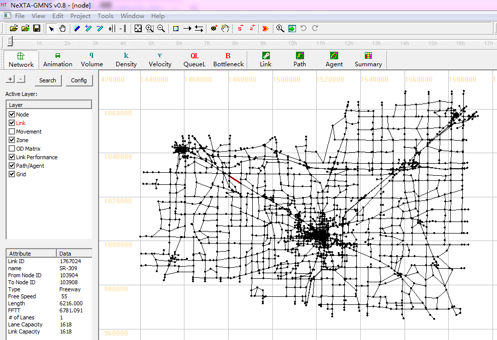
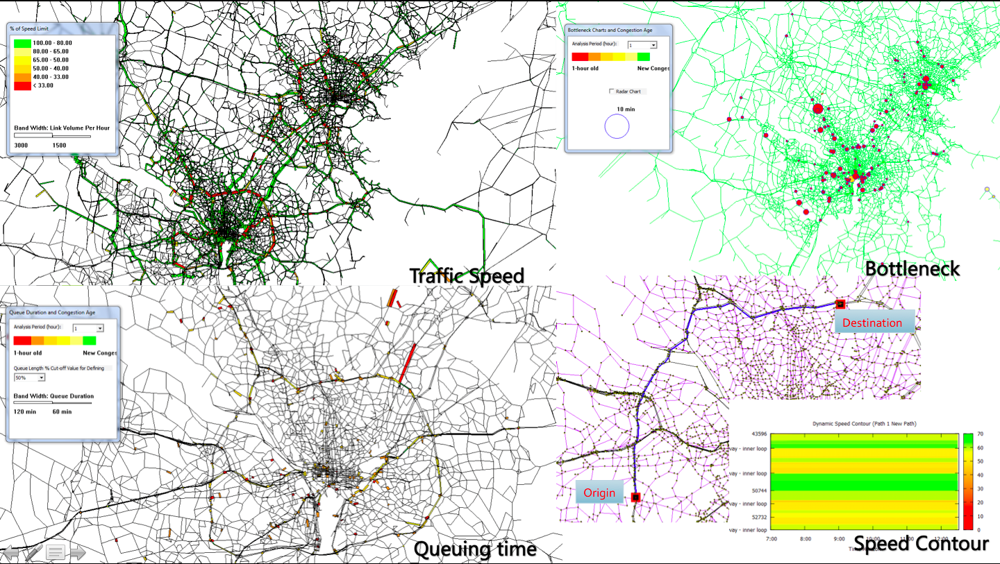
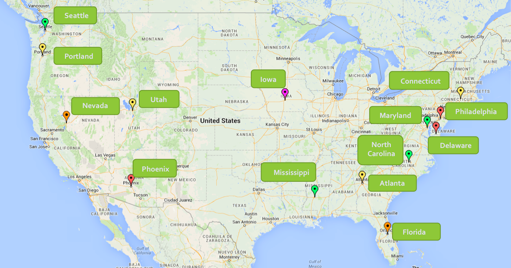

# DTALite

This site mains the source code and Windows-based release for DTALite+NeXTA
package.

For the Python version of DTALite and Path4GMNS package portable on Windows,
Linux and MacOS, please go to <https://github.com/jdlph/Path4GMNS>.

## Step 1: White Paper and Application:

Zhou, Xuesong, and Jeffrey Taylor. "[DTALite: A queue-based mesoscopic traffic
simulator for fast model evaluation and
calibration.](https://www.tandfonline.com/doi/full/10.1080/23311916.2014.961345)"
Cogent Engineering 1.1 (2014): 961345.

Marshall, Norman L. "[Forecasting the impossible: The status quo of estimating
traffic flows with static traffic assignment and the future of dynamic traffic
assignment.](https://www.sciencedirect.com/science/article/pii/S2210539517301232)"
Research in Transportation Business & Management 29 (2018): 85-92.

## Step 2: Youtube Teaching Videos on Use of DTALite/NEXTA Packages

[NeXTA/DTALite Workshop
Webinar](https://www.youtube.com/channel/UCUHlqojCQ4f7VvqroUhbaFA) by Jeff
Taylor

## Step 3: Mini-Lesson on the Internal Algorithmic Details

[Mini-lessson](https://youtu.be/rorZAhNNOf0) : What is the best way to learn
dynamic traffic simulation and network assignment for a beginner? Do you want to
integrate a powerful traffic simulator in your deep learning framework? We would
like to offer a collaborative learning experience through 500 lines of python
codes and real-life data sets. This is part of our mini-lessons through teaching
dialog.

C++ source codes

Python source code

## References:

**1. Parallel computing algorithms**: Qu, Y., & Zhou, X. (2017). Large-scale
dynamic transportation network simulation: A space-time-event parallel computing
approach. Transportation research part c: Emerging technologies, 75, 1-16.

**2. OD demand estimation**: Lu, C. C., Zhou, X., & Zhang, K. (2013). Dynamic
origin–destination demand flow estimation under congested traffic conditions.
Transportation Research Part C: Emerging Technologies, 34, 16-37.

**3. Simplified emission estimation model**: Zhou, X., Tanvir, S., Lei, H.,
Taylor, J., Liu, B., Rouphail, N. M., & Frey, H. C. (2015). Integrating a
simplified emission estimation model and mesoscopic dynamic traffic simulator to
efficiently evaluate emission impacts of traffic management strategies.
Transportation Research Part D: Transport and Environment, 37, 123-136.

**4. Eco-system optimal time-dependent flow assignment**: Lu, C. C., Liu, J.,
Qu, Y., Peeta, S., Rouphail, N. M., & Zhou, X. (2016). Eco-system optimal
time-dependent flow assignment in a congested network. Transportation Research
Part B: Methodological, 94, 217-239.

**5. Transportation-induced population exposure assessment**: Vallamsundar, S.,
Lin, J., Konduri, K., Zhou, X., & Pendyala, R. M. (2016). A comprehensive
modeling framework for transportation-induced population exposure assessment.
Transportation Research Part D: Transport and Environment, 46, 94-113.

**6. Integrated ABM and DTA**: Xiong, C., Shahabi, M., Zhao, J., Yin, Y., Zhou,
X., & Zhang, L. (2020). An integrated and personalized traveler information and
incentive scheme for energy efficient mobility systems. Transportation Research
Part C: Emerging Technologies, 113, 57-73.

**7. State-wide transportation modeling**: Zhang. L. (2017) Maryland SHRP2 C10
Implementation Assistance – MITAMS: Maryland Integrated Analysis Modeling
System, Maryland State Highway Administration

**8. Workzone applications**: Schroeder, B, et al. Work zone traffic analysis &
impact assessment. (2014) FHWA/NC/2012-36. North Carolina. Dept. of
Transportation. Research and Analysis Group.

>   nexta

>   nexta

>   DTALite/NeXTA applications in the United States

>   maps
