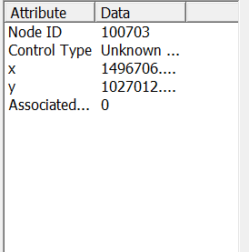
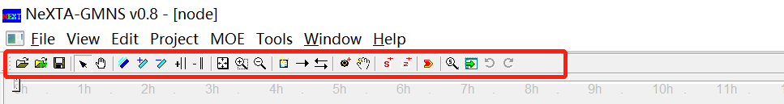
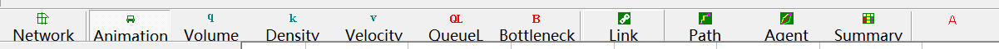
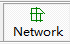
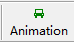
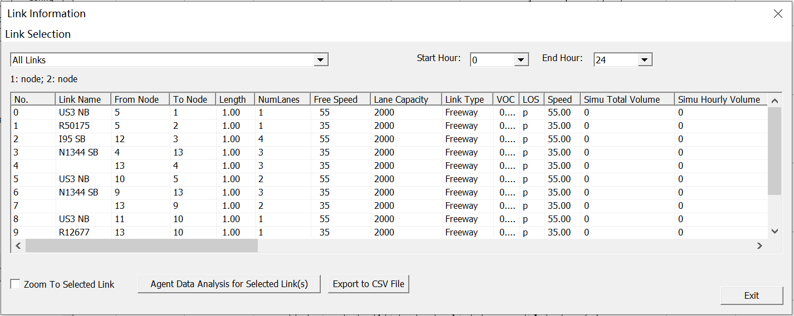

| **User Guide for NeXTA for GMNS** |
|-----------------------------------|
| Revision Date 2020-3-31           |

**CONTACT INFORMATION**

Further Details in https://github.com/xzhou99

For more information, please contact:

Xuesong Zhou (<xzhou74@asu.edu>)

**TABLE OF CONTENTS**

[1. GETTING STARTED	1](#_Toc36543000)

>   [1.1	What is GMNS?	1](#_Toc36543001)

>   [1.2	What is AMS?	1](#_Toc36543002)

>   [1.3	What is NEXTA?	1](#_Toc36543003)

[2. DATA FILE DESCRIPTION	2](#_Toc36543004)

>   [2.1 GMNS Network Files	2](#_Toc36543005)

>   [2.2 AMS Files	5](#_Toc36543006)

[3. USER INTERFACES & BASIC CONTROLS	6](#_Toc36543007)

>   [3.1	User Interfaces	6](#_Toc36543008)

>   [3.1.1.	Layer Control Panel	6](#_Toc36543009)

>   [3.1.2.	Attribute Data Display Panel	7](#_Toc36543010)

>   [3.2	Management Toolbar	8](#_Toc36543011)

>   [3.2.1.	Basic Management Tools	8](#_Toc36543012)

>   [3.2.2.	Network Editing Tools	9](#_Toc36543013)

>   [3.2.3.	Clock Controlling Tools	10](#_Toc36543014)

>   [3.3	Viewing Modes	11](#_Toc36543015)

>   [3.3.1.	Network View	11](#_Toc36543016)

>   [3.3.2.	Animation View	12](#_Toc36543017)

>   [3.4	MOE Toolbar	12](#_Toc36543018)

>   [3.4.1.	Density Visualization	13](#_Toc36543019)

>   [3.4.2.	Volume Visualization	13](#_Toc36543020)

>   [3.4.3.	Velocity Visualization	14](#_Toc36543021)

>   [3.4.4.	Queue Visualization	15](#_Toc36543022)

>   [3.4.5.	Bottleneck Visualization	15](#_Toc36543023)

>   [3.5	Detailed Analytical Tools	16](#_Toc36543024)

>   [3.5.1.	Link Analysis Tool	16](#_Toc36543025)

>   [3.5.2.	Path Analysis Tool	17](#_Toc36543026)

>   [3.5.3.	Agent Analysis Tool	18](#_Toc36543027)

>   [3.5.4.	Summary Analysis Tool	22](#_Toc36543028)

# GETTING STARTED

## What is GMNS? 

General Travel Network Format Specification is a product of Zephyr Foundation,
which aims to advance the field through flexible and efficient support,
education, guidance, encouragement, and incubation.

Further Details in
<https://zephyrtransport.org/projects/2-network-standard-and-tools/>

## What is AMS? 

As stated in FHWA website,
<https://cms7.fhwa.dot.gov/research/operations/analysis-modeling-simulation/analysis-modeling-simulation-overview>,
FHWA and its State and local agency partners have relied on analysis, modeling,
and simulation (AMS) to support investment decisions for the transportation
system. As the transportation system environment grows in complexity, increasing
pressure is placed on agencies to identify more innovative and efficient
solutions to a wide range of issues. These solutions include leveraging emerging
technologies, data sources, and alternative (non-traditional) strategies. AMS
tools will continue to play a critical role in evaluating these solutions.

## What is NEXTA?

In general, the software suite of NeXTA aims to:

(1) Provide an open-source code base to enable transportation researchers and
software developers to expand its range of capabilities to various traffic
management application.

(2) Present results to other users by visualizing time-varying traffic flow
dynamics and traveler route choice behavior in an integrated environment.

(3) Provide a free, educational tool for students to understand the complex
decision-making process in transportation planning and optimization processes.

This section describes all input and output files associated with NeXTA package.
All GMNS data files are in CSV format. Each input/output file includes
descriptions for required variable names, followed by a short description of
their type, purpose, function, interaction with other variables, and the use
cases in which the variable is required/not required.

**Network data structure** defines the basic node-link structure, along with
attributes for each link and node. Additionally, nodes are related to movement,
which can be used to disaggregate trips from nodes to nodes.

Below is a short list of key features for GMNS data files and simple AMS data
structure.

| **File Name**         |                                                                                                                                     |
|-----------------------|-------------------------------------------------------------------------------------------------------------------------------------|
| A: GMMS Network Files | A1: node.csv                                                                                                                        |
|                       | A2: link.csv                                                                                                                        |
|                       | A3: movement.csv                                                                                                                    |
| B: AMS Output         | B1: [link_performance.csv](https://docs.google.com/spreadsheets/d/1gToOECJqT2T2rDpS6YSPRXZvz-xi4iN2iV32nrjK-AQ/edit#gid=2142282830) |
|                       | B2: [agent.csv](https://docs.google.com/spreadsheets/d/1Jrmq3tlV22qrwJb4tzHivMio04DNHZwHqdlJOcE_oIc/edit#gid=689476001)             |

# DATA FILE DESCRIPTION 

### 2.1 GMNS Network Files

High-level introductions:

-   A generic network used for GMNS readable by NeXTA includes a set of three
    layers: node, link and movement.

-   The specific file names are node.csv, road_link.csv, and movement.csv.

-   A link is defined using upstream node and downstream node ids, with
    essential attributes such as length, free_speed, lanes and capacity,
    typically required for static traffic assignment and mesoscopic traffic
    assignment.

-   The movement file contains the individual’s movement from nodes to nodes.

-   The node and link layers can use arbitrary coordinate system, but a WKT
    (lon/lat) coordinate system is preferred.

-   A user can also manually create a new network from the scratch by using a
    click-and-draw method based on a background image file.

#### 1. node.csv

| **Field Name** | **Description**                                                                                                       | **Sample Value**            |
|----------------|-----------------------------------------------------------------------------------------------------------------------|-----------------------------|
| name           | Optional for visualization only                                                                                       | Main street \@ Highland Dr. |
| node_id        | Node identification number                                                                                            | 1001                        |
| ctrl_type      | Intersection control type                                                                                             | 5                           |
| node_type      | Optional text label for visualization and identifies of node                                                          | 1                           |
| x_coord        | Longitude or horizontal coordinate in any arbitrary geographic coordinate system.                                     | 100                         |
| y_coord        | Latitude or vertical coordinate horizontal coordinate in any arbitrary geographic coordinate system                   | 200                         |
| geometry       | Text string used to describe node location <https://en.wikipedia.org/wiki/Well-known_text_representation_of_geometry> | POINT (30 10)               |

**Remarks:**

#### 2. link.csv

| **Field Name** | **Description**                                                                                                                                                                                                                           | **Sample Values**                |
|----------------|-------------------------------------------------------------------------------------------------------------------------------------------------------------------------------------------------------------------------------------------|----------------------------------|
| Name           | Optional for visualization purposes                                                                                                                                                                                                       | Main Street                      |
| link_id        | Link identification number of the road                                                                                                                                                                                                    | 101                              |
| from_node_id   | Upstream node number of the link, must already defined in input_node.csv                                                                                                                                                                  | 2                                |
| to_node_id     | Downstream node number of the link, must already defined in input_node.csv                                                                                                                                                                | 3                                |
| link_type      | Optional text label for visualization and data checking purposes                                                                                                                                                                          | 1                                |
| length         | The length of the link (between end nodes), measured in units of miles.                                                                                                                                                                   | 1.0                              |
| lanes          | The number of lanes on the link                                                                                                                                                                                                           | 2                                |
| free_speed     | Free-flow speed on defined link . Suggested Unit: mph or kmph                                                                                                                                                                             | 20                               |
| capacity       | The number of vehicles per hour per lane.                                                                                                                                                                                                 | 1500                             |
| geometry       | Text string used to describe link shape and location (typically in WKT geographic coordinate system). The initial value can be empty, and NeXTA will generate the text string based on the coordinates of upstream and downstream nodes.  | LINESTRING (30 10, 10 30, 40 40) |

**Remarks:**

**Fields can be generated or populated by NeXTA:**

>   geometry fields can be imported from GIS shape files or generated based on
>   the coordinates of upstream and downstream nodes. direction = 1 by default.

#### 3. movement.csv

| **Field Name** | **Description**                                                                 | **Sample Values** |
|----------------|---------------------------------------------------------------------------------|-------------------|
| mvmt_id        | Movement identification number                                                  | 1                 |
| node_id        | Node identification number                                                      | 1001              |
| name           |                                                                                 | Main Street       |
| ib_link_id     | upstream link identification number of the movement                             | 100002 1          |
| ib_lane        | Lane number of inbound link                                                     | 1                 |
| ob_link_id     | Downstream link identification number of the movement                           | 1 100002          |
| ob_lane        | Lane number of outbound link                                                    | 1                 |
| type           | Optional text label for visualization and identifies the direction of movement  | U-Turn            |
| penalty        |                                                                                 | 50                |
| capacity       | Maximum service flow rate for each lane of the movement, in vehicles per hour.  | 1500              |
| ctrl_type      | Intersection control type                                                       | 2                 |

### 2.2 AMS Files

High-level introductions:

-   Dynamic AMS data visualization files readable by NeXTA includes a set of two
    layers: agent, link_performance.

-   The specific file names are agent.csv, link_performance.csv.

-   The agent file contains the specific information of each agent in the
    simulation network, such as, agent id, demand type, time period and so on.

-   The link performance file contains the each link’s information, such as,
    time period, travel time and some notes.

#### 1. agent.csv

| **Field Name** | **Description**                                                           | **Sample Value** |
|----------------|---------------------------------------------------------------------------|------------------|
| agent_id       | Node identification number                                                | 1                |
| o_zone_id      | Origin zone number of the agent                                           | 1                |
| d_zone_id      | Destination zone number of the agent                                      | 7                |
| o_node_id      | Origin node number of the agent                                           | 1                |
| d_node_id      | Destination node number of the agent                                      | 20               |
| demand_type    | Optional demand label for visualization and identifies of agent           | SOV              |
| time_period    | The simulation time period of the agent                                   | 0700_0900        |
| volume         | Maximum flow rate for each lane on the link, in vehicles per hour         | 60               |
| cost           | The amount of money/time that agent spend                                 | 360              |
| travel_time    | The total time from the origin to the destination of the agent            | 360              |
| distance       | The total travel distance from the origin to the destination of the agent | 22               |
| node_sequence  | The number of nodes through which agents pass in turn                     | 1;2;6;8;7;18;20; |

#### 2. link_performance.csv

| **Field Name** | **Description**                                    | **Sample Values** |
|----------------|----------------------------------------------------|-------------------|
| road_link_id   | Link identification number of the road             | 1                 |
| time_period    | The simulation time period of the agent            | 0600_1100         |
| volume         | Link based flow volume for the defined time period | 60                |
| travel_time    | Link travel_time per min                           | 60                |
| notes          | Some explanatory text                              | period-based      |

# USER INTERFACES & BASIC CONTROLS

## User Interfaces

### Layer Control Panel

NeXTA’s user interface uses layer controls which are similar to those used in
common GIS software applications to manage which network object types are
displayed/selected.

The list of layers at the left side of the screen, highlighted in the figure
above, is used to control what is visible in the display. The panel display
controls the Node, Link, Movement, Zone, OD Matrix, Link Performance,
Path/Agent, Grid. Each layer refers to a different type of network data, which
is stored in the network input/output files in the project folder.

**The box alongside each layer’s text label** is used to control the layer’s
visibility. An empty box indicates that the layer is not visible, and a check
mark in the box indicates that the layer is visible (if data is available for
display). In some cases, after turning a layer on or off, the user may need to
click the layer’s text label to refresh the display for that specific layer.

**The layer text label** is used to control which objects can be selected in the
network. In particular, the selectable layers are limited to the layers such as
Node, Link, Movement, Zone and OD Matrix. With the layer turned on (enabled),
left-clicking on the layer text label enables selection using the Select Object
tool. The text label is highlighted in red text after selection, indicating
which network object type can be selected using the Select Object tool. Please
see more detail illustration for examples for using this functionality.

### Attribute Data Display Panel

The lower half of the panel at the left side of the screen shows attribute data
for a selected object, as shown in the figure below. The information displayed
in this section of the panel is dependent upon the selected network object type.

Node attribute data displayed in the panel includes the node ID number, control
type, geographic coordinates, and associated zone ID number (=corresponding zone
number, if a node is an activity location; =0, otherwise) for the selected node.
Link attribute data displayed in the panel includes the link ID number, link
name, starting node ID number, ending node ID number, link type, speed limit,
length, free-flow travel time, number of lanes, lane capacity and link capacity
for the selected link. An example is shown in the figure below with link
attribute data.

## Management Toolbar

### Basic Management Tools

| **Icon**                                                                                 | **Name**                          | **Function**                                                                                                                                                                                                                                                           |
|------------------------------------------------------------------------------------------|-----------------------------------|------------------------------------------------------------------------------------------------------------------------------------------------------------------------------------------------------------------------------------------------------------------------|
|                                                                                          | Open Project                      |                                                                                                                                                                                                                                                                        |
|                                                                                          | Save Project                      | Save network to given path/file name                                                                                                                                                                                                                                   |
|                                                                                          | Select Object                     | Select a node/link/zone                                                                                                                                                                                                                                                |
|                                                                                          | Move Network                      |                                                                                                                                                                                                                                                                        |
|                                                                                          | Switch Link Bar/Line Display Mode |                                                                                                                                                                                                                                                                        |
|                                                                                          | Increase Link Bandwidth           |                                                                                                                                                                                                                                                                        |
|                                                                                          | Decrease Link Bandwidth           |                                                                                                                                                                                                                                                                        |
|                                                                                          | Increase Link Offset              |                                                                                                                                                                                                                                                                        |
|                                                                                          | Decrease Link Offset              |                                                                                                                                                                                                                                                                        |
|                                                                                          | Show Network                      | Show entire network                                                                                                                                                                                                                                                    |
|                                                                                          | Zoom In                           |                                                                                                                                                                                                                                                                        |
|                                                                                          | Zoom Out                          |                                                                                                                                                                                                                                                                        |
|                                                                                          | Search Node/ Link/Path/Vehicle    | Opens a dialog box which enables search functionality in NeXTA. Search by node number to find nodes, links (from node and to node notation), paths (from node and to node notation, using shortest path), and vehicle number (when simulations results are available). |
|                                                                                          | Visit Development Website         |                                                                                                                                                                                                                                                                        |
| [media/3b0e198a4f9402bfe257181e46d294d9.png](media/3b0e198a4f9402bfe257181e46d294d9.png) | Run Simulation                    |                                                                                                                                                                                                                                                                        |

### Network Editing Tools

| **Icon**                                                                                 | **Name**                            | **Function**                                                                                                                                                                                                     |
|------------------------------------------------------------------------------------------|-------------------------------------|------------------------------------------------------------------------------------------------------------------------------------------------------------------------------------------------------------------|
| [media/4d1a6b33253ea3b8fd3cc9c35b5e05f2.png](media/4d1a6b33253ea3b8fd3cc9c35b5e05f2.png) | Set Default Link Type               | Opens a dialog box displaying the default link properties for different link types. The user may select and edit the default link properties so that all new links created afterward are assigned those changes. |
| [media/5091a70c116ae743dae5fc52c3bca412.png](media/5091a70c116ae743dae5fc52c3bca412.png) | Add New One-Way Links               | Use mouse click-and-draw fashionn, Create a new one-way, directional link between two nodes. Ctrl+ mouse will allow a link being created from a middle point of a link.                                          |
|                                                                                          | Add New Two-Way Links               | Create two one-way, directional links between two nodes.                                                                                                                                                         |
| [media/c9fff32ed13cea62555ac459208374a4.png](media/c9fff32ed13cea62555ac459208374a4.png) | Add New Node                        | Create a new node to which links can be attached.                                                                                                                                                                |
| [media/2b37436f692c7e6cde850ecc45baf676.png](media/2b37436f692c7e6cde850ecc45baf676.png) | Move Node Position                  |                                                                                                                                                                                                                  |
| [media/2a44a628a71daa7dcfece0a7d77e8746.png](media/2a44a628a71daa7dcfece0a7d77e8746.png) | Create Subarea for subarea Analysis | Create a subarea boundary which is used to perform a subarea cut (see Subarea Analysis for more details).                                                                                                        |
| [media/1b0c419977b40a2a53d12fa9c0858df1.png](media/1b0c419977b40a2a53d12fa9c0858df1.png) | Create New Zone                     | Create a new zone                                                                                                                                                                                                |

### Clock Controlling Tools

**The Clock Bar**(highlighted in the figure above) is a toolbar feature located
at the top of the screen which allows the user to view time-dependent MOEs by
controlling the position of the slider on the toolbar. As shown above, the
toolbar is divided into hours so that the position of the slider refers to the
time within a 24-hour modeling time horizon.

The buttons at the right above the Clock Bar are used for controlling the
progression of time. This can also be accomplished by using the mouse to move
the slider, clicking and dragging the slider to the desired location (time) on
the bar.

| **Icon** | **Name**                    | **Function**                                                                               |
|----------|-----------------------------|--------------------------------------------------------------------------------------------|
|          | Star Animation (Min by Min) | Progresses forward automatically through time in 1 minute steps                            |
|          | Rewind                      | Rewind the time back to 00:00                                                              |
|          | Pause Animation             | Temporarily stops the automatic progression of time until the play button is pressed again |
|          | Stop Animation              | Stops the automatic progression of time and reset the time back to 00:00                   |
|          | Play Forward 1 Min          | Moves forward in time by 1 minute                                                          |
|          | Skin Forward 5 Min          | Moves forward in time by 5 minutes from the current time                                   |
|          | Play Backward 1 Min         | Moves backward in time by 1 minute                                                         |
|          | Skin Backward 5 Min         | Moves backward in time by 5 minutes from the current time                                  |
|          | Play Forward 1 Sec          | Moves forward in time by 1 second                                                          |
|          | Play Backward 1 Sec         | Moves backward in time by 1second                                                          |
|          | Star Animation (Sec by Sec) | Progresses forward automatically through time in 1 second steps                            |
|          | Show/Hide Legend            | Toggles legend visibility                                                                  |

## Viewing Modes

Two different viewing modes are available in NeXTA - Network View mode and
Animation View mode. The default Network View mode is used to display Measures
of Effectiveness (MOEs) and the network geometry, while the Animation View is
used to show individual vehicles moving in the network during simulation. The
user can use the

and

buttons on the MOE Toolbar to control which view is used.

### Network View

In the default visualization state, each link is shown with a line width to
represent the number of lanes. Additionally, many MOE visualization features use
the link width to visually show how MOEs change over time or differ from one
link to another. The

button on the MOE Toolbar changes this visualization state so that no links in
the network will be shown with a link width.

### Animation View

The Animation View changes the visualization state to show vehicles moving in
the simulation over time, where the time step is controlled by the Clock Bar.
This feature is engaged by pressing the

button. Vehicles in the simulation are represented as green circles moving along
the links in the network.

## MOE Toolbar

The majority of the visualization tools provided in NeXTA are available through
the MOE Toolbar features highlighted below. Traditional MOE (Measure of
Effectiveness) visualizations are provided for the Volume, Density, Velocity,
Queue and Bottleneck. In general, multiple visualization modes cannot be enabled
at the same time, except in the case of using the Synchronized Display Mode. In
addition to these traditional visualization options, three new analysis features
are currently available: Bottleneck and Emissions. Each visualization feature is
explained in the relevant sections below.

### Density Visualization

The Density Visualization View is enabled using the

button, showing the time-dependent density for each link in the network. An
example is shown below, where the link width is based on the time-dependent link
volume. The visualization may be modified to show links without widths by using
the

button.

Each link is color-coded based on the MOE value at the time specified by using
the Clock Bar, and a legend is provided (shown at left in the above figure) to
relate MOE values to color codes. Legend visibility can be toggled using the

button on the toolbar.

### Volume Visualization

The Volume Visualization View is enabled using the

button, showing the time-dependent volume for each link in the network. The
visualization may be modified to show links without widths by using the

button.

### Velocity Visualization

The Speed Visualization View is enabled using the

button, showing the time-dependent speed for each link in the network. An
example is shown below for a portion of the West Jordon network, where the link
width is based on the time-dependent link volume. The visualization may be
modified to show links without widths by using the

button.

Each link is color-coded based on the MOE value at the time specified by using
the Clock Bar, and a legend is provided (shown at left in the above figure) to
relate MOE values to color codes. As shown in the legend, the color coding is
based on the ratio of the average speed vs. the specified speed limit for each
specific link. Legend visibility can be toggled using the

button on the toolbar.

### Queue Visualization

The Queue Visualization View is enabled using the

button, showing the time-dependent queue length for each link in the network. An
example is shown in the figure below. This visualization mode works in both
Network View Mode and with link widths corresponding to the number of lanes (not
volume), and these viewing modes can be toggled using the

button.

### Bottleneck Visualization

The Bottleneck Visualization View is enabled using the

button, showing the time-dependent congestion nodes in the network. An example
is shown below for a portion of the West Jordon network. This visualization mode
works in both Network View Mode and with node sizes corresponding to the age of
congestion in analysis period, and these viewing modes can be toggled using the

button.

The bottleneck is visually represented as the portion of the congestion node
which is color-coded, and the size of each congestion node changes dynamically
over time, corresponding to the age of congestion. Legend visibility can be
toggled using the

button on the toolbar.

## Detailed Analytical Tools

In addition to the previously-described visualization tools, the Link, Path,
Vehicle, and Summary analytical tools are available for more detailed analyses.
These features may be accessed through the highlighted buttons shown below on
the MOE Toolbar. Each visualization feature is explained in different sections
below.

### Link Analysis Tool

Selecting the

button, or going to MOE \> Link List Dialog, opening the Link Information window
(as shown below), which is used to view link attributes and MOEs. Selecting a
row with the mouse also selects the link in the network, allowing the user to
quickly find specific links. The Link Zoom toggle button at the bottom left side
of the window centers the network view window at the selected row after a row is
selected. Each column of data can be used to sort the list, allowing the user to
more quickly find links with specific attributes or which meet certain criteria.
The “Vehicle Data Analysis for Selected Link(s)” button at the bottom of the
window offers vehicle analysis data for selected links. The “Export to CSV File”
button at the bottom of the window helps users export link information and MOEs
to CSV file.

Additionally, the Link Selection menu at the top left side of the window offers
options for filtering the rows by link type. Filtering options are available for
displaying only Selected links, links within Subarea, Freeway, Highway, Ramp,
Arterial, Connector links and Non-Connector links. The Start/End Hour Selection
menu at the top right side of the window offer options for analysis period.

### Path Analysis Tool

The Path Analysis Tool is enabled by using the

button or going to MOE \> Path List Dialog, which is used to view link
attributes and path travel time statistics.

To use the tool, a path must first be selecting in the path layer. As a recap,
this is accomplished by right-clicking the mouse at the origin node for the
path, selecting “Direction from Here”, and then right-clicking again at the
destination, selecting “Direction to Here”. The path is chosen automatically
based on the shortest path between the two points. Additionally, an intermediate
point can be chosen by selecting “add intermediate destination here”. You may
also avoid intermediate nodes/links by selecting “avoid this node”/ “avoid using
this link”.

Selecting the

button opens the Path Information window, as shown in the example below. Similar
to the Link Information window, this tool shows link attributes for the links in
the path. Path statistics (including distance and free flow travel time) are
shown in bottom of the window, and MOE values of path (including speed contour,
density contour, V/C contour, Trip data Analysis and Google Earth) are shown in
right side of the window.

Additionally, The Link Zoom toggle button at the bottom left side of the window
centers the network view window at the selected row after a row is selected.
Each column of data can be used to sort the list, allowing the user to more
quickly find links with specific attributes or which meet certain criteria. The
Start Hour, End Hour and Agg Interval Selection menu at the top right side of
the window offer options for analysis period and time interval for statistics.

### Agent Analysis Tool

The Vehicle Analysis Tool, enabled using the

button or going to MOE \> Vehicle Path Analysis, is a powerful analysis feature
used to examine travel statistics for individual vehicle or groups of vehicles.
This window is divided into four sections: the OD Pair Filter, OD List, Path
List, and Vehicle List.

The OD Pair Filter (as shown in the figure below), located at the top of the
window, offers several filtering options for limiting an analysis based on
specific criteria. The top row of drop-down lists primarily provides filterable
criteria related to the vehicle, including the Origin Zone ID, Destination Zone
ID, Demand Type and Vehicle Type, Information Class and Departure Time(min), and
whether the vehicle was traveling within a certain Time Interval. Also relevant
to vehicle characteristics, a filter based on a range for the Value of Time is
offered at the far right side of the window. The drop-down lists immediately to
the right of the OD List are filterable criteria related to path attributes,
including the Number of Vehicles using a path, the Total Travel Distance (in
miles) and Travel Time Index on the path.

The Find Critical OD Pairs button, found at the top right corner of the window,
uses some default filter criteria (path with more than 500 vehicles and at least
2 miles in length) to find the most important OD Pairs.

The OD List shows any Origin-Destination pairs which meet the criteria used in
the OD Pair Filter (as shown in the figure below). Each pair is listed with
origin and destination zone ID, along with the number of vehicles, average
travel time, average distance, average speed, travel time STD and travel time
per distance STD.

By clicking on a specific OD Pair in the OD List, the Path List and Vehicle List
is populated with paths and vehicles associated with that specific OD Pair (as
shown in the figure below). Selecting different paths in the Path List
highlights those paths in the network, as shown below, and further limits the
vehicles shown in the vehicle list to only those vehicles using the selected
path. Export buttons are located near the bottom of each list so that the user
may export the items in the separate lists and save them as CSV files.

### Summary Analysis Tool

The System Analysis Tool is used to examine travel statistics for groups of
vehicles. By using the

button or going to MOE \> Network Statistics Dialog, the Data Summary Dialog
opens, as shown below.

The drop-down lists at the top of the window are inputs which allow the user to
modify the chart shown in the window. As described in the figure, the first
drop-down list controls the X Axis, and the second controls the Y Axis. The X
Axis options (Vehicle Filter) will divide groups based on their Value of Time
(VOT), vehicle type, demand type, traveler information class, departure time
intervals, distance bin and travel time bin over the modeling horizon. The Y
Axis options (MOE Selection) allow plotting the number of vehicles, total and
average travel times, total and average travel distance, total toll revenue,
average toll cost, total and average generalized travel cost (in minutes and
dollars), total and average emissions and so on.
