**Lesson 4 Bottleneck**

**Traffic Congestion Propagation: Understanding Theoretical Basics of Dynamic
Traffic Network Assignment and Simulation**

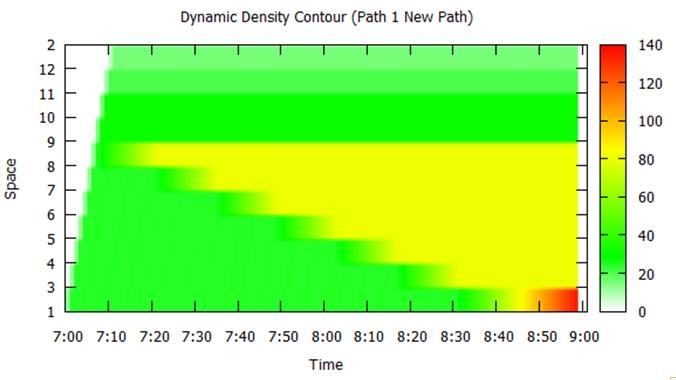

*Please share your comments online for improving this document. If you have any
questions or encounter any problems, please feel free to contact us
(*<xzhou74@asu.edu>*). Your any feedback is greatly appreciated!*

**2.1 Data Set**:
<https://github.com/xzhou99/stalite-dtalite_software_release/releases>

-   [https://github.com/xzhou99/stalite-dtalite_software_release\\learning_document\\2_traffic_flow_model_and_impact_study](https://github.com/xzhou99/stalite-dtalite_software_release/learning_document/2_traffic_flow_model_and_impact_study)

**2.2 Learning objectives:**

(1) Understand major input and output data for a dynamic network loading
program;

(2) Identify bottlenecks and model congestion

propagation;

(3) Calculate traffic states through different computational
approaches.

**2.3 Contents:**

[Introduction to Dynamic Network Loading: Input and
Output](#h.gjdgxs)

[Overview of 3-corridor network and experiments](#h.30j0zll)

[(1) Network](#h.1fob9te)

>   [1) Check the property of the network](#h.3znysh7)

>   [2) Calculate travel time of three paths and find links with minimum
>   capacity](#h.2et92p0)

[(2) OD demand matrix](#h.tyjcwt)

[(3) Traffic states as a result of demand-supply
interactions](#h.3dy6vkm)

>   [(I) Network Level Text Display](#h.1t3h5sf)

>   [(II) Path Level Dynamic Contour Plot](#h.4d34og8)

>   [(III) Link Level MOE Display](#h.2s8eyo1)

>   [(IV) Time-dependent Link MOE Visualization](#h.17dp8vu)

>   [(V) Introduction to two methods for traffic state
>   estimation](#h.3rdcrjn)

[(4) One-iteration Simulation setup](#h.26in1rg)

>   [Case1: demand = supply (demand = 3600)](#h.lnxbz9)

>   [(1) DTALite (KW Simulation Model)](#h.35nkun2)

>   [(2) Graphical Method](#h.1ksv4uv)

>   [Case2: demand \> supply (demand =5000)](#h.44sinio)

>   [(1) DTALite (KW Simulation Model)](#h.2jxsxqh)

>   [(2) Graphical Method](#h.z337ya)

>   [Case3: demand \> supply (demand =6400)](#h.3j2qqm3)

>   [(1) DTALite (KW Simulation Model)](#h.1y810tw)

>   [(2) Graphical Method](#h.4i7ojhp)

(5) [Multi-iteration evaluation of road pricing
scenarios](#h.26in1rg)

>   

| Fig.1. The process of dynamic network loading | 1. The **basic data input** for a dynamic network loading program (f) includes time-dependent origin-destination demand (a) and the traffic network (b) with road capacity constraints on links. 2. **Activity locations** (c) describe a zone-to-node mapping between OD demand matrix (a) and the traffic network (b). 3. Through calculating the **dynamic travel time** of all links (free-flow travel time is used at first iteration), corresponding to element (d), the **route choice model** (e) embeds a standard time-dependent least-cost path algorithm (h) to generate paths for all agents. 4. The core **dynamic network loading program** (f) loads previously generated agents on the traffic network for the entire planning horizon, which produces traffic data output (g) that describes time-varying traffic states at the link level, including traffic flow volume, traffic density, speed, travel time. The link-based traffic states (g) can be further processed to represent traffic congestion and propagation at the aggregated path level, as well as update the time-dependent travel time database (d).  5. At the following step within an **iterative assignment process**, the route choice module (e) will again recomputed the route selection for each agent using updated travel times (d), for another iteration of dynamic network loading (f), until the model is converged or reaches the maximum number of iterations.  |
|-----------------------------------------------|-----------------------------------------------------------------------------------------------------------------------------------------------------------------------------------------------------------------------------------------------------------------------------------------------------------------------------------------------------------------------------------------------------------------------------------------------------------------------------------------------------------------------------------------------------------------------------------------------------------------------------------------------------------------------------------------------------------------------------------------------------------------------------------------------------------------------------------------------------------------------------------------------------------------------------------------------------------------------------------------------------------------------------------------------------------------------------------------------------------------------------------------------------------------------------------------------------------------------------------------------------------------------------------------------------------------------------------------------------------------------------------------------------------------------------------------------------------------------|

# **2.4 Introduction to Dynamic Network Loading: Input and Output**

A dynamic traffic assignment program includes two major components: dynamic
network loading and traveler route assignment. In this learning document, we
focus on the first dynamic network-loading module using single assignment
iteration. Its general process is shown below:

**Methods:**

This document utilizes two methods to compute traffic states under different
levels of traffic demand and the same bottleneck capacity.

-   Analytical model and graphical solution method

-   Newell’s simplified Kinematic Wave Model (Newell, 1993), which is
    implemented in the DTALite simulation engine.

By systematically comparing results from those two methods, students are
expected to verify and understand the demand-supply interaction mechanism of a
dynamic network loading program. Doing this set of exercises could help students
tackle more complicated topics, such as dynamic route choice and traffic
management scenario evaluation.

**Overview of 3-corridor network and experiments:**

The demand time period in this experiment covers from 7:00 am to 8:00 am, and
the hypothetic traffic network is shown in Fig. 2. To understand a dynamic
network loading data set, we will go over the following data elements first:

## (1) Network

This network includes 40 nodes, 55 links, 6 zones and 6 activity locations.
There are two major zones: origin zone 1 and destination zone 2, which are
associated with three major paths (path 1, path 2, and path 3) as shown in Fig.
2.

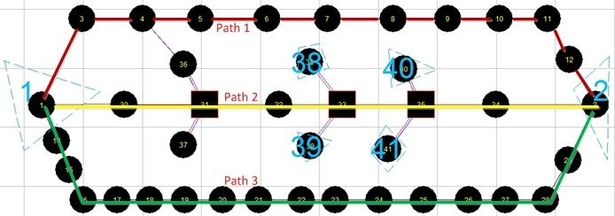

Fig. 2. Layout of 3-corridor Traffic Network

### 1) Check the property of the network

Please first use NeXTA to find the number of nodes, links, zones, and activity
locations. The properties of the network are shown in Table 1.

Table 1. Properties of traffic network

| **File No.** | **GIS Layer**            | **Associated Data File**                                                                                                                           | **Associated Menu for Data Editing**  | **Important Attributes**                                                             |
|--------------|--------------------------|----------------------------------------------------------------------------------------------------------------------------------------------------|---------------------------------------|--------------------------------------------------------------------------------------|
| 1            | Node                     | node.csv                                         | Project-\>Network Data-\> Node        | node coordinate, control type                                                        |
| 2            | Link                     | link.csv                                         | Project-\>Network Data-\> Link        | from node, to node, speed limit -\> free-flow travel time, capacity, number of lanes |
| 3            | OD demand matrix         | demand_file_list in  demand.csv and settings.csv | Project-\> Demand Database            | \# of trips from zone i to zone j                                                    |
| 4            | Traffic simulation setup | settings.csv                                     | Project-\> Perform Traffic Assignment | \# of iterations, traffic models, traffic assignment method…                         |
| 5            | Generated Vehicle Data   | agent.csv                                        | \---                                  | Agent ID, Arrival time, departure time…                                              |
| 6            | Traffic States           | link_performance.csv                             | \---                                  | Travel time, speed, density…                                                         |

**Link properties:**

To check the link properties in NeXTA, please follow the steps below for link
8-\>9 as an example, shown in Fig. 3.

Select the “Link” in the GIS layers panel, then right click to choose “View Link
Properties for Selected Link”.

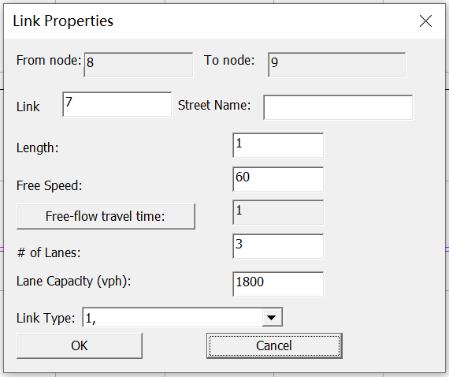

Fig. 3. Properties of link 8-\>9

**Node and link tables:**

To check node and link tables, please follow the steps in Fig. 4.

| Fig.4. Properties of link 8-\>9 | STEPS **Step 1**: click the “Project” in menu bar. **Step 2**: click “Network and Demand Data”. **Step 3**: click “Node”, “Link”, “Movement”,“Agent”, etc. in the tab page. |
|---------------------------------|-----------------------------------------------------------------------------------------------------------------------------------------------------------------------------|

**Problem 1 (for students):**

1.  Which node is defined as the origin node of zone 1? (check node.csv file for
    field zone_id)

2.  Which node is defined as the destination node of zone 2? (check node.csv
    file)

3.  How many trips are loaded from 7AM to 8AM? (Check demand_period in
    settings.csv file and associated demand file.)

### 2) Calculate travel time of three paths and find links with minimum capacity

In this experiment, we will examine major features of the dynamic
network-loading module in DTALite by using a single assignment iteration. In
DTALite’s first iteration, all drivers use the first path (which is the minimum
travel time path), calculated based on a free-flow condition. We first go over
two approaches for calculating the travel time of a path.

**(i) Manual calculation by using data from link.csv**

The data from link.csv for calculation of path 1 is shown in table 2. Students
can also calculate path travel times on paths 2 and 3

Table 2. Link attributes for calculating the travel time of path 1

| **No.**  | **Link (From node-\> to Node)** | **Distance (mile)** | **Free-flow travel time(min)** | **Link capacity (veh/h)** |
|----------|---------------------------------|---------------------|--------------------------------|---------------------------|
| 1        | 1-\>3                           | 1                   | 1                              | 5700                      |
| 2        | 3-\>4                           | 1                   | 1                              | 5400                      |
| 3        | 4-\>5                           | 1                   | 1                              | 5400                      |
| 4        | 5-\>6                           | 1                   | 1                              | 5400                      |
| 5        | 6-\>7                           | 1                   | 1                              | 5400                      |
| 6        | 7-\>8                           | 1                   | 1                              | 5400                      |
| 7        | 8-\>9                           | 1                   | 1                              | 5400                      |
| 8        | 9-\>10                          | 1                   | 1                              | 3600                      |
| 9        | 10-\>11                         | 1                   | 1                              | 3600                      |
| 10       | 11-\>12                         | 1                   | 1                              | 5400                      |
| 11       | 12-\>2                          | 1                   | 1                              | 7200                      |
| Subtotal | \---                            | 11                  | 11                             | \---                      |

In Table 2, based on the capacity of links, the bottleneck is link 9-\>10 and
link 10-\>11. It should be remarked here, DTALite assumes homogeneous link
capacity (which means that the capacity of any sections of the link is equal),
so the capacity value puts a constraint on both incoming flow and outgoing flow
of a link, such as, the link shown in Fig. 5.

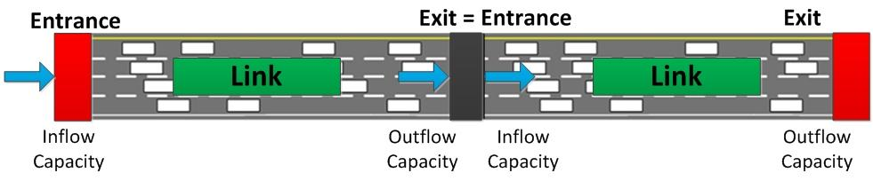

Fig. 5. Capacity analysis of one link

For link 8-\>9, although its (outgoing flow) capacity is 5400 vehicles per hour
per link, its actual number of output flow volume being discharged also depends
on the inflow capacity of its next link, link 9-\>10, with a capacity of 3600
vehicles per hour per link. Thus, when the demand of link 8-\>9 is greater than
3600 per hour, at its exit point (i.e. the downstream node 9), a queue will be
formed as a result of traffic congestion, and will be propagated to other
upstream links. Table 3 summarizes the travel times on three paths.

Table 3. Travel time and travel distance of three paths

| **Path**                               | **Node sequence**        | **\# of links** | **Travel time (min)** | **Travel Distance (mile)** | **Bottleneck**            |
|----------------------------------------|--------------------------|-----------------|-----------------------|----------------------------|---------------------------|
| Path 1 (Major Freeway)                 | 1-\>3-\>4...-\> 12-\>2   | 11              | 11                    | 11                         | Link 9-\>10, Link 10-\>11 |
| Path 2 (Alternative Arterial corridor) | 1-\>30-\>31...-\> 34-\>2 | 7               | 12                    | 8                          |                           |
| Path 3 (Alternative Freeway)           | 1-\>14-\>15...-\> 29-\>2 | 17              | 17                    | 17                         |                           |

The free-flow travel times of path 1, path 2, and path 3 are 11 min, 12 min, and
17 min, respectively. Since path 1 has the least travel time, it will be first
chosen when the OD demand is sufficiently small. In the following session, we
will focus on path 1.

**Problem 2 (for students)**

1.  Which path will be selected at the first iteration?

2.  Find links with minimum capacity along three paths. Show the upstream node
    and downstream node numbers of those links and the hourly capacity values.
    Please use an image to highlight these links in the traffic network.

3.  What is the expected speed on link 8-\>9, if the demand is 5400 vehicles per
    hour, and all vehicles use the first path?

**(ii) Obtain travel time of paths through NeXTA**

The method of selecting a path is shown in Fig. 6. The travel time of path 2 and
path 3 can be obtained, similarly.

| [media/a6501cf5d68d92145ea2922f8ad1cbb3.jpeg](media/a6501cf5d68d92145ea2922f8ad1cbb3.jpeg) Fig.6. Path list dialog | STEPS **Step 1**: Select the “Path” layer in the GIS layers panel **Step 2**: Click on node 1-\> right click menu to choose “Direction from here” **Step 3**: Click node 2-\> right click menu to choose “Direction to here” **Step 4**: Select any node (e.g. node 6) of the path 1-\> right click to choose “Add Intermediate Destination here”. **Step 5**: To view the traffic states of selected path, click on the “Path” button in the MOE bar |
|--------------------------------------------------------------------------------------------------------------------|-------------------------------------------------------------------------------------------------------------------------------------------------------------------------------------------------------------------------------------------------------------------------------------------------------------------------------------------------------------------------------------------------------------------------------------------------------|

##  (2) OD demand matrix

For checking the OD demand:

-   Check the demand_file_list field in settings.csv and demand.csv;

## (3) Traffic States as a result of demand-supply interactions

NeXTA provides a number of visualization interfaces for checking the traffic
states such as density and volume.

### (I) Network Level Text Display

Please follow the steps in Fig. 8 to view traffic states for all links in the
network. For example, check the “Link Capacity”.

| [media/ed629bdaa2f94e77a988ff154ed57eaa.png](media/ed629bdaa2f94e77a988ff154ed57eaa.png) | STEPS **Step 1**: Click on the “Config” button at the top of the GIS layers panel **Step 2**: “Link Capacity” in “link text” **Step 3**: View the link capacity of any links in the network. |
|------------------------------------------------------------------------------------------|----------------------------------------------------------------------------------------------------------------------------------------------------------------------------------------------|

Fig.8. Procedure of analyzing the bottleneck

### (II) Path Level Dynamic Contour Plot

Please follow the steps in Fig. 6 to define a path using NeXTA, and then plot
“Density Contour”, “Speed Contour”, “Trip Data analysis”, shown in Fig.9.

Fig.9. Path list dialog

### (III) Link Level Performance Display

After simulation, select the “Link performance” layer of the GIS layer panel and
then click one link to see the link MOE dialog shown in Fig.10.

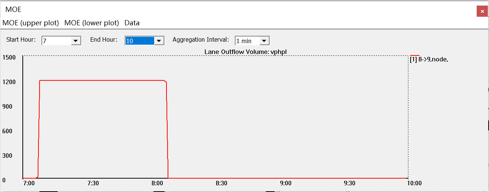

Fig.10. Interface of the MOE of link 8-\>9

Please click the “MOE (upper plot)” in the menu bar, and examine different
traffic state variables shown in Fig.11. One can use the key combination
“control +click” to select multiple links into the link MOE display.

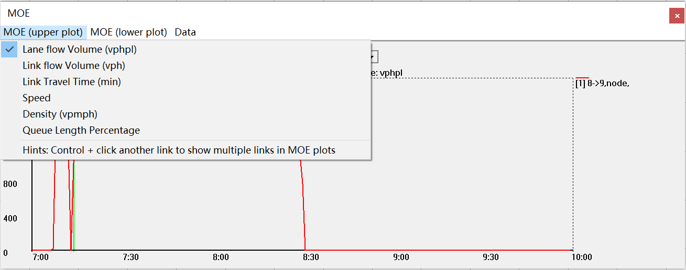

Fig.11. Detailed content of Link MOE

### (IV) Time-dependent Link MOE Visualization

Following the steps introduced in Lesson 1.1, one can also visualize traffic
states using the tool bars shown in Fig.12.

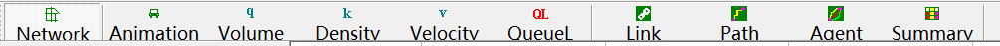

Fig.12. Shortcut icons for traffic simulation and analysis

### (V) Introduction to two methods for traffic state estimation

Now we introduce two calculation methods for estimating traffic states in this
document.

**(i) Graphical method**

Take the freeway on path 1 as an example. Its property is shown in the Fig.13,
and the flow-density relationship for different lanes of links can be plotted in
Fig.14.

| [media/b7b842fe82727c35ea34397649244051.png](media/b7b842fe82727c35ea34397649244051.png) Fig.13. Properties of link | [media/f5dccf0516ea2c39ffd772972df09e13.jpeg](media/f5dccf0516ea2c39ffd772972df09e13.jpeg) Fig.14. The flow-density relationship for different lanes of links |
|---------------------------------------------------------------------------------------------------------------------|---------------------------------------------------------------------------------------------------------------------------------------------------------------|

**(ii) KW simulation model in DTALite**

Dr. Newell’s papers on kinematic wave modeling are

*A Simplified Theory of Kinematic Waves in Highway Traffic*, part 1, 2, 3, (
G.F.Newell, 1993 )

DTALite has implemented the simulation steps, and interested readers can find
the source code at https://code.google.com/p/nexta/source/list.

The high-level overview of the three test cases in our experiment is shown in
Fig.15.

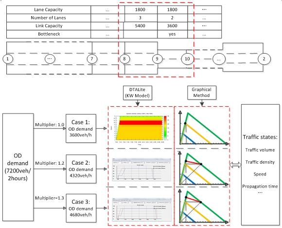

Fig.15. High-level overview of three testing cases

## (4) Simulation setup

Review “network data” in node.csv and link.csv, “demand data” in settings.csv.

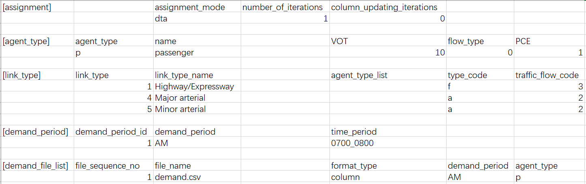

Fig.16. the file of simulation settings with assignment mode of dta

# **Case 1: demand = supply (demand = 3600)**

## (1) DTALite (KW Simulation Model)

The hourly OD demand is 3600 vehicles and the limit capacity of the path 1 is
3600, so now the demand is equal to the path capacity.

**1)** Check the value of traffic demand

The traffic demand from origin zone 1 to destination zone 2 is 3600 vehicles in
one hours. You can check value of traffic demand from “demand.csv” in the
project folder.

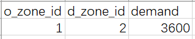

Fig.17. The Excel dispaly of demand.csv for case 1

**2)** Setup simulation settings

Please use the following simulation settings shown in Fig.18.

| [media/e918d348dfdc1b89730bc499493702e8.png](media/e918d348dfdc1b89730bc499493702e8.png) Fig.18. The Excel display of settings.csv for case 1 | Link Traffic Flow Model: “**Newell’s Kinematic Wave Model”** \# of Iterations/Days: **1** Click on **“Run Simulation”**  |
|-----------------------------------------------------------------------------------------------------------------------------------------------|--------------------------------------------------------------------------------------------------------------------------|

**3)** View the result of simulation and analyze traffic states

**3.1)** Traffic variable: “Total Volume over Capacity Ratio”

**(i)** View the simulation result in “link_performance.csv”.

In the table 4, we can know the change of flow on link 8-\>9 during
7:00am-8:10am, the total flow is 3600 and the total volume over capacity ratio
is 0.6667.

Table 4. Simulation Data of link8-\>9 in the file link_performance.csv.

| link_id | from_node_id | to_node_id | time_period     | volume | CA   | CD   | queue | travel_time | waiting_time_in_sec | speed  |
|---------|--------------|------------|-----------------|--------|------|------|-------|-------------|---------------------|--------|
| 7       | 8            | 9          | 0700:00_0701:00 | 0      | 0    | 0    | 0     | 0           | 0                   | 60     |
| 7       | 8            | 9          | 0701:00_0702:00 | 0      | 0    | 0    | 0     | 1           | 0                   | 60     |
| 7       | 8            | 9          | 0702:00_0703:00 | 0      | 0    | 0    | 0     | 1           | 0                   | 60     |
| 7       | 8            | 9          | 0703:00_0704:00 | 0      | 0    | 0    | 0     | 1           | 0                   | 60     |
| 7       | 8            | 9          | 0704:00_0705:00 | 0      | 0    | 0    | 0     | 1           | 0                   | 60     |
| 7       | 8            | 9          | 0705:00_0706:00 | 0      | 0    | 0    | 0     | 1           | 0                   | 60     |
| 7       | 8            | 9          | 0706:00_0707:00 | 0      | 1    | 0    | 0     | 1           | 0                   | 60     |
| 7       | 8            | 9          | 0707:00_0708:00 | 1      | 61   | 1    | 0     | 1           | 0                   | 60     |
| 7       | 8            | 9          | 0708:00_0709:00 | 60     | 121  | 61   | 0     | 1           | 0                   | 60     |
| 7       | 8            | 9          | 0709:00_0710:00 | 60     | 181  | 121  | 0     | 1           | 0                   | 60     |
| 7       | 8            | 9          | 0710:00_0711:00 | 60     | 241  | 181  | 0     | 1           | 0                   | 60     |
| 7       | 8            | 9          | 0711:00_0712:00 | 60     | 301  | 241  | 0     | 1           | 0                   | 60     |
| 7       | 8            | 9          | 0712:00_0713:00 | 60     | 361  | 301  | 0     | 1           | 0                   | 60     |
| 7       | 8            | 9          | 0713:00_0714:00 | 60     | 421  | 361  | 0     | 1           | 0                   | 60     |
| 7       | 8            | 9          | 0714:00_0715:00 | 60     | 481  | 421  | 0     | 1           | 0                   | 60     |
| 7       | 8            | 9          | 0715:00_0716:00 | 60     | 541  | 481  | 0     | 1           | 0                   | 60     |
| 7       | 8            | 9          | 0716:00_0717:00 | 60     | 601  | 541  | 0     | 1           | 0                   | 60     |
| 7       | 8            | 9          | 0717:00_0718:00 | 60     | 661  | 601  | 0     | 1           | 0                   | 60     |
| 7       | 8            | 9          | 0718:00_0719:00 | 60     | 721  | 661  | 0     | 1           | 0                   | 60     |
| 7       | 8            | 9          | 0719:00_0720:00 | 60     | 781  | 721  | 0     | 1           | 0                   | 60     |
| 7       | 8            | 9          | 0720:00_0721:00 | 60     | 841  | 781  | 0     | 1           | 0                   | 60     |
| 7       | 8            | 9          | 0721:00_0722:00 | 60     | 901  | 841  | 0     | 1           | 0                   | 60     |
| 7       | 8            | 9          | 0722:00_0723:00 | 60     | 961  | 901  | 0     | 1.001       | 0.033               | 59.967 |
| 7       | 8            | 9          | 0723:00_0724:00 | 60     | 1021 | 961  | 0     | 1           | 0                   | 60     |
| 7       | 8            | 9          | 0724:00_0725:00 | 60     | 1081 | 1021 | 0     | 1           | 0                   | 60     |
| 7       | 8            | 9          | 0725:00_0726:00 | 60     | 1141 | 1081 | 0     | 1           | 0                   | 60     |
| 7       | 8            | 9          | 0726:00_0727:00 | 60     | 1201 | 1141 | 0     | 1           | 0                   | 60     |
| 7       | 8            | 9          | 0727:00_0728:00 | 60     | 1261 | 1201 | 0     | 1           | 0                   | 60     |
| 7       | 8            | 9          | 0728:00_0729:00 | 60     | 1321 | 1261 | 0     | 1           | 0                   | 60     |
| 7       | 8            | 9          | 0729:00_0730:00 | 60     | 1381 | 1321 | 0     | 1           | 0                   | 60     |
| 7       | 8            | 9          | 0730:00_0731:00 | 60     | 1441 | 1381 | 0     | 1           | 0                   | 60     |
| 7       | 8            | 9          | 0731:00_0732:00 | 60     | 1501 | 1441 | 0     | 1           | 0                   | 60     |
| 7       | 8            | 9          | 0732:00_0733:00 | 60     | 1561 | 1501 | 0     | 1           | 0                   | 60     |
| 7       | 8            | 9          | 0733:00_0734:00 | 60     | 1621 | 1561 | 0     | 1           | 0                   | 60     |
| 7       | 8            | 9          | 0734:00_0735:00 | 60     | 1681 | 1621 | 0     | 1           | 0                   | 60     |
| 7       | 8            | 9          | 0735:00_0736:00 | 60     | 1741 | 1681 | 0     | 1           | 0                   | 60     |
| 7       | 8            | 9          | 0736:00_0737:00 | 60     | 1801 | 1741 | 0     | 1           | 0                   | 60     |
| 7       | 8            | 9          | 0737:00_0738:00 | 60     | 1861 | 1801 | 0     | 1           | 0                   | 60     |
| 7       | 8            | 9          | 0738:00_0739:00 | 60     | 1921 | 1861 | 0     | 1.001       | 0.05                | 59.95  |
| 7       | 8            | 9          | 0739:00_0740:00 | 60     | 1981 | 1921 | 0     | 1           | 0                   | 60     |
| 7       | 8            | 9          | 0740:00_0741:00 | 60     | 2041 | 1981 | 0     | 1           | 0                   | 60     |
| 7       | 8            | 9          | 0741:00_0742:00 | 60     | 2101 | 2041 | 0     | 1           | 0                   | 60     |
| 7       | 8            | 9          | 0742:00_0743:00 | 60     | 2161 | 2101 | 0     | 1           | 0                   | 60     |
| 7       | 8            | 9          | 0743:00_0744:00 | 60     | 2221 | 2161 | 0     | 1           | 0                   | 60     |
| 7       | 8            | 9          | 0744:00_0745:00 | 60     | 2281 | 2221 | 0     | 1           | 0                   | 60     |
| 7       | 8            | 9          | 0745:00_0746:00 | 60     | 2341 | 2281 | 0     | 1           | 0                   | 60     |
| 7       | 8            | 9          | 0746:00_0747:00 | 60     | 2401 | 2341 | 0     | 1           | 0                   | 60     |
| 7       | 8            | 9          | 0747:00_0748:00 | 60     | 2461 | 2401 | 0     | 1           | 0                   | 60     |
| 7       | 8            | 9          | 0748:00_0749:00 | 60     | 2521 | 2461 | 0     | 1           | 0                   | 60     |
| 7       | 8            | 9          | 0749:00_0750:00 | 60     | 2581 | 2521 | 0     | 1           | 0                   | 60     |
| 7       | 8            | 9          | 0750:00_0751:00 | 60     | 2641 | 2581 | 0     | 1           | 0                   | 60     |
| 7       | 8            | 9          | 0751:00_0752:00 | 60     | 2701 | 2641 | 0     | 1           | 0                   | 60     |
| 7       | 8            | 9          | 0752:00_0753:00 | 60     | 2761 | 2701 | 0     | 1           | 0                   | 60     |
| 7       | 8            | 9          | 0753:00_0754:00 | 60     | 2821 | 2761 | 0     | 1           | 0                   | 60     |
| 7       | 8            | 9          | 0754:00_0755:00 | 60     | 2881 | 2821 | 0     | 1           | 0                   | 60     |
| 7       | 8            | 9          | 0755:00_0756:00 | 60     | 2941 | 2881 | 0     | 1           | 0                   | 60     |
| 7       | 8            | 9          | 0756:00_0757:00 | 60     | 3001 | 2941 | 0     | 1           | 0                   | 60     |
| 7       | 8            | 9          | 0757:00_0758:00 | 60     | 3061 | 3001 | 0     | 1           | 0                   | 60     |
| 7       | 8            | 9          | 0758:00_0759:00 | 60     | 3121 | 3061 | 0     | 1           | 0                   | 60     |
| 7       | 8            | 9          | 0759:00_0800:00 | 60     | 3181 | 3121 | 0     | 1           | 0                   | 60     |
| 7       | 8            | 9          | 0800:00_0801:00 | 60     | 3241 | 3181 | 0     | 1           | 0                   | 60     |
| 7       | 8            | 9          | 0801:00_0802:00 | 60     | 3301 | 3241 | 0     | 1           | 0                   | 60     |
| 7       | 8            | 9          | 0802:00_0803:00 | 60     | 3361 | 3301 | 0     | 1           | 0                   | 60     |
| 7       | 8            | 9          | 0803:00_0804:00 | 60     | 3421 | 3361 | 0     | 1           | 0                   | 60     |
| 7       | 8            | 9          | 0804:00_0805:00 | 60     | 3481 | 3421 | 0     | 1           | 0                   | 60     |
| 7       | 8            | 9          | 0805:00_0806:00 | 60     | 3541 | 3481 | 0     | 1           | 0                   | 60     |
| 7       | 8            | 9          | 0806:00_0807:00 | 60     | 3600 | 3541 | 0     | 1           | 0                   | 60     |
| 7       | 8            | 9          | 0807:00_0808:00 | 59     | 3600 | 3600 | 0     | 1           | 0                   | 60     |
| 7       | 8            | 9          | 0808:00_0809:00 | 0      | 3600 | 3600 | 0     | 1           | 0                   | 60     |
| 7       | 8            | 9          | 0809:00_0810:00 | 0      | 3600 | 3600 | 0     | 1           | 0                   | 60     |

**(ii)** Analyze the simulation result: “Total Volume over Capacity Ratio”

Question: Why Link 9-\>10 and link 10-\>11 are easy to be bottleneck? It is due
to its capacity and traffic demand. In this case, the path 1 is only chosen. The
capacity of the link is 3600 per hour, the OD demand is 3600 vehicles per hour,
so its volume/capacity is 1.

**3.2)** View the traffic states of one path

**(i)** View the simulation result

Through the operation mentioned above, the traffic states of path 1 can be
viewed in Fig.19.

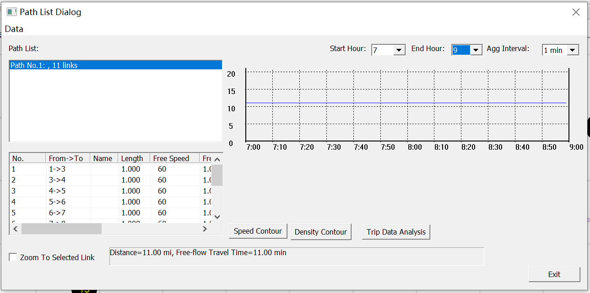

Fig. 19. Path List Dialog for Path 1.

Then, click on the “Density Contour”, “Speed Contour”, and “Trip Data Analysis”
to analyze the details of this traffic assignment. The assumption is that you
have installed the **gnuplot** software at
.

**(ii)** Analyze the simulation result:

In this case, the density contour is shown in Fig. 20. Similarly, other analyses
can also be displayed easily.

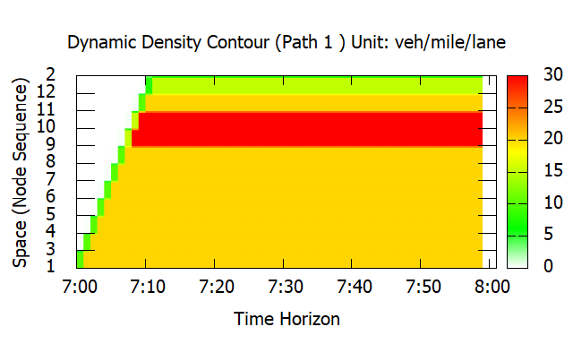

Fig. 20. The plot of dynamic density of path 1

From this figure, link 9-\>10 and link 10-\>11 has a high density, which is
consistent with the above “Total Volume over Capacity Ratio”.

**3.3)** View link MOE of bottleneck links

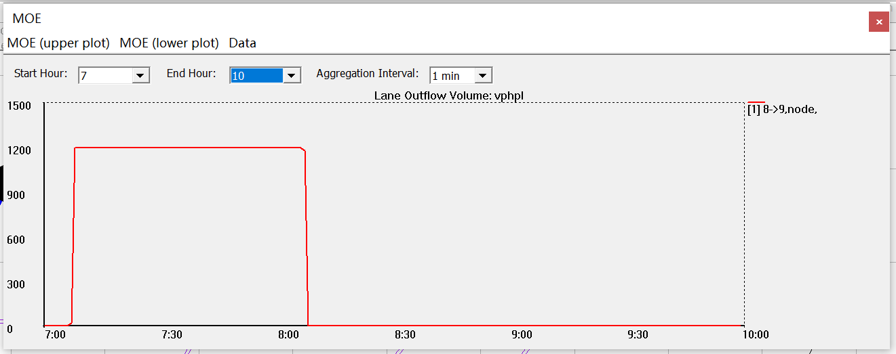

Fig.21. Simulated lane volume of link 8-\>9

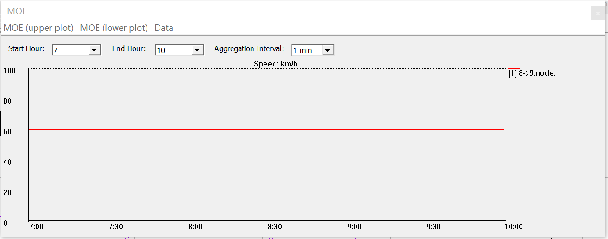

Fig.22. Simulated speed of link 8-\>9

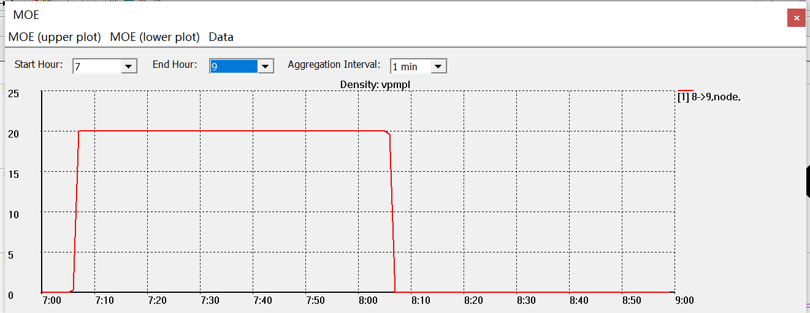

Fig.23. Simulated density of link 8-\>9

**Problem 3 (for students)**

Please show the traffic density, speed and link and lane-based volume time
series plots for links 8-\>9 and link 9-\>10. Explain why the density on link
8-\>9 is 20 vehicles per mile per lane, shown in Fig. 22.

**Problem 4 (for students)**

In order to have detailed data extracted from the simulation results, please
click on Menu-\>Data -\>Export Link MOE to CSV File.

Please plot the flow-density points in the Q-K relationship figure for links
8-\>9 and 9-\>10.

##  (2) Graphical Method

In order to ensure DTALite provides results from the analytical method, we now
examine link 8-\>9 and link 9-\>10. Recall that, link 8-\>9 has three lanes and
link 9-\>10 has two lanes. One can derive their traffic states using the
graphical method shown in Fig.23. and Fig.24.

| [media/6554229798d1ecbff963d5b90741a793.jpeg](media/6554229798d1ecbff963d5b90741a793.jpeg) Fig.24. The flow-density relationship for different states of links | [media/89f9a93ec141e340938756fe2f30c3bf.png](media/89f9a93ec141e340938756fe2f30c3bf.png) U: interface between two different traffic states. State O: there is no traffic flow State A: the demand traffic enter the link 8-\>9 State C: the steady traffic state of link 9-\>10                                                                                                                                                          |
|----------------------------------------------------------------------------------------------------------------------------------------------------------------|------------------------------------------------------------------------------------------------------------------------------------------------------------------------------------------------------------------------------------------------------------------------------------------------------------------------------------------------------------------------------------------------------------------------------------------|
| [media/bebdec7aedce4439999cbbb50767b888.jpeg](media/bebdec7aedce4439999cbbb50767b888.jpeg) Fig.25. Vehicles’ trajectory in space-time diagram                  | **Speed:** The speed of link 8-\>9 and link 9-\>10 is the free flow speed, 60 mph, because the demand is equal to the capacity for the two links. **Density:** Link 8-\>9 is always at the state A and link 9-\>10 is at the state C, so its density is 60 vpmpl(link) for the both links. Meanwhile, about the density of each lane, link 8-\>9 is 20 vpmpl(lane) and link 9-\>10 is 30 vpmpl(lane). **Propagation time duration**: N/A |

# **Case2: demand \> supply (demand=5000)**

## (1) DTALite (KW Simulation Model)

The hourly OD demand is 5000 vehicles and the limit capacity of the path 1 is
3600, so now the demand is slightly higher than the path capacity. As a result,
a traffic congestion is formed and further propagated to the upstream corridor.
The procedures are

1.  Change the demand.csv in the excel sheet.

    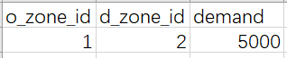

2.  Run the simulation for 1 iteration.

3.  View its density contour shown in Fig.25.

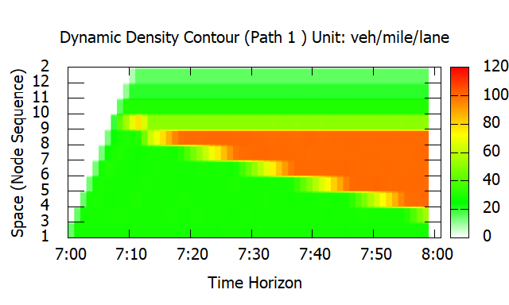

Fig.26. Density contour of path 1 in case 2

Indicated by the above figure, traffic congestion starts from link 8-\>9, and
then propagates back to upstream links. Then the traffic jam reaches the
starting link 1-\>3 (without further space to accommodate the congestion),
leading to continuously increasing density.

3) Check the speed, density, and propagation time of link 8-\>9 from the “Link
MOE” dialog, shown in Fig.27. and Fig.28, respectively.

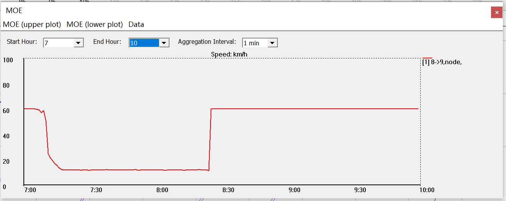

Fig.27. Simulated speed of link 8-\>9

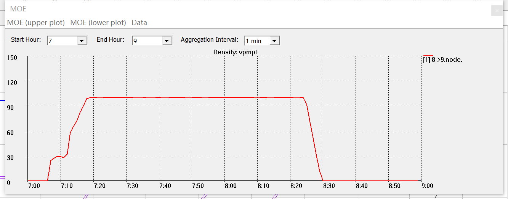

Fig.28. Simulated density of link 8-\>9

**Problem 5**

Describe traffic speed and density evolutions on links 7-\>8 and 8-\>9.
Calculate the traffic congestion speed.

**Hints**: The speed of link 8-\>9 changes from 60 mph to 15 mph in the first 20
min, and its density increases from 0 vpmpl to 100 vpmpl.

To calculate traffic congestion propagation speed, we need to measure the
propagation time and link length (1 mile). First, we need to select two links
simultaneously, link 8-\>9 and link 7-\>8. Using key combination “ctrl +mouse
click”, we can obtain the link MOE plot shown in Fig.28 and then measure the
queue propagation time.

Fig.28. the simulation density of two links, 8-\>9 and 7-\>8

One can also precisely measure the exact propagation time duration using
exported link MOE csv file. The method for exporting the Link MOE csv is: click
the “Export Link MOE to CSV File” of “Data” in the menu bar of MOE dialog.

-   When the density (link 8-\>9) becomes 80, the corresponding time is 441min

-   When the density (link 7-\>8) becomes 80 for, the corresponding time is 455
    min.

Thus, the propagation time duration is 14 min.

## (2) Graphical Method

Given an increased demand, the flow-density plot is updated in Fig.29.and the
graphical illustration is shown in Fig.30.

| [media/a4417284a8e9e7e5cdb302308fbea335.jpeg](media/a4417284a8e9e7e5cdb302308fbea335.jpeg) Fig.29. The flow-density relationship for different states of links | [media/89f9a93ec141e340938756fe2f30c3bf.png](media/89f9a93ec141e340938756fe2f30c3bf.png) U: interface between two different traffic states. State O: there is no traffic flow State A: the demand traffic enters the link 8-\>9 State B: the steady traffic state of link 8-\>9 State C: the steady traffic state of link 9-\>10                                                                                                                                                                                                                                                                                      |
|----------------------------------------------------------------------------------------------------------------------------------------------------------------|-----------------------------------------------------------------------------------------------------------------------------------------------------------------------------------------------------------------------------------------------------------------------------------------------------------------------------------------------------------------------------------------------------------------------------------------------------------------------------------------------------------------------------------------------------------------------------------------------------------------------|
| [media/a62adbbdfe4fe7822cf1844bd0406678.png](media/a62adbbdfe4fe7822cf1844bd0406678.png) Fig.30. Vehicles’ trajectory in time-space diagram                    | **Speed:** for link 8-\>9, at state A, its speed is 60 mph; at state B, due to the limitation of capacity, its speed is 15 mph. For link 9-\>10, the vehicles will drive at a speed based on the capacity, state C, whose speed is 60 mph; **Density:** for link 8-\>9, at the state A, its density is 72 vpmpl(link). After the propagation time, it is at the state B, whose density is 240 vpmpl(link). Meanwhile, the link 9-\>10 is always at the state C, whose density is 60 vpmpl(link). In addition, the method of calculating the density of each lane is the same as case 1. **Propagation time:** 14 min. |

**Problem 6**

Please compare the results between the simulation method and the graphical
method. What is the expected start time for vehicles on link 7-\>8 seeing
traffic congestion?

# **Case 3: demand \> supply (demand = 6400)**

## (1) DTALite (KW Simulation Model)

In this case, the demand OD is still 6400 from 7am to 8am. The analysis process
is the same as case 2.

Select the “Link MOE” of the GIS layer panel -\> click the link 8-\>9. Then show
the “speed” and “density” of MOE to analyze the traffic state. For example, when
clicking the “speed (mph)”, it is shown in Fig.31; when clicking the “density
(vpmpl)”, it is shown in Fig.32.

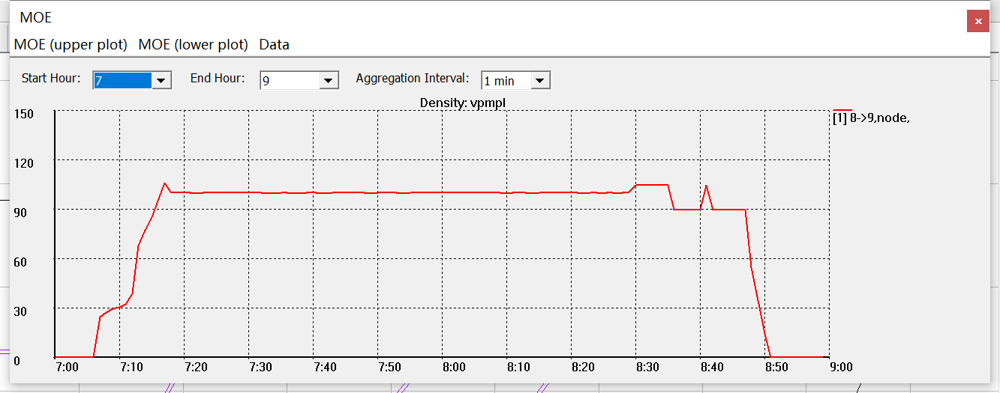

Fig.31. Simulated density of link 8-\>9

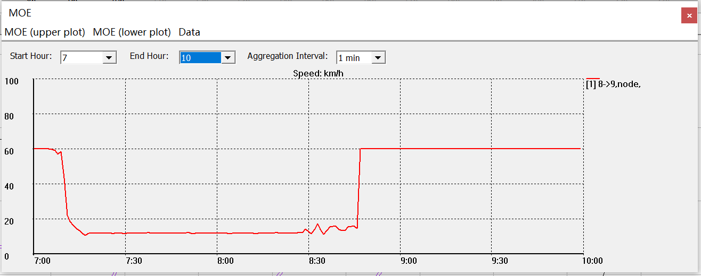

Fig.32 Simulated speed of link 8-\>9

>   The speed of link 8-\>9 changes from 60 mph to 15 mph, and its density of
>   one lane increases from 0 vpmpl to 100 vpmpl. A traffic congestion
>   propagation time of 9 min can be observed in Fig.33.

Fig.33. Simulated density of two links, 8-\>9 and 7-\>8

## (2) Graphical Method

Given an increased demand, the corresponding flow-density relationship is
illustrated in Fig.34 and the graphical illustration is shown in Fig.35.

| [media/eef64502cfd366ff292005d068e658b2.jpeg](media/eef64502cfd366ff292005d068e658b2.jpeg) Fig.34. The flow-density relationship for different states of links | [media/89f9a93ec141e340938756fe2f30c3bf.png](media/89f9a93ec141e340938756fe2f30c3bf.png) U: interface between two different traffic states. State O: there is no traffic flow State A: the demand traffic enter the link 8-\>9 State B: the steady traffic state of link 8-\>9 State C: the steady traffic state of link 9-\>10                                                                                                                                                                                                                                                                      |
|----------------------------------------------------------------------------------------------------------------------------------------------------------------|------------------------------------------------------------------------------------------------------------------------------------------------------------------------------------------------------------------------------------------------------------------------------------------------------------------------------------------------------------------------------------------------------------------------------------------------------------------------------------------------------------------------------------------------------------------------------------------------------|
| [media/413578ad24dc2baec89561cb80afbf68.png](media/413578ad24dc2baec89561cb80afbf68.png) Fig.35. Vehicles’ trajectory in time-space diagram                    | **Speed:** For link 8-\>9, at state A, its speed is 60 mph; at state B, due to the limitation of capacity, its speed is 15 mph. For link 9-\>10, the vehicles will drive in a speed based on the capacity, state C, whose speed is 60 mph; **Density**: For link 8-\>9, at state A, its density is 78 vpmpl(link). After the propagation time, at state B, its density is 240 vpmpl(link). Meanwhile, the link 9-\>10 is always at the state C, whose density is 60 vpmpl(link). In addition, the method of calculating the density of each lane is the same as case 1. **Propagation time:** 9 min. |

**Problem 7**

Please compare the results of cases 1, 2 and 3, and plot path 1 travel time in
time horizon under three OD demand levels.

**Remark:**

You can access to “export_path_MOE.csv” from menu bar of path dialog “Data”-\>
“Export Path Statistics To External CSV File” as shown in fig. 36. to analyze
travel time of path 1 for different cases.

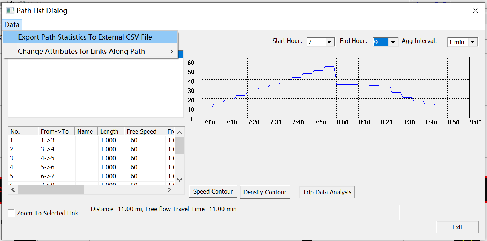

Fig. 36. Process of Exporting export_path_MOE File from NeXTA after Simulation
for Case 3.

**Problem 8**

In case 3, how much time does it take from traffic congestion propagating from
the bottleneck to the origin node? Please calculate the congestion propagation
time analytically, and then check your estimated value based on the “density
contour” or “speed contour” in NeXTA.

5. Traffic States as a result of demand-supply interactions

**1. Base case without toll settings**

The 3-corridor traffic network is chosen as our test case.

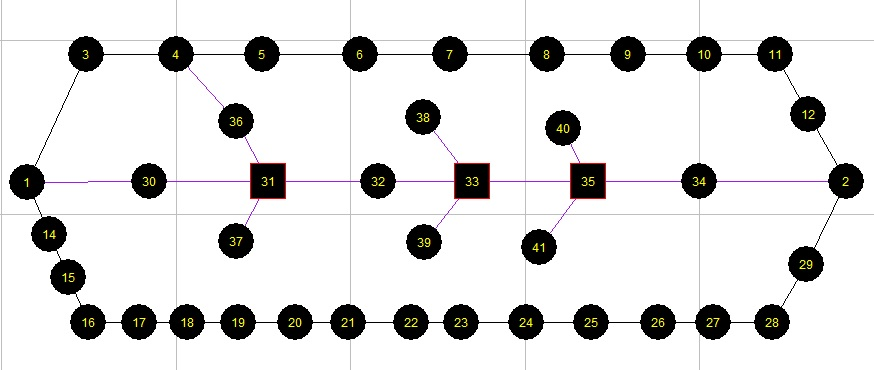

Fig. 37. Layout of 3-corridor Traffic Network

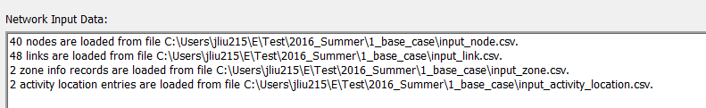

Fig. 38. Data Loading Status

There are three main paths from zone 1 (node 1) to zone 2 (node 2), which are
listed as follows:

Fig. 39. Direction of Paths with Associated Travel Times

Now we just run one iteration as our base case, and the specific settings and
data set can be downloaded at
“learning_document\\2_traffic_flow_model_and_impact_study”. Since the shortest
path is path 1, all vehicles choose path 1 at 1st iteration. The result can be
checked in NeXTA as follows:

Fig. 40. Vehicle Dialog Box of Base Condition.

Step 1: Click “Agent” to call the dialogue of “Find/Filter Agent”.

Step 2: Choose the target OD pair and corresponding conditions. In this case, we
choose OD pair 12.

Step 3: Click the OD list to check the general summary of OD pair 12.

Step 4: Choose one used path in Path List, which is visualized in traffic
network as shown in the fig. 40. Meanwhile, the general information of each
vehicle that choose that path is listed in Vehicle List. It is obvious that all
vehicles choose path 1 after 1 iteration.

**Solution Problems in Learning Document 3.2**

**Prepared by Xuesong Zhou (**<xzhou74@asu.edu>**)**

**Problem 1:**

**(1) Which node is defined as the origin node of zone 1? (check node.csv
file)**

An origin node is a node where traffic demand (activity) is loaded from the
origin zone, so the node is the activity location (i.e. centroid) of the origin
zone. The node 1 is the origin node of zone 1.

**(2) Which node is defined as the destination node of zone 2? (check
node.csv)**

Node 2 is the destination node.

**(3) How many trips are loaded from 7AM to 8AM. (check input_demand_file_list
file and associated demand file.)**

From input_demand_file_list.csv, we can find the demand file as input_demand.csv
and a demand duration covering from 420 min to 540 min, and the input_demand.csv
file further shows demand from zone 1 to zone 2 as 3600. Therefore, the trips
loaded from 7am to 8am are 3600.

**Problem 2:**

**(1) Which path will be selected at the first iteration?**

Since the free-flow travel times of path 1, path 2, and path 3 are 11 min, 12
min, and 17 min, respectively, path 1 has the least travel time and will be
selected at the first iteration.

**(2) Find links with minimum capacity along three paths. Show the upstream node
and downstream node numbers of those links and the hourly capacity values.
Please use an image to highlight these links in the traffic network.**

On path 1, the links with the minimum capacity are 9-\>10 and 10-\>11 with
capacity of 3600vph; On path 2, the links with the minimum capacity are 30-\>31,
32-\>33, 33-\>35 and 35-\>34 with capacity 1800vph; On path 3, all links have
capacity 5400vph. Those links in the traffic network can be visualized in the
following Figure. (please click “Config” at top of GIS panel -\>”Link Capacity”
in “Link Text”-\> “OK” to show the text labels in the network)

Remark: if you download the dataset linked in the learning document, please
check the capacity and number of lanes for link9-\>10. Its lane capacity should
be 1800vph, and the number of lanes are 2.

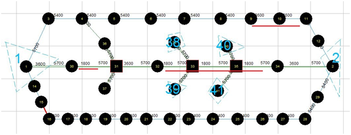

**(3) What is the expected speed on link 8-\>9, if the demand is 5400 vehicles
per hour, and all vehicles use the first path?**

When the demand is 5400vph: since the path 1 will be first selected and the
capacity of link 8-\>9 and link 9-\>10 is 5400vph and 3600vph, respectively,
node 9 will form a bottleneck. At the beginning of traffic simulation, the
expected speed of link 8-\>9 is the free-flow speed of 60 mph, and then the
speed will decrease as the congestion propagates. You can also set the demand as
5400 in input_demand_file_list to check your analysis. The speed plot is shown
as below:

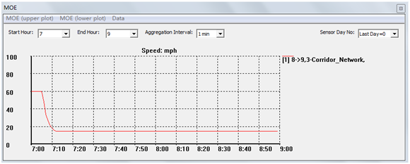

Remark:

When you set the simulation settings: the number 3 means kinematic wave model
and the number 2 means spatial queue.

**Problem 3:**

**Please show the traffic density, speed and link and lane-based volume time
series plots for links 8-\>9 and link 9-\>10. Explain why the density on link
8-\>9 is 20 vehicles per mile per lane, shown in Fig. 22.**

**Remark:**

**There would be an approximation error in NeXTA simulation.**

Traffic density for link 8-\>9:

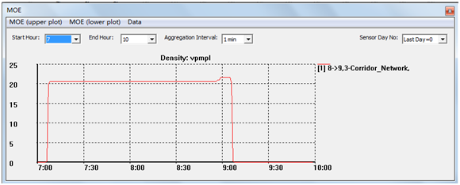

Traffic speed for link 8-\>9:

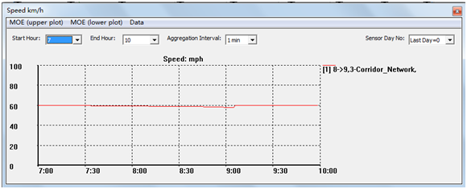

Traffic lane-based volume for link 8-\>9:

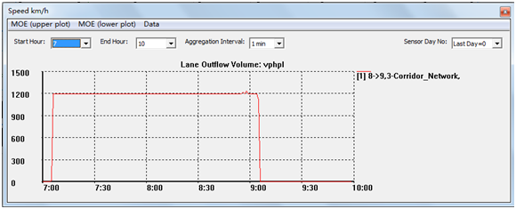

Traffic link-based volume for link 8-\>9:

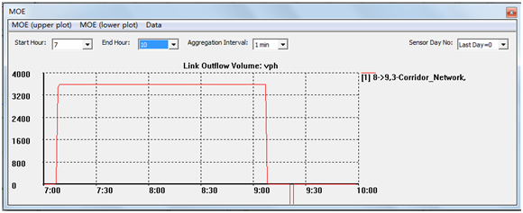

Traffic density for link 9-\>10:

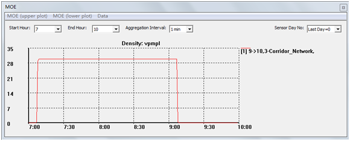

Traffic speed for link 9-\>10:

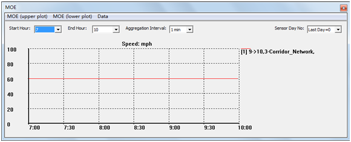

Traffic lane-based volume for link 9-\>10:

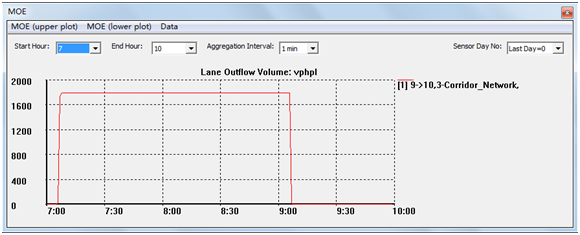

Traffic link-based volume for link 9-\>10:

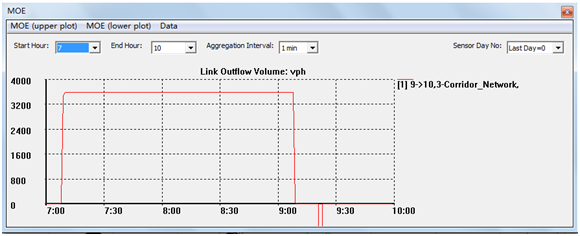

Based on the Q-K relationship, when link outflow is 3600 vehicles/per hour, the
corresponding density is 60vpmpl. Since the lane number is 3 for link 8-\>9, the
final lane density is (60/3)20 vpmpl. This is also right about link 9-\>10, the
corresponding density is 60 vpmpl. As a result, the density for each lane is
(60/2)30 vpmpl.

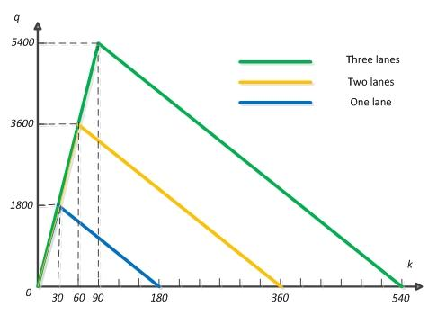

**Problem 4:**

**In order to have detailed data extracted from the simulation results, please
click on Menu bar of MOE dialog-\>Data -\>Export Link MOE to CSV File.**

**Please plot the flow-density points in the Q-K relationship figure for links
8-\>9 and 9-\>10.**

Based on the exported csv file, the lane outflow volume and density are listed
in the following table for the link 8-\>9:

| Lane outflow volume | density |
|---------------------|---------|
| 0                   | 0       |
| 1200                | 20      |

As observed from this table, there are generally two traffic states (lane
outflow volume, density), state 1(0, 0) and state 2 (1200, 20).

The length of link 8-\>9 is 1 mile, and the speed is free-flow speed, 60mph, so
the travel time from node 8 to node 9 at the beginning when traffic flow comes
in just needs 1/60 h (1 min). It means that for link 8-\>9, the process from
traffic state 1(0, 0) to traffic state 2 (1200, 20) just needs 1 min. In the
exported statistics csv file, the statistic time interval is 1min, so you can
just see two traffic states. For link 9-\>10, the same analysis method can be
applied.

>   The below table is for link 9-\>10, lane outflow volume and density.

| Lane outflow volume | density |
|---------------------|---------|
| 0                   | 0       |
| 1800                | 30      |

Q-K curve is shown in the below figure for both link 8-\>9 and 9-\>10.

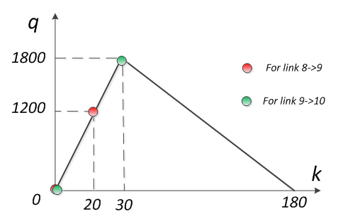

**Problem 5:**

**Describe traffic speed and density evolution on links 7-\>8 and 8-\>9.
Calculate the traffic congestion speed.**

In order to describe traffic speed and density evolution on link 7-\>8 and
8-\>9, we can use its speed and density plot in NeXTA:

(1) Speed:

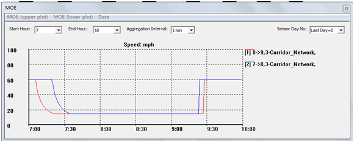

(2) Density:

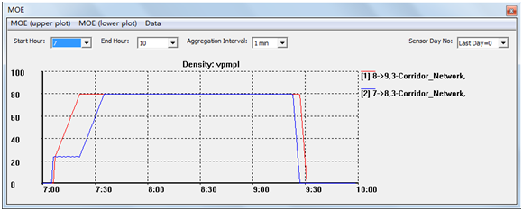

So we can observe that at the beginning, traffic is in free-flow state, and then
due to the bottleneck impact, the congestion begins to propagate. After 14 min,
it reaches at point 8, and at this time, the link 7-\>8 begins to form queues.
As the length of link 8-\>9 is 1 mile, the congestion speed is (1mile/14min)
=60/14 mph.

**Problem 6:**

**Please compare the results between the simulation method and the graphical
method. What is the expected start time for vehicles on link 7-\>8 seeing
traffic congestion?**

For 7-\>8, the same simulation method and graphical method are used:

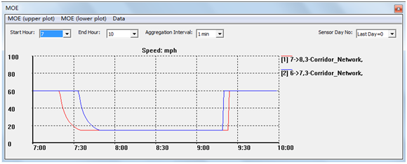

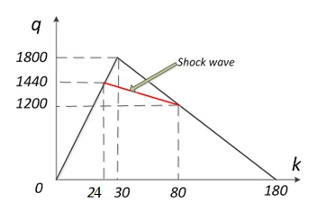

Since the properties of link 7-\>8 is the same as that of link 8-\>9, so the
propagation time is still 14min. The expected start time for vehicles on link
7-\>8 seeing traffic congestion is 455 min.

**Problem 7:**

**Please compare the results of cases 1, 2 and 3, and plot path 1 travel time in
time horizon under three OD demand levels.**

After running simulation, the travel time in the time horizon can be obtained in
the export_path_MOE.csv file. So the final results under three OD demand levels
are listed in the following table:

|         |                | case 1             | case 2             | case 3             |
|---------|----------------|--------------------|--------------------|--------------------|
| path_no | departure time | travel_time_in_min | travel_time_in_min | travel_time_in_min |
| 1       | 7:00           | 11                 | 11.18              | 11.2               |
| 1       | 7:15           | 11                 | 16.99              | 23.07              |
| 1       | 7:30           | 11                 | 22.84              | 34.24              |
| 1       | 7:45           | 11                 | 28.9               | 46.45              |
| 1       | 8:00           | 11                 | 31.48              | 34.84              |
| 1       | 8:15           | 11                 | 15.73              | 33.74              |
| 1       | 8:30           | 11                 | 11                 | 21                 |
| 1       | 8:45           | 11                 | 11                 | 11                 |

The figure is plotted as follows:

**Problem 8:**

**In case 3, how much time does it take from traffic congestion propagating from
the bottleneck to the origin node? Please calculate the congestion propagation
time analytically, and then check your estimated value based on the “density
contour” or “speed contour” in NeXTA.**

Based on the Q-K relationship, the propagation speed is (1560-1200)/(80-26)=20/3
mph:

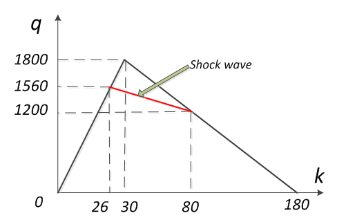

The length from node 1 to node 9 is 7 mile, so the propagation time is
7\*(3/20)\*60min = 63 min;

Based on the density contour in NeXTA:

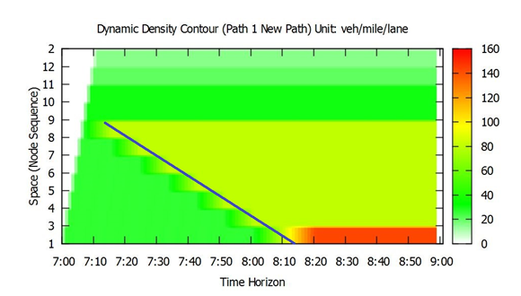

The observed propagation time from the plot is about 63 min, which is consistent
with the analytical calculation result.
