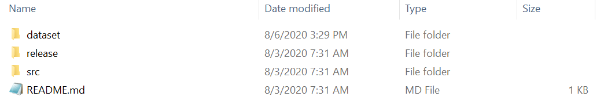
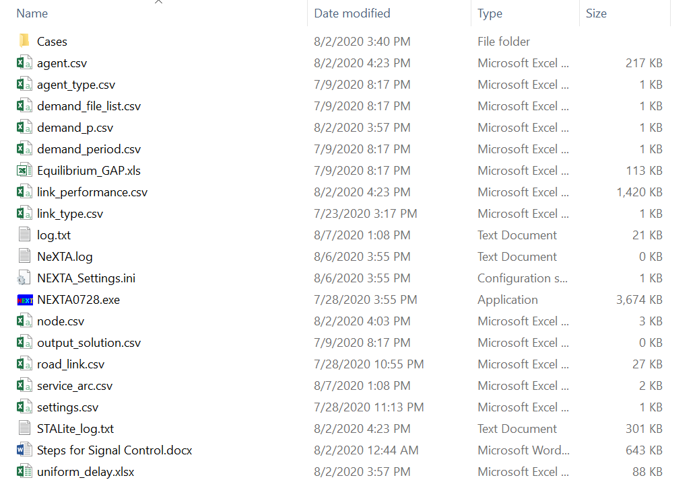
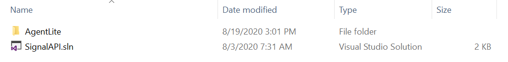
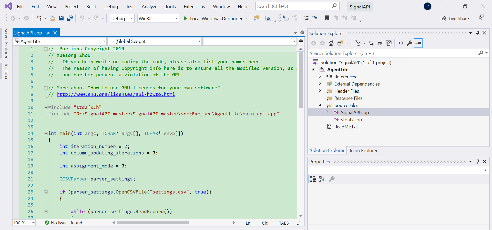
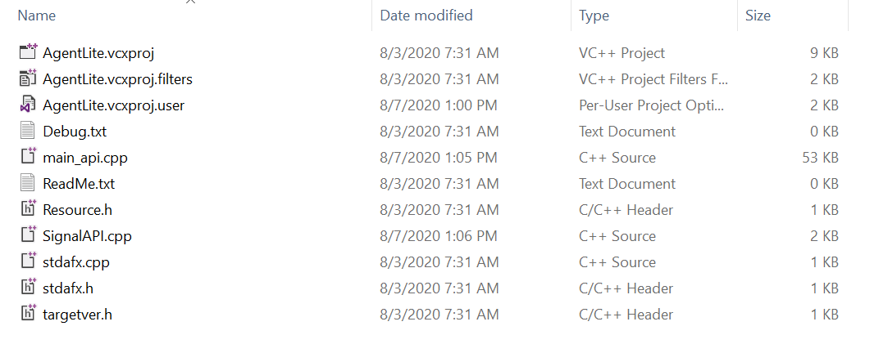
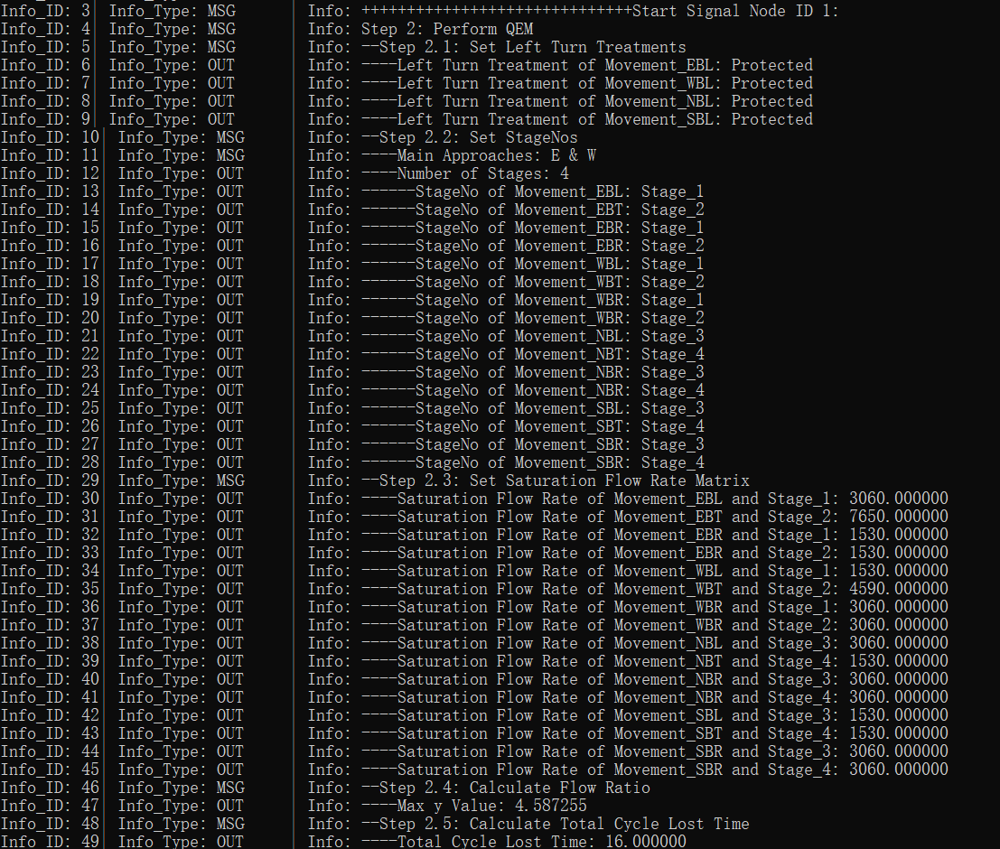
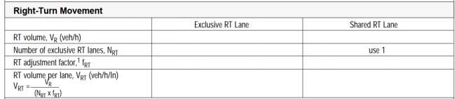
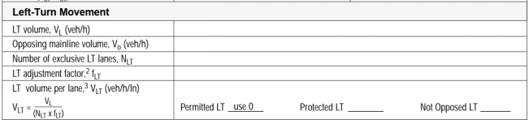
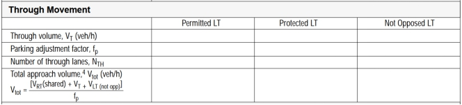
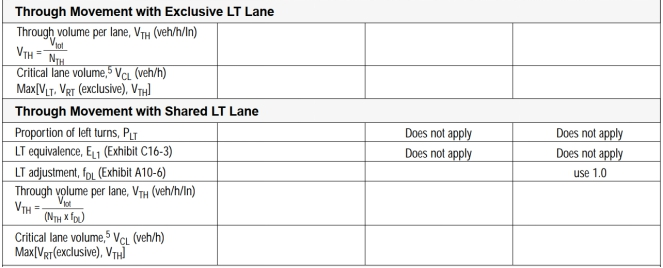

**Lesson 6 Signal Timing**

**CONTACT INFORMATION**

Further Details in <https://github.com/xzhou99/SignalAPI>

For more information, please contact:

Xuesong Zhou (<xzhou74@asu.edu>)

**TABLE OF CONTENTS**

>   [1  Introduction	1](#_Toc48761956)

>   [2  Steps for using SignalAPI	1](#_Toc48761957)

>   [2.1  Download software packages	1](#_Toc48761958)

>   [2.2  Input Data Preparation	1](#_Toc48761959)

>   [2.3  Prepare file road_link.csv	2](#_Toc48761960)

>   [2.4  Compile and run SignalAPI in visual C++ environment	3](#_Toc48761961)

>   [2.5  Screen output	4](#_Toc48761962)

>   [3  Brief introduction on computational steps of QEM	5](#_Toc48761963)

>   [Step 1. Input information	5](#_Toc48761964)

>   [Step 2. Determine left-turn treatment	5](#_Toc48761965)

>   [Step 3. Determine Ring-Barrier Structure and Movements	7](#_Toc48761966)

>   [Step 4. Adjust Lane Volumes (Calculate Analysis Flow Rate, not fully
>   implemented in Signal API)	7](#_Toc48761967)

>   [Step 5. Determine Critical Lane Group	8](#_Toc48761968)

>   [Step 6. Calculate sum of the flow ratios	8](#_Toc48761969)

>   [Step 7. Calculate total cycle lost time	8](#_Toc48761970)

>   [Step 8. Calculate minimum Cycle Length and Optimal Cycle
>   Length	9](#_Toc48761971)

>   [Step 9. Allocate green time and calculate effective green
>   time	10](#_Toc48761972)

>   [Step10. Calculate capacity and V/C ratio	10](#_Toc48761973)

>   [Step11. Calculate Signal Delay and LOS	10](#_Toc48761974)

>   [References	11](#_Toc48761975)

1 Introduction

The goal of this open-source package is to develop a light-weight computational
engine to input and optimize signal control timing data, and analyze the
effectiveness of signal control strategies. This SignalAPI engine is written in
C++ based on an QEM spreadsheet tool written by Prof. Milan Zlatkovic
(<https://github.com/milan1981/Sigma-X>).

Meanwhile, users can utilize NeXTA-GMNS
(<https://github.com/xzhou99/NeXTA-GMNS>) as a network visualization tool to
display related optimization results.

2 Steps for using SignalAPI

2.1 Download software packages

Before using SignalAPI executables, the users are strongly recommended to use
and understand the internal logic of Sigma-X.
<https://github.com/milan1981/Sigma-X>

The latest software release can be downloaded at
<https://github.com/xzhou99/SignalAPI>. Table 1. illustrates the contents of
different folders in the package.

>   Table 1. Folders of SignalAPI package

| **Github Folder Name** | **Contents**                                                                                                                                                                                                            |
|------------------------|-------------------------------------------------------------------------------------------------------------------------------------------------------------------------------------------------------------------------|
| Src                    | source code of SignalAPI                                                                                                                                                                                                |
| Release                | Executable of SignalAPI.exe in Windows                                                                                                                                                                                  |
| Doc                    | User’s guide and other documentations for SignalAPI                                                                                                                                                                     |
| Dataset                | 1. Steps for Signal Control.docx 2. GMNS based network csv files, and additional extension in the **road_link.csv** for additional movement related attributes) 3. Case studies (including 3 cases with QEM Excel file) |

2.2 Input Data Preparation

Users should collect the basic information for signal control, including
intersection id, movement type, number of lanes, lane type, and volume for each
movement.

2.3 Prepare file road_link.csv

Once we have the count data ready for the intersection of interest, please open
folder “dataset -\>1_signal_intersection_test2” (Fig.1) and locate the csv file
“road_link.csv” (Fig.2)**.**

Fig.1 Location of the folder “dataset”

Fig.2 Location of the csv file “road_link.csv”

The basic attributes of the file “road_link.csv” follow the GMNS specification
(link here). The additional fields for signal timing optimization are shown in
Table 2.

Table 2. List of additional fields for signal timing optimization

| **Field Name** | **Description**                |
|----------------|--------------------------------|
| lanes          | Number of lanes for a movement |
| main_node_id   | Intersection ID                |
| movement_str   | Movement Type                  |
| volume         | Volume for each movement       |

An illustrative example of an intersection is shown in Fig.3.

Fig.3 An illustrative example of an intersection

The user can summarize the basic information of the intersection in Table 3.

Table 3. Basic information of the illustrative intersection

| **Movement**     | EBL | EBT | EBR | WBL | WBT | WBR | NBL | NBT | NBR | SBL | SBT | SBR |
|------------------|-----|-----|-----|-----|-----|-----|-----|-----|-----|-----|-----|-----|
| **Volume**       | 104 | 697 | 304 | 201 | 762 | 93  | 127 | 640 | 112 | 138 | 896 | 122 |
| **No. of lanes** | 2   | 3   | 1   | 2   | 3   | 1   | 1   | 3   | 1   | 1   | 3   | 1   |

2.4 Compile and run SignalAPI in visual C++ environment

Firstly, open the folder “src-\>Exe_src” and open the C++ project solution file
“SignalAPI.sln”, as shown in Fig.4.

Fig.4 Location of the C++ project solution file

The source code starts with “SignalAPI.cpp”, as shown in Fig.5.

Fig.5 SignalAPI.cpp source code

The mechanism of signal control and the core modeling steps of SignalAPI are
implemented in file “main_api.cpp” (Fig.6). To successfully execute the project
with a data set, we need to setup the working directory of the data set through
“Project”-“AgentLite Attribute”-“Debugging”.

Fig.6 Location of the file “main_api.cpp”

2.5 Screen output

The output is shown partially in Fig.7. The users can check the console for the
entire display, and read the user guide to understand a detailed process of the
underlying QEM method, based on a particular data set.

Fig.7 Screen output for signal timing optimization result

3 Brief introduction on computational steps of QEM

Step 1. Input information

**Movement volume and number of lanes:**

| **Movement**     | EBL | EBT | EBR | WBL | WBT | WBR | NBL | NBT | NBR | SBL | SBT | SBR |
|------------------|-----|-----|-----|-----|-----|-----|-----|-----|-----|-----|-----|-----|
| **Volume**       |     |     |     |     |     |     |     |     |     |     |     |     |
| **No. of lanes** |     |     |     |     |     |     |     |     |     |     |     |     |
| **Shared lanes** |     |     |     |     |     |     |     |     |     |     |     |     |

Step 2. Determine left-turn treatment

1.  **Left-turn lane check**

Criterion: If the number of left-turn lane on any approach exceeds 1, then it is
recommended that the left turns on that approach be protected.

1.  **Minimum volume Check**

Criterion: If left-turn volume on any approach exceeds 240 veh/h, then it is
recommended that the left turns on that approach be protected.

1.  **Opposing Through Lanes Check**

Criterion: If there are more than 4 or more through lanes on the opposing
approach, then it is recommended that the left turns on that approach be
protected.

1.  **Opposing Traffic Speed Check**

Criterion: If the opposing traffic speed exceeds 45mph, then it is recommended
that the left turns on that approach be protected.

1.  **Minimum Cross-Product Check**

Criterion:

Protected+permissive:

| **Number of Through Lanes** | **Minimum Cross-Product** |
|-----------------------------|---------------------------|
| 1                           | 50000                     |
| 2 or more                   | 100000                    |

Protected only:

| **Number of Through Lanes** | **Minimum Cross-Product** |
|-----------------------------|---------------------------|
| 1                           | 150000                    |
| 2 or more                   | 300000                    |

Calculation: cross-product for each left-turn

| **Movement**                                                | EBL | WBL | NBL | SBL |
|-------------------------------------------------------------|-----|-----|-----|-----|
| **Opposing Through Lanes**                                  |     |     |     |     |
| **Cross-Product**                                           |     |     |     |     |
| **Exceed Protected Minimum Cross-Product?(Y/N)**            |     |     |     |     |
| **Exceed Protected+Permissive Minimum Cross-Product?(Y/N)** |     |     |     |     |
| **Protected decision**                                      |     |     |     |     |

Based on the analysis above, we can reach the left-turn final decision.

**Left-turn Final Decision**

| **Movement**            | EBL | WBL | NBL | SBL |
|-------------------------|-----|-----|-----|-----|
| **Left-turn Treatment** |     |     |     |     |

Step 3. Determine Ring-Barrier Structure and Movements

|           | **Final Ring-Barrier Structure** |   |   |   |
|-----------|----------------------------------|---|---|---|
| **Ring1** |                                  |   |   |   |
| **Ring2** |                                  |   |   |   |
|           | **Final Ring-Barrier Movement**  |   |   |   |
| **Ring1** |                                  |   |   |   |
| **Ring2** |                                  |   |   |   |

Step 4. Adjust Lane Volumes (Calculate Analysis Flow Rate, not fully implemented
in Signal API)

1.  **Right-turn Movement**

    

2.  **Left-turn Movement**

    

3.  **Through Movement**

    

4.  **Through Movement with exclusive LT lane & shared LT lane**

    

5.  **Saturation flow rate**

**for protected phase:**

The default value of saturation flow rate for protected phase is 1530veh/h/lane

**for permissive phase(for left-turn):**

The default value of saturation flow rate for permissive phase is
150-200veh/h/lane

Step 5. Determine Critical Lane Group

To determine the critical lane group for each stage, we should select the lane
group with maximum v/s(v: volume, s: saturation rate) for each stage.

Step 6. Calculate sum of the flow ratios

The sum of the flow ratios for the critical lane groups for this phasing plan
will be needed for the next section. Since this phasing plan does not include
any overlapping phases, this value is simply the sum of the highest lane group
*v*/*s* ratios for the three stages, as follows:

where

Step 7. Calculate total cycle lost time

The total lost time for the cycle will also be used in the calculation of cycle
length. In determining the total lost time for the cycle, the general rule is to
apply the lost time for a critical lane group when its movements are initiated
(the start of its green interval). The total cycle lost time is given as

where

Step 8. Calculate minimum Cycle Length and Optimal Cycle Length

1.  **calculation of minimum cycle length:**

where

1.  **calculation of optimal cycle length:**

A practical equation for the calculation of the cycle length that seeks to
minimize

vehicle delay was developed by Webster (1969). Webster’s optimum cycle length

formula is

where

The analytical cycle length determined from the above calculation is only
approximate in nature, and should be further adjusted to the real-world
considerations. Webster noted that values between 0.75and 1.5 will likely give
similar values of delay, and engineers typically select a cycle length as a
multiplier of 5 or 10 seconds, e.g., 70 seconds, as oppose to 67.5 seconds.

Step 9. Allocate green time and calculate effective green time

There are several strategies for allocating the green time to the various
stages. One of the most popular and simplest is to distribute the green time so
that the *v*/*c* ratios are equalized for the critical lane groups, as by the
following equation:

where

Effective green time is calculated as follows:

where

Step10. Calculate capacity and V/C ratio

Capacity can be calculated as follows:

where

Then we can calculate the ratio of V/C.

Step11. Calculate Signal Delay and LOS

1.  **Average Uniform Delay**

2.  **Average Incremental Delay (not fully implemented in Signal API)**

where

1.  **Control Delay**

2.  **Approach Delay**

where

1.  **Intersection Delay**

where

1.  **LOS for each lane group, each approach and the intersection**

The corresponding relationship between LOS and control delay is shown in Table
3:

Table 3. The relationship of LOS and Control delay

| LOS | Control delay per vehicle |
|-----|---------------------------|
| A   | ≤10                       |
| B   | \>10-20                   |
| C   | \>20-35                   |
| D   | \>35-55                   |
| E   | \>55-80                   |
| F   | \>80                      |

References

>   Traffic Control Systems Handbook
>   <https://ops.fhwa.dot.gov/publications/fhwahop06006/>

>   Traffic Signal Timing Manual
>   <https://ops.fhwa.dot.gov/publications/fhwahop08024/>

Signalized Intersections: Informational Guide
<https://www.fhwa.dot.gov/publications/research/safety/04091>
