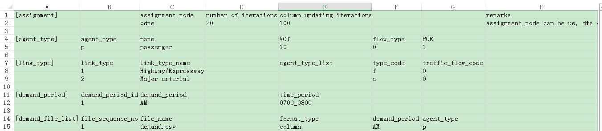
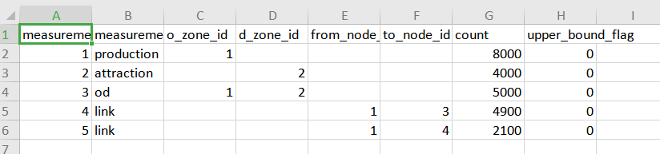
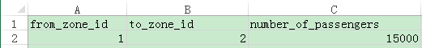
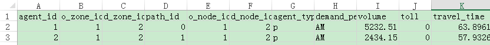
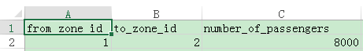
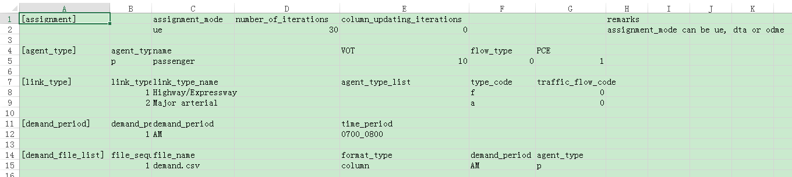
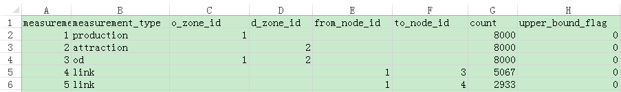
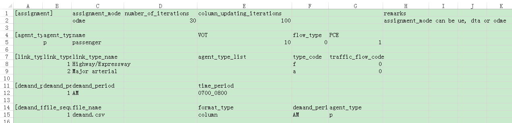

**Lesson 6:**

**Path-based Origin-Destination Demand Matrix Estimation (ODME) using DTALite:
Model, Workflow and Users Guide**

1.  **Introduction**

This document aims to offer users to understand and further apply OD demand
estimation. The algorithm is implemented in DTALite, based on a simplified
version of single-level nonlinear optimization model proposed by Lu, Zhou and
Zhang (2013). This (static) path flow estimation model has the following key
features.

1.  The model is a **path flow-based optimization** model, which incorporates
    heterogeneous sources of traffic measurements and does not require building
    an external optimization program with the explicit link-path incidence
    matrix.

2.  The **objective** is to minimize (i) the deviation between observed and
    estimated traffic flow, (ii) the deviation between aggregated path flows and
    target OD flows, and (iii) the deviation between observed and estimated
    production and attractions at the zone level, subject to nonnegative flow
    constraints.

3.  This algorithm integrates a **gradient-projection-based path flow
    adjustment** method within a column generation-based framework.

**Reference:** Lu C-C, Zhou\*, X. Zhang, K. (2013) Dynamic Origin-Destination
Demand Flow Estimation under Congested Traffic Conditions. *Transportation
Research Part C.* 34, 16-37.

1.  **Mathematical model and solution algorithm**

Given sensor data (i.e. observed link flows), zonal production and attraction,
and target (aggregated historical) OD demands, the proposed single-level path
flow estimation model is a nonlinear program with the path flows **r**
*=*{*r*(*w*, *p*), *w*, *p*} as the decision variables.

The objective funciton, Eq.(1), minimizes the weighted sum of the deviation
between estimated OD demands (or aggregated path flows) and target demands, the
deviation between estimated and observed link flows, and the deviation between
observed and estimated productions and attractions at the zone level, where *r*,
*q*, *o* and *d* are the weights reflecting different degrees of confidence on
target OD demands and observed link flows and zonal production and attractions,
respectively. Eq.(2) represents nonnegative constraints of estimated path flows.

**P1: Nonlinear program**

Min (1)

Subject to

*r*(*w*, *p*) 0, *w*, *p*. (2)

**where**

**Set:**

*A*: set of links

*W*: set of OD pairs

*P*: set of paths

*S*: set of links with sensors, *S A*

*I*: set of origin zones

*J*: set of destination zones

**Index:**

>   *w*: index of OD pairs, *wW*

>   *p*: index of paths for each OD pair, *pP*

>   *l*: index of links, *lA*

>   *i*: index of origin zones, *iI*

>   *j*: index of destination zones, *jJ*

**Indicator Parameters (given from column generation stage):**

>   : equals 1 if link *l* is on path *p* between OD pair *w*; 0 otherwise

>   : equals 1 if zone *i* is the origin of OD pair *w*; 0 otherwise

>   : equals 1 if zone *j* is the destination of OD pair *w*; 0 otherwise

**Traffic measurements inputs**

>   : observed number of vehicles passing through link *l*

>   : target demand, which is the total traffic demand for OD pair *w* over a
>   planning horizon

>   : observed generation rate of origin zone

>   : observed attraction rate of destination zone

**Estimation variables**

>   *r*(*w*, *p*): estimated path flow on path *p* of OD pair *w*

>   *q*(*l*): estimated number of vehicles passing through link *l*

>   *d*(*w*): estimated demand of OD pair *w*

>   *O*(*i*) : estimated generation rate of origin zone

>   :estimated attraction rate of destination zone

**Solution algorithm**

To solve the restricted master problem, a gradient-projection-based descent
direction method (Lu et al., 2009) is used to update path flows **r**(*m*+1),
while maintaining the feasibility of non-negativity constraints Eq.(2).
Specifically,

(3)

where (*m*) is the step size, and the gradients, which consist of the
first-order partial derivatives with respect to a path flow variable
*r*(*w*,*p*), can be derived as follows.

(4)

(5)

(6)

(7)

Estimated path flows, link flows, zonal production and zonal attraction and the
corresponding partial derivatives, namely , , and are obtained from the
restricted master problem model P1.

The steps of this algorithm are presented as the following two major phases:
column generation and column updating.

**Algorithm 1: Column based-solution algorithm**

Figure 1. Column based-solution flowchart

Solving the proposed single-level dynamic OD estimation model requires the
evaluation of the partial derivatives with respect to path flows, i.e., , ,, and
.

**3.**  **Users guide and workflow**

This section takes the following two-corridor network as an example. Shown in
Figure 1, the two-corridor network has 4 nodes, 4 links and 1 OD pair (i.e.,
from node 1 to node 4). According to historical demand data and additional
survey updates, the seed demand is set as 15000. The first path uses links 1-3
and 3-4 and the second one uses links 1-2 and 2-4.

Figure 2. Two-corridor network

**Step 1: Set parameters in file settings.csv**

The settings.csv file is used to define parameters for conducting traffic
analysis. Table 1 lists important data fields for ODME with the corresponding
values for one case. Specifically, there are three parameters:

1.  Assignment_mode = odme.

2.  The number_of_iterations defines the iteration number in stage A, i.e., the
    generation of a priori column pool.

3.  The column_updating_iterations defines the iteration number in stage B,
    namely path flow estimation.

Table 1. Related attributes in file settings.csv for ODME

**Step 2: Prepare sensor data in measurement.csv file and set up the seed OD
demand file for ODME**

Different types of sensor data for ODME are recorded in file measurement.csv, as
listed in Table 2. The second row records an observed total production rate of
zone 1, . The third row represents an observed attraction rate of zone 4, . The
historical OD demand is listed in the fourth row, . It should be noted that, the
historical OD demand as the measurements could be different from the seed
demand. We typically use a higher demand level in the seed demand so as to
generate a sufficient number of columns under congested conditions. The last two
rows are observed link counts on link 1-3 and link 1-4, respectively.

Table 2. Required fields in measurement.csv, two-corridor test example.

Remarks:

The field of upper_bound_flag aims to penalize the positive deviation, with
respect to the measured traffic flow.

Table 3 lists three fields for the seed demand in demand.csv.

Table 3. Required data in demand.csv

**Step 3: Run DTALite.exe**

**Step 4: Check the estimation results in agent.csv and link_performance.csv**

As shown in Table 4, two available paths have been generated from the first
stage with the updated values from the second updating stage.

Table 4. Estimation results in agent.csv

Table 5. Estimation results in link_performance.csv

**Currently, the file link_performance.csv is empty.**

**Step 5: Check the deviations between the starting and final OD demand matrix
in file output_ODME_table.csv (to do)**

This file is used to compare the final ODME result and the baseline OD demand
table. Table 4 lists part of the results in two-corridor case.

Table 6. Part of the results in two-corridor case

| **o_zone** | **d_zone** | **hist\_ value** | **updated\_ value** | **difference** | **%_difference**  |
|------------|------------|------------------|---------------------|----------------|-------------------|
| 1          | 3          | 7                | 7                   | 0              | 0                 |
| 1          | 3          | 8                | 8                   | 0              | 0                 |
| 1          | 3          | 8                | 8                   | 0              | 0                 |
| 1          | 3          | 7                | 7                   | 0              | 0                 |
| 1          | 3          | 8                | 9.75                | 1.75           | 21.9              |
| 1          | 3          | 8                | 9.23                | 1.23           | 15.3              |
| 1          | 3          | 8                | 9.75                | 1.75           | 21.9              |
| 1          | 3          | 7                | 8.2                 | 1.2            | 17.1              |
| 1          | 9          | 16               | 15.1                | \-0.9          | \-5.6             |
| 1          | 9          | 17               | 16.97               | \-0.03         | \-0.2             |

**4.**  **Sensitivity analysis**

This section examines the estimation results of the proposed algorithm on the
above two-corridor network shown in Figure 2. As step 0, we use the UE
assignment results as the benchmark to validate the estimation accuracy of
DTALite, under different data availability and conditions.

**Step 0: Ground truth case**

In this the ground truth case, we load a total demand of 8,000 vehicles/hour to
those two paths as shown in Table 7, with 30 UE iterations in Table 8, and with
the field of assignment_mode being set as ‘ue’. The resulting UE assignment
results are shown in Table 9, indicating that the equilibrium flow pattern and
travel time on each path.

Table 7. Required data in demand.csv

Table 8. Required fields in settings.csv

Table 9. User equilibrium traffic assignment results on the two-corridor network

| Path  | FFTT(min) | Capacity(veh/h) | Assigned flow(veh/h) | Travel time(min) |
|-------|-----------|-----------------|----------------------|------------------|
| 1-3-2 | 44.4      | 4000            | 5067                 | 61.5             |
| 1-4-2 | 54.4      | 3000            | 2933                 | 61.8             |

**Step 1: ODME case**

We consider the error-free flow counts (the first path is 5067 and the second
one is 2933), as shown in the last three rows in Table 10.

Table 10. Required fields in measurement.csv

With a dramatically different demand seed in demand.csv.

Table 11. Required data in demand.csv

As shown in Table 12, the field of assignment_mode is set as ‘odme’ representing
OD matrix estimation. The number of iteration is set 30 and the column updating
iterations is set 100.

Table 12. Related attributes in file settings.csv

Table 13 lists the comparison between the ground truth case and the ODME
solution. As we can see, the estimated demand is eventually adjusted to a level
very close to the ground-truth demand, and the errors of path flow distribution
and path travel times between these two solutions are reduced to insignificant
values.

Table 13. Comparison between ground truth case and ODME solution

| Path  | Assigned flow(veh/h) in ground truth case | Assigned flow(veh/h) in ODME solution | Error | Travel time(min) in ground truth case | Travel time(min) in ODME solution | Error |
|-------|-------------------------------------------|---------------------------------------|-------|---------------------------------------|-----------------------------------|-------|
| 1-3-2 | 5067                                      | 5069                                  | 0%    | 61.5                                  | 61.6                              | 0%    |
| 1-4-2 | 2933                                      | 2931                                  | 0%    | 61.8                                  | 61.8                              | 0%    |
