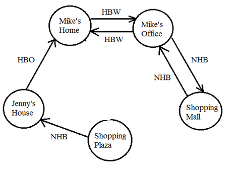
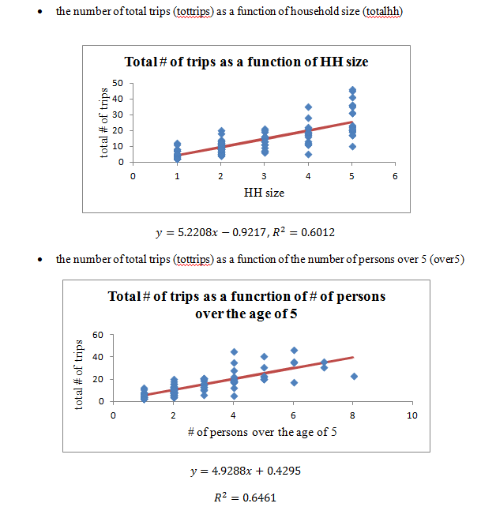
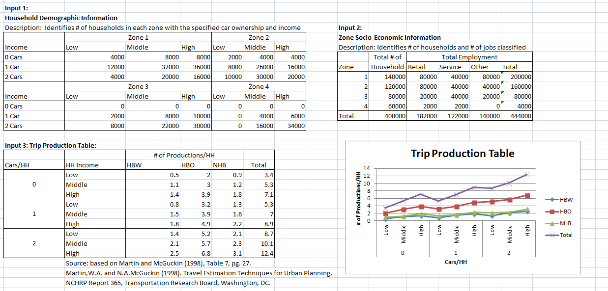
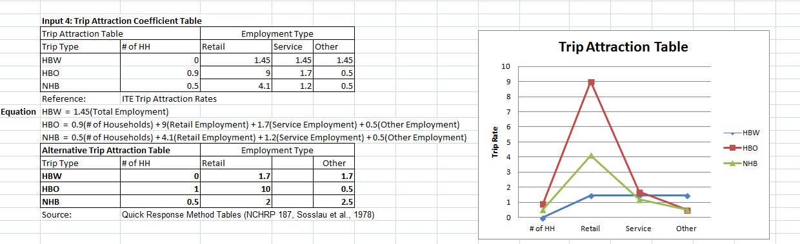
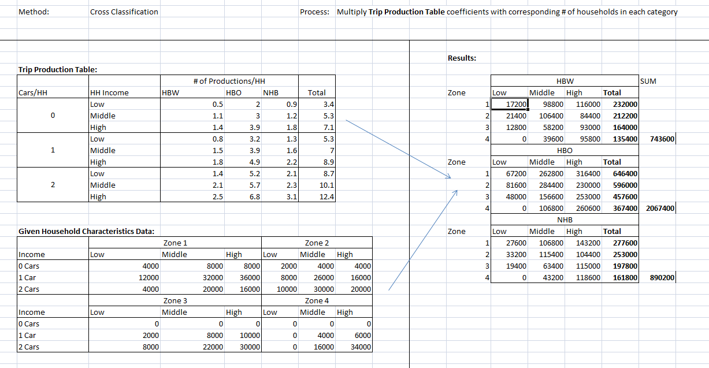
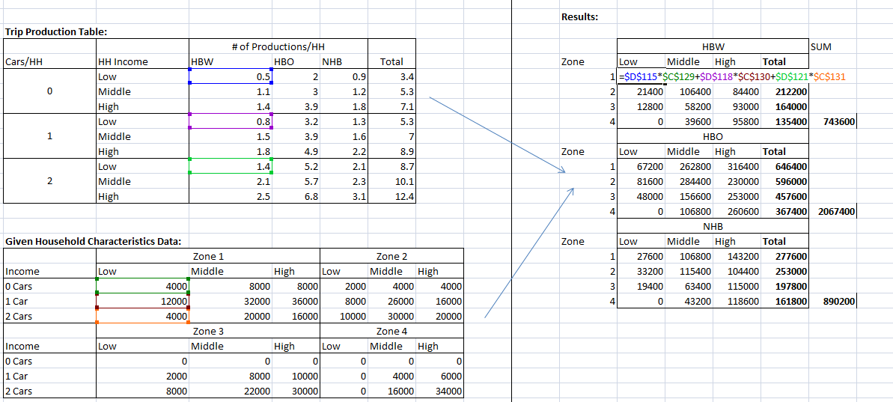
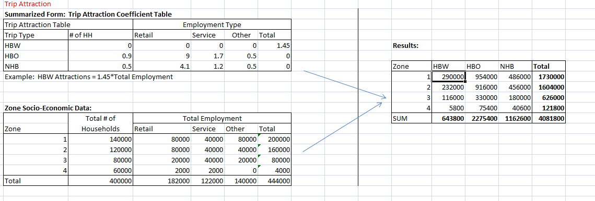
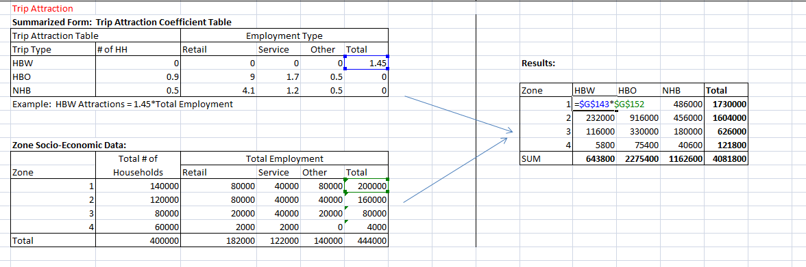

**Lesson 2: Trip generation**

Learning Goals:

1. Draw trip pattern diagram and count trip productions and attractions at each
zone

2. Use multiple linear regression to calibrate trip generation model

3. Apply regression model and cross classification to produce balanced
productions and attractions for each zone for each trip purpose

Trip generation is the first step in the larger context of 4-step process.

-   Trip Generation: Estimate \# of trips entering/leaving a zone/TAZ

    -   Trip Distribution: Estimate how many trips from each zone/TAZ end in all
        zones/TAZs

    -   Mode Choice: Estimate which travel method is used

    -   Traffic Assignment: Distribute vehicles to different paths during travel

Trip generation uses socioeconomic data to estimate the number of person trips
for a modeled time period (e.g., daily, peak hour), on a Traffic Analysis Zone
(TAZ) level.

In the four step process, there are two typical types of equations used to
predict trips based on attributes:

1: Trip rate method based on regression equations

2: Cross classification using category-based trip rates.

The produced trips by different purposes are separated, HBW, HBO, NHB.

In activity-based models, the daily travel activities are generated based on
activity patterns for households, and the trip generation modules include tour
and subtour generation, as well as intermediate stop generation.

In transportation planning, for a home-based trip, a production is related to
the home end, while an attraction is related to non-home end. For a
non-home-based trip, a production is related to the origin location, and an
attraction is related to the destination location. Entering/Leaving trips should
balance, That is, if a person leaves a zone, they should also return; if a
person enters a zone, they should also leave.

For example, if a person travels from home to work and then from work to home on
a certain day, then there are 2 home-based work trip productions are generated
at the home TAZ, and two attractions related at his or her work location.

*Problem 1:* **Trip Pattern Diagram**

*Mike drives his car to his office in the morning, and drives to a shopping mall
in the downtown area to have lunch. After returning home at 6 PM, Mike walks to
a nearby shopping plaza to buy a gift for Jenny, his friend, and then he takes a
bus from the shopping plaza to Jenny’s house at 8 PM. At 9PM, Jenny gives Mike a
ride back to his home.*

*Please follow draw Mike’s trip pattern diagram. Please count the number of
productions and attractions for each zone by trip purpose.*

>   Zone 1: Mike’s home

>   Zone 2: Mike’s work place

>   Zone 3: Shopping mall in the downtown area

>   Zone 4: Shopping plaza close to Mike’s home

>   Zone 5: Jenny’s house

|        | HBW | HBO | NHB |   |   |   |
|--------|-----|-----|-----|---|---|---|
|        | P   | A   | P   | A | P | A |
| Zone 1 |     |     |     |   |   |   |
| Zone 2 |     |     |     |   |   |   |
| Zone 3 |     |     |     |   |   |   |
| Zone 4 |     |     |     |   |   |   |
| Zone 5 |     |     |     |   |   |   |
| Total  |     |     |     |   |   |   |

Answer:

|        | HBW | HBO | NHB |   |   |   |
|--------|-----|-----|-----|---|---|---|
|        | P   | A   | P   | A | P | A |
| Zone 1 | 2   |     | 1   |   |   |   |
| Zone 2 |     | 2   |     |   | 1 | 1 |
| Zone 3 |     |     |     |   | 1 | 1 |
| Zone 4 |     |     |     |   | 1 |   |
| Zone 5 |     |     |     | 1 |   | 1 |
| Total  | 2   | 2   | 1   | 1 | 3 | 3 |

>   Note: We have 7 trips - 7 productions and 7 attractions; the number of
>   productions and attractions is the same for each category of trip purposes.

**Regression Analysis**

In regression analysis, we need to describe trip rates by attributes

-   \# of households, household size

    -   Income

    -   Car ownership

    -   Accessibility/density.

*Problem 2:*

Given the following hypothetical sample data, we first conduct a multiple linear
regression analysis.

Reference:
http://chem.science.oregonstate.edu/courses/ch361-464/ch464/RegrssnFnl.pdf

| household no.           | \# of persons per household | \# of trips      | \# of vehicles |           |             |             |               |               |
|-------------------------|-----------------------------|------------------|----------------|-----------|-------------|-------------|---------------|---------------|
| 1                       | 2                           | 4                | 1              |           |             |             |               |               |
| 2                       | 2                           | 5                | 2              |           |             |             |               |               |
| 3                       | 3                           | 8                | 2              |           |             |             |               |               |
| 4                       | 3                           | 9                | 2              |           |             |             |               |               |
| 5                       | 4                           | 12               | 3              |           |             |             |               |               |
| 6                       | 4                           | 11               | 1              |           |             |             |               |               |
| 7                       | 5                           | 13               | 2              |           |             |             |               |               |
| SUMMARY OUTPUT          |                             |                  |                |           |             |             |               |               |
|                         |                             |                  |                |           |             |             |               |               |
| *Regression Statistics* |                             |                  |                |           |             |             |               |               |
| Multiple R              | 0.980364                    |                  |                |           |             |             |               |               |
| R Square                | 0.961114                    |                  |                |           |             |             |               |               |
| Adjusted R Square       | 0.94167                     |                  |                |           |             |             |               |               |
| Standard Error          | 0.268733                    |                  |                |           |             |             |               |               |
| Observations            | 7                           |                  |                |           |             |             |               |               |
|                         |                             |                  |                |           |             |             |               |               |
|                         |                             |                  |                |           |             |             |               |               |
|                         | *Coefficients*              | *Standard Error* | *t Stat*       | *P-value* | *Lower 95%* | *Upper 95%* | *Lower 95.0%* | *Upper 95.0%* |
| Intercept               | 0.763806                    | 0.358872         | 2.128355       | 0.100394  | \-0.23258   | 1.760194    | \-0.23258     | 1.760194      |
| \# of trips             | 0.3339                      | 0.035031         | 9.53165        | 0.000676  | 0.236639    | 0.43116     | 0.236639      | 0.43116       |
| \# of vehicles          | \-0.23449                   | 0.174451         | \-1.34418      | 0.250063  | \-0.71885   | 0.24986     | \-0.71885     | 0.24986       |

Question 1: Should we include \# of vehicles as explanatory variable? Why?

Answer: No. the *t Stat* for the \# of vehicles variable is -1.34418, which is
not significant.

Question 2: Please calibrate the following equation:

*Trip rate per household = beta \* household_size.*

*Answer:*

Problem 3: Use real-world data to calibrate the trip generation model.

>   Please visit <http://surveyarchive.org/archive.html>

>   Download travel survey data (the survey was conducted by Wasatch Front
>   Regional Council (WFRC) conducted in 1993)

>   <http://surveyarchive.org/Wasatch/saltlake_93.zip>

>   Open files hhldperstrip-doc.txt (explanations of variables) and
>   hhpertrip.csv (raw data)

>   Question 1: Please provide the following household statistics:

-   Number of household samples

    -   Average number of persons, workers, driver licenses and cars per
        household

    -   Percentage of households do not provide income data

    -   Histogram of household income (in \$10,000 increments)

        Please provide the following trip characteristics.

        Average number of

        –all trips

        –HB work trips

        –HB school trips

        –HB college trips

        –HB shop trips

        –HB other trips

        –NHB work trips

        –NHB other trips

>   **The Number of household samples is 2980**

>   **The average number of persons = 3.19**

>   **The average number of workers = 1.38**

>   **The average number of Drivers Licenses = 1.88**

>   **Cars = 1.99**

>   **Percentage of households not providing income = (2980-2764)/2980 = 7.2%**

-   all trips = 13.74

    -   HB work trips = 1.71

    -   HB school trips = 1.24

    -   HB college trips = 0.29

    -   HB shop trips = 1.29

    -   HB other trips = 5.09

    -   NHB work trips = 1.33

    -   NHB other trips = 2.77

>   Please use 100 raw samples to estimate the following linear regression
>   models. For each model, please show the scatter chart, linear regression
>   equation and R2 statistics. Briefly describe your findings. For more
>   information about adding a trend line in a chart, please read
>   <http://office.microsoft.com/en-us/excel/HP100074611033.aspx>

-   the number of total trips (tottrips) as a function of household size
    (totalhh)

-   the number of total trips (tottrips) as a function of the number of persons
    over 5 (over5)

Answers:

**Trip Productions**

Productions are typically modeled as a function of population or number of
households, as well as income levels or auto ownerships. Other explanatory
variables might be used such as number of workers, but we need to make sure
explanatory variables are often **not** interrelated and correlated with each
other.

Step 1: collect socioeconomic data

The data below are obtained from the census data in year 2000.

Source: <http://quickfacts.census.gov/qfd/states/49000.html>

Other potential data sources include:

1.  Census/American Community Survey (ACS)

2.  Census Transportation Planning Products (CTPP)

    -   TAZs, HH and employment data

3.  National Household Travel Survey

    -   Daily trip information for individuals in households

4.  Longitudinal Employment and Household Dynamics (LEHD)

    -   More detailed employment information

| **Zone**  | **City**         | **Population** | **\# of households** | **\# of employees**  |
|-----------|------------------|----------------|----------------------|----------------------|
| 1         | West Jordan      | 68336          | 18897                | 45470                |
| 2         | Sandy            | 88418          | 25737                | 61874                |
| 3         | West Valley City | 108896         | 32253                | 76161                |
| 4         | Salt Lake City   | 181743         | 71461                | 143161               |

Step 2. Apply Regression Models

The following model is used to estimate the total number of trips (including
HBW, HBO and NHB trips) produced per household:

*Trip rate per household = 2.7 \* household_size.*

The percentage of HBW, HBO and NHB trips is 30%, 40% and 30%, respectively, out
of all trips per household.

The following models are used to estimate the number of trips attracted, where
EMP is the number of employees and HH is the number of households:

*\# of HBW trips = 1.7\*EMP*

*\# of HBO trips = 3\*EMP + 1\*HH*

*\# of NHB trips = 1\*EMP + 1\*HH*

*Problem 2: Please estimate the balanced productions and attractions for each
zone and for each trip purpose. Please complete the following table, and compare
the person trip rates per household by trip purpose.*

*Table 1: Household Size and Trip Rate*

| **Zone**  | **City**         | **Household Size =**  **Population/\# of HH** | **Trip Rate = 2.7\*HH Size** |
|-----------|------------------|-----------------------------------------------|------------------------------|
| 1         | West Jordan      | 3.616                                         | 9.764                        |
| 2         | Sandy            | 3.435                                         | 9.276                        |
| 3         | West Valley City | 3.376                                         | 9.116                        |
| 4         | Salt Lake City   | ?                                             | ?                            |

*Answer :*

| 4    | Salt Lake City | **Household Size =**181743/71461=2.543 | **Trip Rate =2.7\***2.543=6.867 |
|------|----------------|----------------------------------------|---------------------------------|
|      |                |                                        |                                 |
| HBW  |                |                                        |                                 |
| HBO  |                |                                        |                                 |
| NHB  |                |                                        |                                 |

*Problem 4: Please complete the following table, and calculate the ratio of
total attractions and total productions*

*Productions and Attractions*

| **Zone**  | **City**         | **Productions** | **Attractions** |          |           |           |           |
|-----------|------------------|-----------------|-----------------|----------|-----------|-----------|-----------|
|           |                  | **HBW**         | **HBO**         | **NHB**  | **HBW**   | **HBO**   | **NHB**   |
| 1         | West Jordan      | 55352.16        | 73802.88        | 55352.16 | 77299.00  | 155307.00 | 64367.00  |
| 2         | Sandy            | 71618.58        | 95491.44        | 71618.58 | 105185.80 | 211359.00 | 87611.00  |
| 3         | West Valley City | 88205.76        | 117607.68       | 88205.76 | 129473.70 | 260736.00 | 108414.00 |
| 4         | Salt Lake City   | ?               | ?               | ?        | ?         | ?         | ?         |
| **∑**     | ?                | ?               | ?               | ?        | ?         | ?         |           |

>   Answer: number of HBW trip productions at SLC = trip rate per household \*
>   number **of households =** 71461 \* 6.867 \* 30% = 147211.83.

>   number of HBW trip attractions at SLC = *= 1.7\*EMP* **= 1.7\***143161=
>   243373.70

|                | **Productions** | **Attractions** |           |           |            |           |
|----------------|-----------------|-----------------|-----------|-----------|------------|-----------|
|                | **HBW**         | **HBO**         | **NHB**   | **HBW**   | **HBO**    | **NHB**   |
| Salt Lake City | 147211.83       | 196282.44       | 147211.83 | 243373.70 | 500944.00  | 214622.00 |
| **∑**          | 362388.33       | 483184.44       | 362388.33 | 555332.20 | 1128346.00 | 475014.00 |

A/P = 2158692/1207961 = 1.787054

Step 3. Balance productions and attractions

It is important to recognize that productions and Attractions, estimated
separately, may be unequal. We often make adjustments based on which estimate is
more reliable

-   HBW: Adjust Attractions to match Productions

    -   NHB: Adjust Productions to match Attractions

For Home based trips , we trust Productions more

For non-home based trips, we trust Attractions more

Problem 5: Please provide b*alanced Productions and Attractions for* Salt Lake
City. Cells highlighted in yellow need to be changed.

| **Zone**  | **City**         | **Balanced Productions** | **Balanced Attractions** |           |          |           |           |
|-----------|------------------|--------------------------|--------------------------|-----------|----------|-----------|-----------|
|           |                  | **HBW**                  | **HBO**                  | **NHB**   | **HBW**  | **HBO**   | **NHB**   |
| 1         | West Jordan      | 55352.16                 | 73802.88                 | 72554.905 | 50442.34 | 66506.13  | 64367.00  |
| 2         | Sandy            | 71618.58                 | 95491.44                 | 93876.721 | 68640.19 | 90508.92  | 87611.00  |
| 3         | West Valley City | 88205.76                 | 117607.68                | 115618.98 | 84489.53 | 111653.32 | 108414.00 |
| 4         | Salt Lake City   | ?                        | ?                        | ?         | ?        | ?         | ?         |

Answer:

Sample Calculation:

Balanced NHB productions for SLC = total attraction \* relative production =
total attraction \* (SLC NHB productions/ total NHB productions)=

475014.00\*(147211.83/362388.33) =192963.39

| **Zone**  | **City**         | **Balanced Productions** | **Balanced Attractions** |          |          |          |         |
|-----------|------------------|--------------------------|--------------------------|----------|----------|----------|---------|
|           |                  | **HBW**                  | **HBO**                  | **NHB**  | **HBW**  | **HBO**  | **NHB** |
| 1         | West Jordan      | 55352.16                 | 73802.88                 | 72554.91 | 50442.34 | 66506.13 | 64367   |
| 2         | Sandy            | 71618.58                 | 95491.44                 | 93876.72 | 68640.19 | 90508.92 | 87611   |
| 3         | West Valley City | 88205.76                 | 117607.7                 | 115619   | 84489.53 | 111653.3 | 108414  |
| 4         | Salt Lake City   | 147211.8                 | 196282.4                 | 192963.4 | 158816.3 | 214516.1 | 214622  |
|           | Total            | 362388.3                 | 483184.4                 | 475014   | 362388.3 | 483184.4 | 475014  |

**Cross-Classification Method**

-   Assumption: Trip rates and demographic information can change rapidly and be
    highly variable

-   Solution: Use categories to describe attributes

    -   Categories should change less over time

1.  Determine category/grouping

    1.  Household Distribution by Category

2.  Trip Rate for Category

3.  Trip Purpose Breakdown by Category

4.  Total trips per day: Sum them up!

5.  Trips by purpose

Problem 6:

The following input are provided:

Input 1: Household Demographic Information

Input 2: Zone Socio-Economic Information

Input 3: Trip Production Table:

Input 4: Trip Attraction Coefficient Table

Please calculate the balanced trip productions and attractions for each zone and
for each trip purpose.

Answer:

Sample calculation:

HBW trips from low income households in zone 1 is:

0.5\*4000+0.8\*12000+1.4\*4000+ 17200.

Trip attraction calculation:

HBW trip for zone 1 = 1.45\* 200000 = 290000.

