**Lesson 1: Learning Transportation Network**

**Introduction with the Tempe ASU Network**

| **Open Educational Resources (OER)** are teaching, learning, and research materials that are either (a) in the public domain or (b) [licensed](https://creativecommons.org/licenses/) in a manner that provides everyone with free and perpetual permission to engage in the [5R activities](https://opencontent.org/definition/). Retain – make, own, and control a copy of the resource Reuse – use your original, revised, or remixed copy of the resource publicly Revise – edit, adapt, and modify your copy of the resource Remix – combine your original or revised copy of the resource with other existing material to create something new Redistribute – share copies of your original, revised, or remixed copy of the resource with others |
|---------------------------------------------------------------------------------------------------------------------------------------------------------------------------------------------------------------------------------------------------------------------------------------------------------------------------------------------------------------------------------------------------------------------------------------------------------------------------------------------------------------------------------------------------------------------------------------------------------------------------------------------------------------------------------------------------------------------------------------------------------|

**Data set:**

<https://github.com/asu-trans-ai-lab/DTALite/tree/main/data/06_Tempe_ASU_Network>

**Learning Objectives:**

1.  Understand how to view/edit network attributes in NeXTA (4 problems)

2.  Understand the user interface of NEXTA

3.  Understand node and link files in GMNS format

## 1.1. Background introduction

The City of Tempe will soon start a construction project Along S Rural Road
around the ASU campus. In order to complete this project, Rural Road must be
partially closed (from 2 lanes in each direction to 1 lane in each direction) to
create a safe work zone for the repair crews.

You (and an optional partner) have been tasked with creating a network model to
evaluate the travel impacts (congestion, delay, etc.) associated with partially
closing Rural Road.

### What is AMS?

As stated in FHWA website,
<https://cms7.fhwa.dot.gov/research/operations/analysis-modeling-simulation/analysis-modeling-simulation-overview>,
FHWA and its State and local agency partners have relied on analysis, modeling,
and simulation (AMS) to support investment decisions for the transportation
system. As the transportation system environment grows in complexity, increasing
pressure is placed on agencies to identify more innovative and efficient
solutions to a wide range of issues. These solutions include leveraging emerging
technologies, data sources, and alternative (non-traditional) strategies. AMS
tools will continue to play a critical role in evaluating these solutions.

### What is NEXTA?

NeXTA: Network explorer for Traffic Analysis

In general, the software suite of NeXTA aims to:

(1) Provide an open-source code base to enable transportation researchers and
software developers to expand its range of capabilities to various traffic
management application.

(2) Present results to other users by visualizing time-varying traffic flow
dynamics and traveler route choice behavior in an integrated environment.

(3) Provide a free, educational tool for students to understand the complex
decision-making process in transportation planning and optimization processes.

## 1.2 Understand how to view/edit network attributes in NeXTA

**Step 1: Download and Open NeXTA, Open the Tempe ASU Network**

Before going into too much detail, first makes sure you’re using the most
up-to-date version of NeXTA, and open the Tempe ASU network.

**Step 2: Open the Tempe ASU Network in NeXTA**

In NeXTA, go to File -\> Open Traffic Network Project

In the Lesson 1, go to the Tempe_ASU_network folder, select the **node.csv**
file, and click **Open**

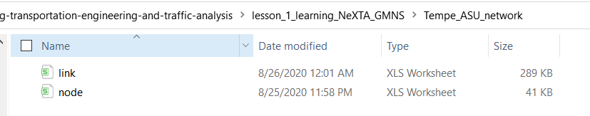

NeXTA will open the network, and display the **File Loading Status window**. The
File Loading Status window displays information about the network currently open
in NeXTA, including information about the number of links, nodes, and
zones/activity locations in the network. This window can also be accessed by
going to **File -\> Check Data Loading Status**.

**Problem 1:** How many nodes are in the Tempe ASU network? How many links are
in the Tempe ASU network?

**Step 3: Viewing/Editing Network Attributes in NeXTA**

Network objects primarily consist of links, nodes, and zones. A driver starts
and ends their trip at a zone, traveling along road segments (links) between the
origin and destination. Links are connected together at nodes, where a node may
represent an intersection or a simple connection between two road segments.

Since vehicles only travel along links, passing nodes between their origin and
destination, trip details (such as travel time, distance, speed, etc.) are
heavily dependent upon link and node attributes. The most important link
attributes are typically link length, speed limit, number of lanes, and
capacity. Since nodes typically represent intersections, their important
attributes typically include node control type (signalized intersection,
stop-controlled intersection, no control, etc.) and traffic signal-related
attributes.

This section will quickly explain how to view and edit these network object
attributes.

**Step 3.1:** To quickly view most link or node attributes, simply select a link
or node using the Select Object tool, and look at the attributes in the GIS
Layer Panel in the bottom right corner of the screen.

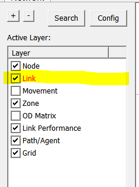

**Step 3.2:** Select link layer as highlighted above.

**Step 3.3:** Select a link along Rural Road as shown below,

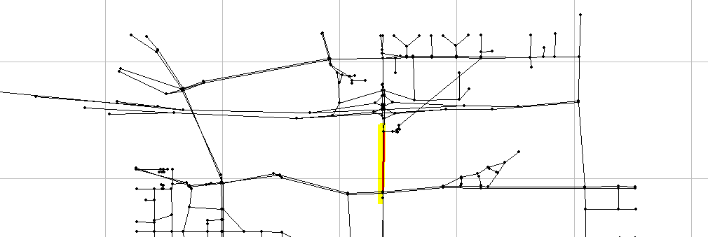

Check the Link Attribute display on the left hand size as shown below.

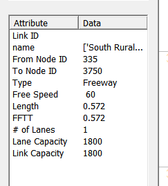

One can now select the node layer in the GIS Layer Panel,

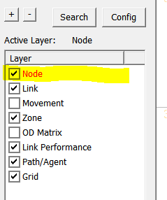

**Step 3.4:** Select a node close to ASU campus,

Check the Node Attribute display on the left-hand size as shown below.

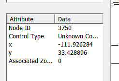

Alternatively, after selecting the link or node, **right-click** near the object
and select either Edit Link Properties or Node Properties. Selecting Edit Link
Properties opens the Link Properties dialog box, shown below. These dialog boxes
offer the ability to edit individual link and node attributes quickly and easily

-   simply replace the text/values in the appropriate field, select OK, and
    click the Save button

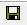

on the Tool Bar to save your changes to the network.

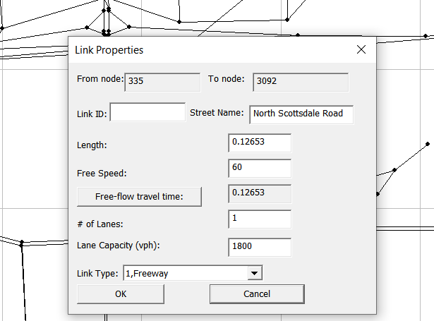

**Problem 2:** In the current data set, not all the data have been fully updated
and the information in the above dialog should be corrected in a later study.

What is the current free-flow speed value along Rural Road? How many lanes are
present along Rural Road in the model? What is the link type in the current
model? What are the correct values in the real-world conditions?

**Problem 3:** What is link capacity? How is it different from lane capacity?

**Step 4: Find short paths and use path analysis tool in NeXTA**

The Path Analysis Tool is enabled by using the

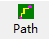

button or going to MOE \> Path List Dialog, which is used to view link
attributes and path travel time statistics.

To use the tool, a path must first be selecting in the path layer as shown
below.

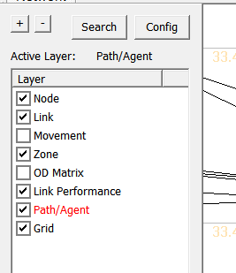

As a recap, this is accomplished by right-clicking the mouse at the origin node
for the path, selecting “Direction from Here”, and then right-clicking again at
the destination, selecting “Direction to Here”. The path is chosen automatically
based on the shortest path between the two points.

Selecting the

button opens the Path Information window, as shown in the example below. Similar
to the Link Information window, this tool shows link attributes for the links in
the path.

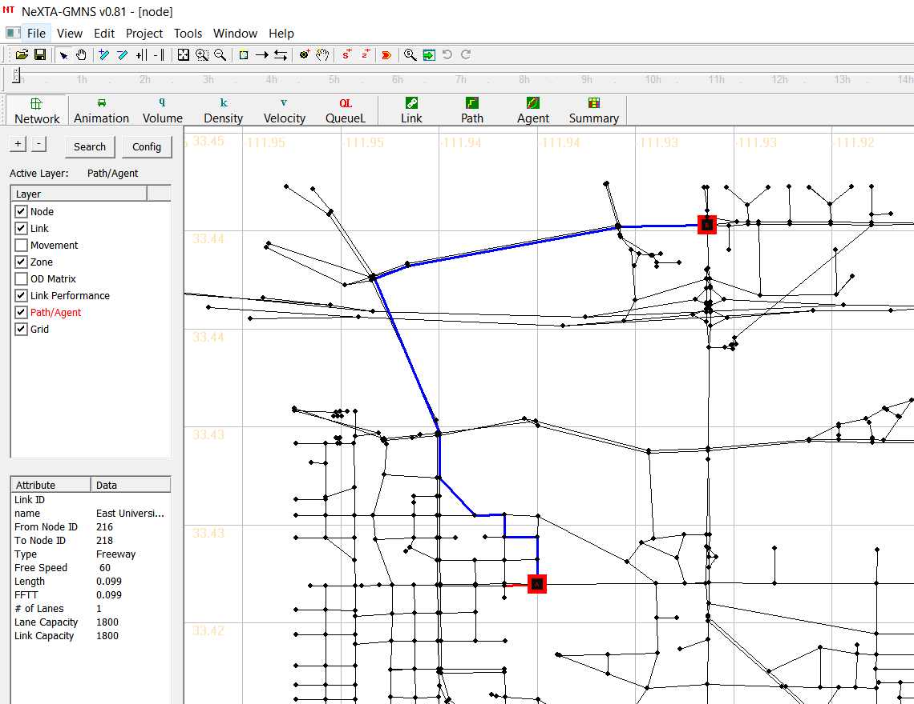

**Problem 4:** Select node 218 as the origin, and node 77 as the destination,
find the path, and report the number of links and distance along this path. Try
to find the same path using the Google Maps. To display the street names, you
can go to the next section of **layer text label** to learn how to display names
of links.

## 1.3. Understand user interfaces & basic controls of NeXTA

### Layer Control Panel

NeXTA’s user interface uses layer controls which are similar to those used in
common GIS software applications to manage which network object types are
displayed/selected.

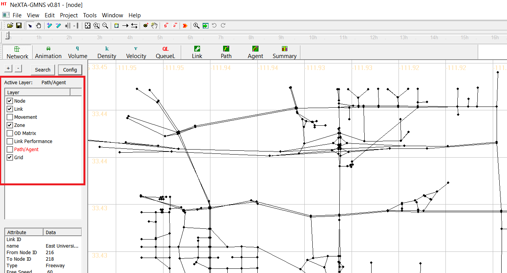

The list of layers at the left side of the screen, highlighted in the figure
above, is used to control what is visible in the display. The panel display
controls the Node, Link, Movement, Zone, OD Matrix, Link Performance,
Path/Agent, Grid. Each layer refers to a different type of network data, which
is stored in the network input/output files in the project folder.

**The box alongside each layer’s text label** is used to control the layer’s
visibility. An empty box indicates that the layer is not visible, and a check
mark in the box indicates that the layer is visible (if data is available for
display). In some cases, after turning a layer on or off, the user may need to
click the layer’s text label to refresh the display for that specific layer.

**The layer text label** is used to control which objects can be selected in the
network. In particular, the selectable layers are limited to the layers such as
Node, Link, Movement, Zone and OD Matrix. With the layer turned on (enabled),
left-clicking on the layer text label enables selection using the Select Object
tool. The text label is highlighted in red text after selection, indicating
which network object type can be selected using the Select Object tool. Please
see more detail illustration for examples for using this functionality.

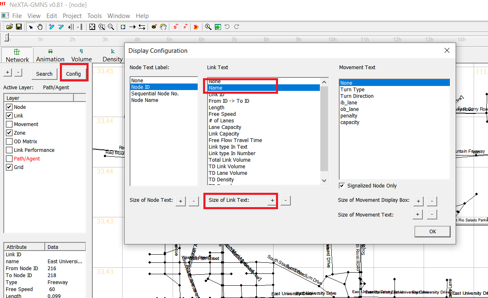

### Attribute Data Display Panel

The lower half of the panel at the left side of the screen shows attribute data
for a selected object, as shown in the figure below. The information displayed
in this section of the panel is dependent upon the selected network object type.

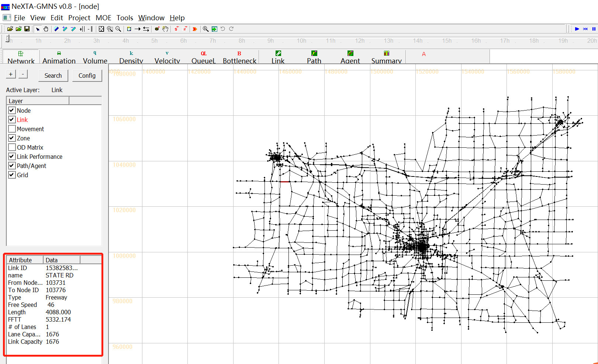

Node attribute data displayed in the panel includes the node ID number, control
type, geographic coordinates, and associated zone ID number (=corresponding zone
number, if a node is an activity location; =0, otherwise) for the selected node.
Link attribute data displayed in the panel includes the link ID number, link
name, starting node ID number, ending node ID number, link type, speed limit,
length, free-flow travel time, number of lanes, lane capacity and link capacity
for the selected link. An example is shown in the figure below with link
attribute data.

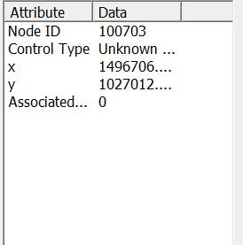

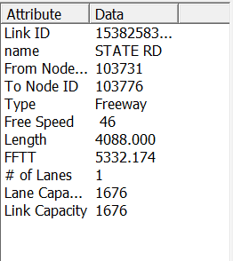

### Management Toolbar

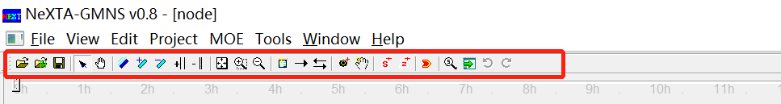

### Basic Management Tools

| **Icon** | **Name**                          | **Function**                                                                                                                                                                                                                                                           |
|----------|-----------------------------------|------------------------------------------------------------------------------------------------------------------------------------------------------------------------------------------------------------------------------------------------------------------------|
|          | Open Project                      |                                                                                                                                                                                                                                                                        |
|          | Open New Project                  |                                                                                                                                                                                                                                                                        |
|          | Save Project                      | Save network to given path/file name                                                                                                                                                                                                                                   |
|          | Select Object                     | Select a node/link/zone                                                                                                                                                                                                                                                |
|          | Move Network                      |                                                                                                                                                                                                                                                                        |
|          | Switch Link Bar/Line Display Mode |                                                                                                                                                                                                                                                                        |
|          | Increase Link Bandwidth           |                                                                                                                                                                                                                                                                        |
|          | Decrease Link Bandwidth           |                                                                                                                                                                                                                                                                        |
|          | Increase Link Offset              |                                                                                                                                                                                                                                                                        |
|          | Decrease Link Offset              |                                                                                                                                                                                                                                                                        |
|          | Show Network                      | Show entire network                                                                                                                                                                                                                                                    |
|          | Zoom In                           |                                                                                                                                                                                                                                                                        |
|          | Zoom Out                          |                                                                                                                                                                                                                                                                        |
|          | Search Node/ Link/Path/Vehicle    | Opens a dialog box which enables search functionality in NeXTA. Search by node number to find nodes, links (from node and to node notation), paths (from node and to node notation, using shortest path), and vehicle number (when simulations results are available). |

### Network Editing Tools

| **Icon**                                                                                 | **Name**                            | **Function**                                                                                                                                                                                                     |
|------------------------------------------------------------------------------------------|-------------------------------------|------------------------------------------------------------------------------------------------------------------------------------------------------------------------------------------------------------------|
| [media/4d1a6b33253ea3b8fd3cc9c35b5e05f2.png](media/4d1a6b33253ea3b8fd3cc9c35b5e05f2.png) | Set Default Link Type               | Opens a dialog box displaying the default link properties for different link types. The user may select and edit the default link properties so that all new links created afterward are assigned those changes. |
| [media/5091a70c116ae743dae5fc52c3bca412.png](media/5091a70c116ae743dae5fc52c3bca412.png) | Add New One-Way Links               | Create a new one-way, directional link between two nodes.                                                                                                                                                        |
|                                                                                          | Add New Two-Way Links               | Create two one-way, directional links between two nodes.                                                                                                                                                         |
| [media/c9fff32ed13cea62555ac459208374a4.png](media/c9fff32ed13cea62555ac459208374a4.png) | Add New Node                        | Create a new node to which links can be attached.                                                                                                                                                                |
| [media/2b37436f692c7e6cde850ecc45baf676.png](media/2b37436f692c7e6cde850ecc45baf676.png) | Move Node Position                  |                                                                                                                                                                                                                  |
| [media/2a44a628a71daa7dcfece0a7d77e8746.png](media/2a44a628a71daa7dcfece0a7d77e8746.png) | Create Subarea for subarea Analysis | Create a subarea boundary which is used to perform a subarea cut (see Subarea Analysis for more details).                                                                                                        |
| [media/1b0c419977b40a2a53d12fa9c0858df1.png](media/1b0c419977b40a2a53d12fa9c0858df1.png) | Create New Zone                     | Create a new zone                                                                                                                                                                                                |

### Viewing Modes

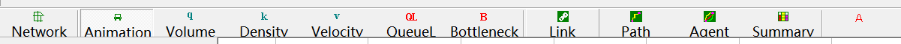

Two different viewing modes are available in NeXTA - Network View mode and
Animation View mode. The default Network View mode is used to display Measures
of Effectiveness (MOEs) and the network geometry, while the Animation View is
used to show individual vehicles moving in the network during simulation. The
user can use the

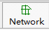

and

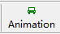

buttons on the MOE Toolbar to control which view is used.

### Detailed Analytical Tools

In addition to the previously-described visualization tools, the Link, Path,
Vehicle, and Summary analytical tools are available for more detailed analyses.
These features may be accessed through the highlighted buttons shown below on
the MOE Toolbar. Each visualization feature is explained in different sections
below.

### Link Analysis Tool

Selecting the

button, or going to MOE \> Link List Dialog, opening the Link Information window
(as shown below), which is used to view link attributes and MOEs. Selecting a
row with the mouse also selects the link in the network, allowing the user to
quickly find specific links. The Link Zoom toggle button at the bottom left side
of the window centers the network view window at the selected row after a row is
selected. Each column of data can be used to sort the list, allowing the user to
more quickly find links with specific attributes or which meet certain criteria.
The “Vehicle Data Analysis for Selected Link(s)” button at the bottom of the
window offers vehicle analysis data for selected links. The “Export to CSV File”
button at the bottom of the window helps users export link information and MOEs
to CSV file.

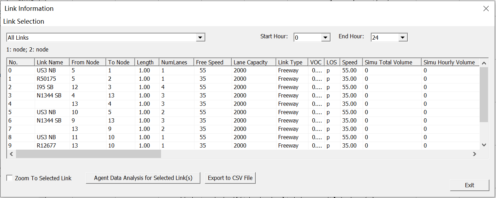

Additionally, the Link Selection menu at the top left side of the window offers
options for filtering the rows by link type. Filtering options are available for
displaying only Selected links, links within Subarea, Freeway, Highway, Ramp,
Arterial, Connector links and Non-Connector links. The Start/End Hour Selection
menu at the top right side of the window offer options for analysis period.

## 1.4. Understand node and link files in GMNS format

### What is GMNS?

General Travel Network Format Specification is a product of Zephyr Foundation,
which aims to advance the field through flexible and efficient support,
education, guidance, encouragement, and incubation.

Further Details in
<https://zephyrtransport.org/projects/2-network-standard-and-tools/>

This section describes all input and output files associated with NeXTA package.
All GMNS data files are in CSV format. Each input/output file includes
descriptions for required variable names, followed by a short description of
their type, purpose, function, interaction with other variables, and the use
cases in which the variable is required/not required.

**Network data structure** defines the basic node-link structure, along with
attributes for each link and node. Additionally, nodes are related to movement,
which can be used to disaggregate trips from nodes to nodes.

Below is a short list of key features for GMNS data files and simple AMS data
structure. In the current lesson, we only need to cover node.csv and link.csv,
and the other files will be examined in the future.

| **File Name**         |                                                                                                                                     |
|-----------------------|-------------------------------------------------------------------------------------------------------------------------------------|
| A: GMMS Network Files | A1: node.csv                                                                                                                        |
|                       | A2: link.csv                                                                                                                        |
|                       | A3: movement.csv                                                                                                                    |
| B: AMS Output         | B1: [link_performance.csv](https://docs.google.com/spreadsheets/d/1gToOECJqT2T2rDpS6YSPRXZvz-xi4iN2iV32nrjK-AQ/edit#gid=2142282830) |
|                       | B2: [agent.csv](https://docs.google.com/spreadsheets/d/1Jrmq3tlV22qrwJb4tzHivMio04DNHZwHqdlJOcE_oIc/edit#gid=689476001)             |

### High-level introductions:

-   A generic network used for GMNS readable by NeXTA includes a set of three
    layers: node, link and movement.

-   The specific file names are node.csv, road_link.csv, and movement.csv.

-   A link is defined using upstream node and downstream node ids, with
    essential attributes such as length, free_speed, lanes and capacity,
    typically required for static traffic assignment and mesoscopic traffic
    assignment.

-   The movement file contains the individual’s movement from nodes to nodes.

-   The node and link layers can use arbitrary coordinate system, but a WKT
    (lon/lat) coordinate system is preferred.

-   A user can also manually create a new network from the scratch by using a
    click-and-draw method based on a background image file.

#### 1. node.csv

| **Field Name** | **Description**                                                                                                       | **Sample Value**            |
|----------------|-----------------------------------------------------------------------------------------------------------------------|-----------------------------|
| name           | Optional for visualization only                                                                                       | Main street \@ Highland Dr. |
| node_id        | Node identification number                                                                                            | 1001                        |
| ctrl_type      | Intersection control type                                                                                             | 5                           |
| node_type      | Optional text label for visualization and identifies of node                                                          | 1                           |
| x_coord        | Longitude or horizontal coordinate in any arbitrary geographic coordinate system.                                     | 100                         |
| y_coord        | Latitude or vertical coordinate horizontal coordinate in any arbitrary geographic coordinate system                   | 200                         |
| geometry       | Text string used to describe node location <https://en.wikipedia.org/wiki/Well-known_text_representation_of_geometry> | POINT (30 10)               |

#### 2. link.csv

| **Field Name** | **Description**                                                                                                                                                                                                                          | **Sample Values**                |
|----------------|------------------------------------------------------------------------------------------------------------------------------------------------------------------------------------------------------------------------------------------|----------------------------------|
| Name           | Optional for visualization purposes                                                                                                                                                                                                      | Main Street                      |
| link_id        | Link identification number of the road                                                                                                                                                                                                   | 101                              |
| from_node_id   | Upstream node number of the link, must already defined in input_node.csv                                                                                                                                                                 | 2                                |
| to_node_id     | Downstream node number of the link, must already defined in input_node.csv                                                                                                                                                               | 3                                |
| link_type      | Optional text label for visualization and data checking purposes                                                                                                                                                                         | 1                                |
| length         | The length of the link (between end nodes), measured in units of miles.                                                                                                                                                                  | 1.0                              |
| lanes          | The number of lanes on the link                                                                                                                                                                                                          | 2                                |
| free_speed     | Free-flow speed on defined link . Suggested Unit: mph or kmph                                                                                                                                                                            | 20                               |
| capacity       | The number of vehicles per hour per lane.                                                                                                                                                                                                | 1500                             |
| geometry       | Text string used to describe link shape and location (typically in WKT geographic coordinate system). The initial value can be empty, and NeXTA will generate the text string based on the coordinates of upstream and downstream nodes. | LINESTRING (30 10, 10 30, 40 40) |
