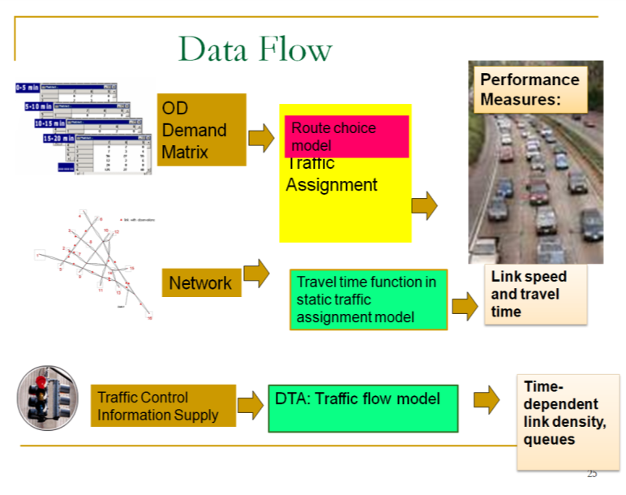
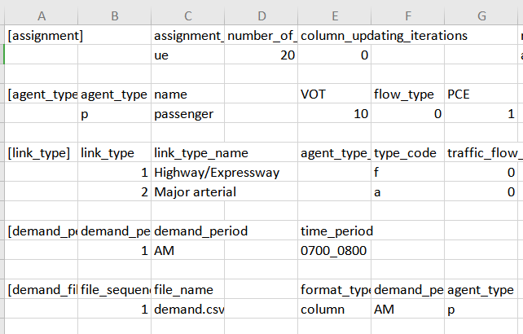
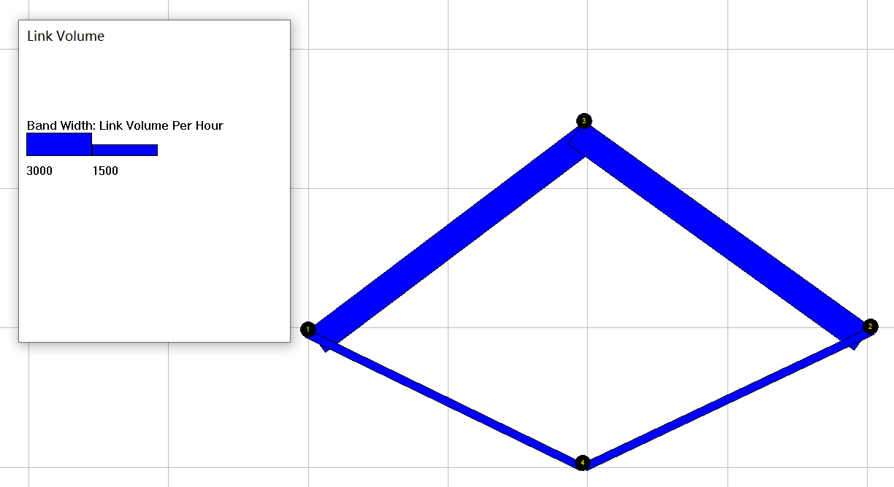

Lesson 2: Network Modeling

Understand Network Equilibrium Model: 2-corridor network and Braess’ Paradox

Please feel free to send any questions, feedback, and corrections to Dr. Xuesong
(Simon) Zhou (xzhou74\@asu.edu) by adding comments in this document.

Permission is granted to copy, distribute and/or modify this document under the
terms of the GNU Free Documentation License, Version 1.3 or any later version
published by the Free Software Foundation; with no Invariant Sections, no
Front-Cover Texts, and no Back-Cover Texts. A copy of the license is included in
[www.gnu.org/licenses/fdl.html](http://www.gnu.org/licenses/fdl.html)

| Braess' paradox, credited to the German mathematician Dietrich Braess, states that adding extra capacity to a network when the moving entities selfishly choose their route, can in some cases reduce overall performance. This is because the Nash equilibrium of such a system is not necessarily optimal. The paradox is stated as follows:  "For each point of a road network, let there be given the number of cars starting from it, and the destination of the cars. Under these conditions one wishes to estimate the distribution of traffic flow. Whether one street is preferable to another depends not only on the quality of the road, but also on the density of the flow. If every driver takes the path that looks most favorable to him, the resultant running times need not be minimal. Furthermore, it is indicated by an example that an extension of the road network may cause a redistribution of the traffic that results in longer individual running times." Source: http://en.wikipedia.org/wiki/Braess%27s_paradox |                                                                                             |
|--------------------------------------------------------------------------------------------------------------------------------------------------------------------------------------------------------------------------------------------------------------------------------------------------------------------------------------------------------------------------------------------------------------------------------------------------------------------------------------------------------------------------------------------------------------------------------------------------------------------------------------------------------------------------------------------------------------------------------------------------------------------------------------------------------------------------------------------------------------------------------------------------------------------------------------------------------------------------------------------------------------------------------------------------|---------------------------------------------------------------------------------------------|
| [media/736147b5215072715b8c0221b24ffb8c.png](media/736147b5215072715b8c0221b24ffb8c.png) \*                                                                                                                                                                                                                                                                                                                                                                                                                                                                                                                                                                                                                                                                                                                                                                                                                                                                                                                                                      | [media/73c27e71543965c7ed2e8656ae920b5c.png](media/73c27e71543965c7ed2e8656ae920b5c.png) \* |

# Background 

**1.1 Learning objectives:**

1.  How to create a network by importing an Excel file in NeXTA.

2.  Understand modeling principles of user equilibrium

3.  Know how to setup BPR function parameters for special link types

4.  Understand the impact of adding a link and analyze the performance at link,
    path and network levels

5.  The impact of different levels of demand on Braess’ paradox

6.  Understand the impact of road pricing on Braess paradox and how to resolve
    Braess’ Paradox

  
**1.2 General description of traffic assignment:**

Traffic assignment loads an origin-destination (OD) trip matrix onto links of a
traffic network, while satisfying a certain route choice behavioral model, e.g.,
Wardrop’s first and second principles of network equilibrium (Wardrop, 1952).

Traffic assignment is used to predict/estimate how trip-makers may shift to
other routes or departure time in response to a number of strategies such as
road pricing, incidents, road capacity improvement and traffic signal re-timing.

For example, tolling typically lead to traffic diversion on alternative routes
and/or other transportation modes, and many traffic congestion mitigation
strategies should be developed to improve the capacity to which the traffic may
be diverted, for example, signal optimization, traveler information provision,
and transit operation.

The common time periods of network equilibrium analysis can be morning peak,
afternoon peak and off-peak, and we can use the time of day factor to calculate
the trip in the peak hour (e.g., morning peak may be 11% of daily traffic) from
a 24-hour demand volume.

**Static Traffic Assignment**

There are a number of key components for static traffic assignment methods:

1.  OD trip table that describes the flow from each origin zone to each
    destination zone (per hour)

2.  A traffic network consisting of nodes, links and link volume delay functions

3.  Route choice principle(s) that describes the spreading of trips over
    alternative routes due to congested conditions

4.  Volume delay function, such as the BPR (Bureau of Public Roads) function
    that shows increased link travel time as an increase in link volume

TT = FFTT [1 + 0.15(v/c)4]

where:

TT = link travel time

FFTT= free-flow travel time of link

v = link flow

c = link capacity

[Remark: Typically, the travel time function of a link only depends on its own
flow, while ignoring link volume on opposing or conflicting directions. The link
capacity might not be a strict upper limit on link flow.]

As one of the **simplest** cases of route choice behavior, Wardrop’s first
principle, user equilibrium (UE), assumes road users are “selfish (or
non-cooperative)” and have complete knowledge about the network. The UE
principle requires iterations to reach the following UE conditions:

-   No individual trip maker can reduce his path costs by switching routes.

-   All used routes between an O-D pair have equal and minimum costs, while all
    unused routes have greater or equal costs (to the used path costs).

| References:  Wardrop (1952) proposed the user equilibrium and system optimal principles of route choice behavior in his seminal paper, and Beckman et al. (1956) formulated the static user equilibrium traffic assignment problem as an equivalent convex mathematical programming problem. Since their influential contributions, the development of the static network assignment formulations, algorithms and applications have made remarkable progress. The books by Sheffi (1985) and Patriksson (1994) provide the most comprehensive coverage on the static traffic assignment problem and its variants. Wardrop, J.G. (1952). Some Theoretical Aspects of Road Traffic Research, Proceedings, Institution of Civil Engineers II(1), pp. 325-378. Beckmann,M. McGuire, C. B. Winsten. C.B, (1956). [Studies in the Economics of Transportation](http://cowles.econ.yale.edu/archive/reprints/specpub-BMW.pdf). Yale University Press: New Haven: <http://cowles.econ.yale.edu/archive/reprints/specpub-BMW.pdf> Patriksson, M. (1994) The Traffic Assignment Problem: Models and Methods. Koninklijke Wohrmann, Zutphen, The Netherlands. <http://www.math.chalmers.se/~mipat/traffic.html> Sheffi, Y. (1985). Urban Transportation Networks: Equilibrium Analysis with Mathematical Programming Methods, Prentice-Hall, NJ. <http://web.mit.edu/sheffi/www/urbanTransportation.html> |
|------------------------------------------------------------------------------------------------------------------------------------------------------------------------------------------------------------------------------------------------------------------------------------------------------------------------------------------------------------------------------------------------------------------------------------------------------------------------------------------------------------------------------------------------------------------------------------------------------------------------------------------------------------------------------------------------------------------------------------------------------------------------------------------------------------------------------------------------------------------------------------------------------------------------------------------------------------------------------------------------------------------------------------------------------------------------------------------------------------------------------------------------------------------------------------------------------------------------------------------------------------------------------------------------------------------------------------------------------------------------------------------------|

# Workflow

5 steps of performing traffic analysis using CSV files

>   The specific instruction for the use of NeXTA and DTALite is as follows:

>   Step 0: **[Download and locate the project folder]** Download and unzip the
>   release software package from github. Locate DTALite file folder with
>   node.csv, link csv, demand.csv and settings.csv. Typically, copy DTALite.exe
>   and NeXTA.exe in the same folder for easy access.

>   Step 1: **[Check input files in Excel]** Open a file explorer, view or edit
>   input files of node, link and demand csv files, in Excel or any text editor.
>   Review and change the configuration in settings.csv in Excel.

>   Step 2: **[Visualize and validate network in NeXTA ]** Click
>   “NeXTA”—“File”—“Open Traffic Network Project” to choose the node.csv file in
>   your network data set. Check the network connectivity through a simple path
>   calculation by selecting one OD pair.

>   Step 3: **[Run DTALite as a Windows console application]** Click on the
>   executable of “DTALite.exe” from a file explorer or run it from Windows
>   command window, to perform traffic assignment and simulation. The output of
>   this Windows console applications is displayed in screen and log file
>   DTALite_log.txt.

>   Step 4: [**Check output files in Excel**] After the completion of DTALite,
>   users can view the output link performance and agent files in Excel.

>   Step 5: [**Visualize output files in NeXTA**] For static traffic assignment,
>   NeXTA is able to display view link travel time, speed and volume, as well as
>   path display in the agent dialog. For dynamic assignment and simulation, one
>   can use NeXTA to view time-dependent queue and density.

# Two-corridor Examples for Computing Static User Equilibrium 

## 3.1 Two-corridor example

>   This example uses a simple case with a single origin-to-destination pair and
>   two paths p=1 for the primary path, p=2 for the alternative path, see in
>   Figure 3.1 As each path has two links, path 1 has a free-flow travel time of
>   20 minutes, and path 2 has a free-flow travel time of 30 minutes.

>   C:\\Users\\陈陈\\AppData\\Local\\Temp\\msohtmlclip1\\02\\clip_image001.png

>   Figure 3.1 illustrative example of two-corridor network

>   For a given OD demand of 7,000 on this network, we can use the User
>   Equilibrium method to perform traffic assignment. A graphic-based solution
>   process can be described by Figure 3.2. As the path flow changes, the travel
>   time on the two paths reaches the same equilibrium point, which satisfied
>   the requirement of User Equilibrium. User equilibrium solution is reached
>   when the freeway flow is 5400, and arterial flow as 7000-5400=1600, and this
>   leads to the same travel time of 30 min on both routes.

>   Figure 3.2 illustration of Equilibrium with X axis as freeway path flow.

>   The detailed parameters are in Table 3.1.

>   Table 3.1 parameters

| **Parameters**                            | **Value** |
|-------------------------------------------|-----------|
| Freeway flow travel time (min): Freeway:  | 20        |
| Freeway flow travel time (min): Arterial: | 30        |
| Capacity (vehicles / hour): Freeway:      | 4000      |
| Capacity (vehicles / hour):Arterial:      | 3000      |
| Demand                                    | 7000      |
| BPR alpha                                 | 0.15      |
| BPR beta                                  | 4         |

>   The travel time function is

>   Freeway_TT = FFTT[1 + 0.15(v/c)4]

>   Arterial \_TT= FFTT[1 + 0.15((demand-v)/c)4]

>   where:

>   TT = link travel time

>   FFTT= free-flow travel time of link

>   v = link flow

>   c = link capacity

## 3.2 Detailed data structure description 

Generic network files used for DTALite include files for three layers: physical
layer, service layer and demand layer.

**Table 3.1 File list for DTALite**

| File type                | Index: file name            | Description                                                                                                                                                          |
|--------------------------|-----------------------------|----------------------------------------------------------------------------------------------------------------------------------------------------------------------|
| Input for physical layer | 1a: *node.csv*              | Define nodes in the network.                                                                                                                                         |
|                          | 1b.: *link.csv*             | Define links in the network with essential attributes for assignment.                                                                                                |
| Input for demand layer   | 2: *demand.csv*             | Define the demand of passengers on each OD pair, which could be extracted by *demand_file_list.csv*.                                                                 |
| Input configuration file | 3: *settings.csv*           | Define basic setting for the Network, it contains five sections.                                                                                                     |
|                          | Section of assignment       | Set the number of iteration and the mode of assignment.                                                                                                              |
|                          | Section of agent_type       | Define attributes of each type of agent, including VOT (unit: dollar per hour) and PCE.                                                                              |
|                          | Section of link_type        | Define types of links in the network                                                                                                                                 |
|                          | Section of demand_period    | Define demand period, which could be extracted by demand_file_list                                                                                                   |
|                          | Section of demand_file_list | Define demand type, period, and format type.                                                                                                                         |
| Input for service layer  | 4: *service_arc.csv*        | Define space-time arcs for service based on the physical link with time window, time interval and travel time.                                                       |
| Output file              | 5a: *link_performance.csv*  | Show the performance of each link, including the travel time, volume, and resource balance.                                                                          |
|                          | 5b: *agent.csv*             | Show the results of the assignment, including the volume, toll, travel time and distance of each path of each agent, as well as the link sequence and time sequence. |

>   The related files used in DTALite are listed below.

>   **（1）Prepare input data**

-   node.csv

    Table 3.2 node.csv

| **node_id** | **zone_id** | **x_coord** | **y_coord** |
|-------------|-------------|-------------|-------------|
| 1           | 1           | 0.017882    | \-0.12518   |
| 2           | 2           | 40.25393    | 0.053648    |
| 3           |             | 19.77825    | 14.80687    |
| 4           |             | 19.68884    | \-9.69242   |

-   link.csv

    Table 3.3 link.csv

| **link_id**  | **from_node_id** | **to_node_id** | **facility_type** | **dir_flag** | **length**     | **lanes**     |
|--------------|------------------|----------------|-------------------|--------------|----------------|---------------|
| 1003         | 1                | 3              | Freeway           | 1            | 10             | 1             |
| 3002         | 3                | 2              | Freeway           | 1            | 10             | 1             |
| 1004         | 1                | 4              | arterial          | 1            | 15             | 1             |
| 4002         | 4                | 2              | arterial          | 1            | 15             | 1             |
| **capacity** | **free_speed**   | **link_type**  | **VDF_fftt1**     | **VDF_cap1** | **VDF_alpha1** | **VDF_beta1** |
| 4000         | 60               | 1              | 20                | 4000         | 0.15           | 4             |
| 4000         | 60               | 1              | 0                 | 4000         | 0.15           | 4             |
| 3000         | 60               | 2              | 30                | 3000         | 0.15           | 4             |
| 3000         | 60               | 2              | 30                | 3000         | 0.15           | 4             |

-   demand.csv

    Table 3.6 demand.csv

| **o_zone_id** | **d_zone_id** | **volume** |
|---------------|---------------|------------|
| 1             | 2             | 7000       |

-   settings.csv

There are different sections in the settings.csv file. And each section starts
with the format of [section_name] along with the field names. There are five
sections in the settings.csv, see in Table 3.4.

>   **(2) Check output files**

>   The files are the output of the previous input data.

-   agent.csv

Table 3.10 agent.csv

| **agent_id**   | **o_zone_id**     | **d_zone_id**     | **path_id**              | **o_node_id**   | **d_node_id** |
|----------------|-------------------|-------------------|--------------------------|-----------------|---------------|
| 1              | 1                 | 2                 | 0                        | 1               | 2             |
| 2              | 1                 | 2                 | 1                        | 1               | 2             |
| **agent_type** | **demand_period** | **agent_type**    | **toll**                 | **travel_time** | **distance**  |
| p              | AM                | p                 | 0                        | 30.3224         | 20            |
| p              | AM                | p                 | 0                        | 30.3224         | 30            |
|                | **node_sequence** | **link_sequence** | **time_sequence**        |                 |               |
|                | 1;3;2;            | 1003;3002;        | 0730:00;0800:19;0800:19; |                 |               |
|                | 1;4;2;            | 1004;4002;        | 0800:19;0830:38;0830:38; |                 |               |

>   The volume in this file represents path volume, and the path is further
>   represented in node_sequence.

>   For the above example (Table 3.10), when the assignment reaches equilibrium,
>   there are two paths to choose. For path id 0, the origin zone id is 1 and
>   destination zone id is 2, and the node sequence of this path is 1, and
>   travel time on this path is 30.3224 minutes, and distance of this path is
>   20.

>   Table 3.11 link_performance.csv

| **link_id** | **from_node_id** | **to_node_id** | **time_period** | **volume** | **travel_time** | **speed** | **VOC** | **notes**    |
|-------------|------------------|----------------|-----------------|------------|-----------------|-----------|---------|--------------|
| 1003        | 1                | 3              | 0700_0800       | 5447.848   | 30.322          | 39.575    | 1.362   | period-based |
| 3002        | 3                | 2              | 0700_0800       | 5447.848   | 0               | 0         | 1.362   | period-based |
| 1004        | 1                | 4              | 0700_0800       | 1552.149   | 30.322          | 59.362    | 0.517   | period-based |
| 4002        | 4                | 2              | 0700_0800       | 1552.149   | 0               | 0         | 0.517   | period-based |

>   From link_performance.csv, users are able to obtain the link volume, link
>   travel_time, speed and VOC. For the above example (Table 3.11), the first
>   link id is 1003, and the from-node of this link is 1, and the end-node of
>   this link is 3. From 7:00 to 8:00, the volume on this link is 5447.848, and
>   the travel time during this period is 30.322 (min), and the speed is 39.575
>   mile per hour, and the volume over capacity (VOC) is 1.362.

>   **（3）Visualize the output in NEXTA**

>   Open NEXTA, import the network, chose the time period that you set in
>   demand_period.csv, and click volume, you can see the assignment outcome in
>   Figure 3.3.

>   Figure 3.3 Link volume visualization
