**User Guide for NeXTA-GIS:**

**Conversion between SHAPE file and CSV file**

1.  **Introduction**

2.  Shape files are commonly used in different GIS and transportation planning
    tools.

3.  GMNS uses CSV for representing network information in node.csv and
    road_link.csv format.

4.  Two-way conversion allows users to easily use Excel to edit field names and
    field values, e.g. using VLOOKUP functions to batch-process the values based
    on link attributes, and then GIS to display the network geometry in a
    standard way.

5.  General Travel Network Format Specification (GMNS) is a product of Zephyr
    Foundation, which aims to advance the field through flexible and efficient
    support, education, guidance, encouragement, and incubation.
    https://github.com/zephyr-data-specs/GMNS

6.  Well-known text (WKT) is a text markup language for representing vector
    geometry objects on a map. WKT format used in coding node and link geometry
    fields, see in Figure 1.1. Coordinates for geometries may be 2D (x, y), 3D
    (x, y, z), 4D (x, y, z, m) with an m value that is part of a linear
    referencing system or 2D with an m value (x, y, m). For the point in Figure
    1.1, the coordinates of the point is [30,10], and the coordinates of the
    three points in the line string are [30,10], [10,30], [40,40].
    https://en.wikipedia.org/wiki/Wellknown_text_representation_of_geome

    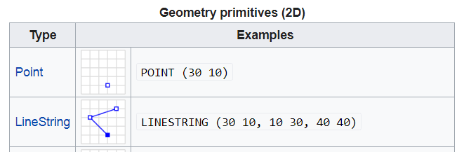

    Figure 1.1 WKT format

    The tools used in this user guide is summarized in Table 1.1.

    Table 1.1 Tools used in this user guide

| Number | Tool        | Address or format                                                                                                                                                                                                                                                                                                      |
|--------|-------------|------------------------------------------------------------------------------------------------------------------------------------------------------------------------------------------------------------------------------------------------------------------------------------------------------------------------|
| 1      | Nexta       | GitHub\\NeXTA-GMNS\\releases                                                                                                                                                                                                                                                                                           |
| 2      | Nexta_GIS   | GitHub\\NeXTA-GMNS\\tools\\GIS_shape_file_CSV_file_conversion\\NEXTA_GIS                                                                                                                                                                                                                                               |
| 3      | Excel       |                                                                                                                                                                                                                                                                                                                        |
| 4      | QGIS/ArcGIS |                                                                                                                                                                                                                                                                                                                        |
| 5      | CSV files   | node.csv, road_link.csv                                                                                                                                                                                                                                                                                                |
| 6      | Shape files | \*.dbf, \*.shp, \*.shx  The shapefile format is a geospatial vector data format for geographic information system (GIS) software. It is developed and regulated by Esri as a mostly open specification for data interoperability among Esri and other GIS software products. https://en.m.wikipedia.org/wiki/Shapefile |

The procedure of converting shape file to csv file and converting csv file to
shape file are illustrated in Figure 1.2 and Figure 1.3. The numbers in Figure
1.2 and Figure 1.3 are corresponding to the numbers in Table 1.1.

Figure 1.2 illustration of converting shape file to csv file

Figure 1.3 illustration of converting csv file to shape file

1.  **Step-by-step process for converting shape file to csv file**

First, please download the NEXTA-GIS tool package, NEXTA_GIS.zip at

<https://github.com/xzhou99/NeXTA-GMNS/tree/master/tools/GIS_shape_file_CSV_file_conversion>

Second, please unzip the package to find 1) NEXTA-GIS.exe executable and 2)
three sets of sample GIS files. Note that, there are a large number of DLL files
in the same folder, which are required as part of GIS SHAPE file reading
utility.

<https://en.wikipedia.org/wiki/QGIS>

<https://en.wikipedia.org/wiki/Shapefile>

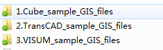

Figure 2.1

**Step 1: Ensure GIS Shape file is readable.**

Open Q-GIS, go to menu-\>layer-\>add layer-\> add vector layer, and open a GIS
shp file, e.g. in data folder “1.Cube_sample_GIS_files”. For more information
about Q-GIS, one can refer to the user guide for Q-GIS at:
<https://docs.qgis.org/3.10/en/docs/user_manual/>

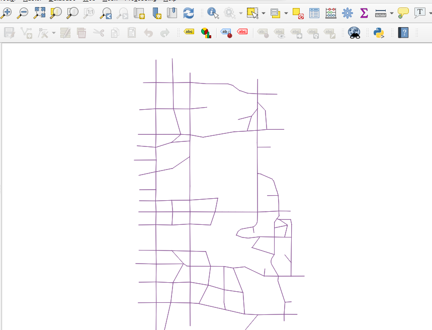

Figure 2.2

**Step 2:** Click on NEXTA-GIS.exe, Select menu ToolsShapefile to CSV two-way
converter,

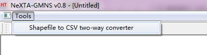

Figure 2.3

Now one can find the dialog of Import/Export Data File. Click the “…” to choose
the Shape file, then click “Export to CSV File”.

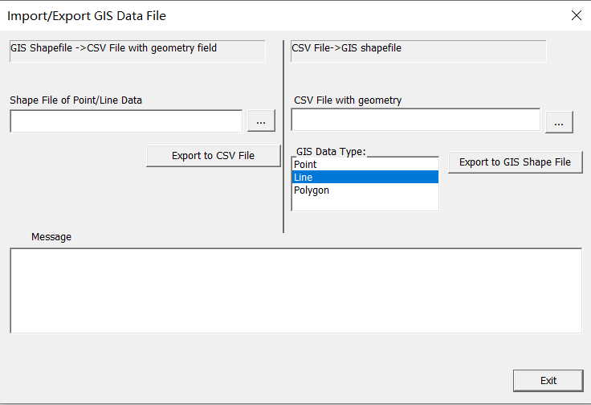

Figure 2.4

**Step 3: Export Shaple file to CSV file**: On the left side of Import/Export
Data File dialog, you can select a GIS Shape file (e.g., SLC_Network_Link.shp)
and then click on the button “Export to CSV File” to save the shape file data
into a new CSV file (e.g. road_link.csv).

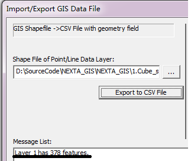

Figure 2.5

As shown above, the sample file has 378 links. The user can check the
saved/converted csv file road link in Excel, where the true shape coordinate
information has been stored in the required field for representing “geometry” in
GMNS.

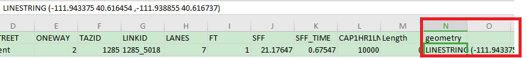

Figure 2.6

One can also use the similar step to convert a node shape file to node.csv.

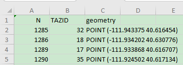

Figure 2.7

**Step 4:** One can carefully change the field name for required fields in GMNS,
such as from_node_id or to_node_id in Excel. If the shape file does not consist
of the “from_node_id” and “to_node_id” messages, the csv file will not have this
filed. Note that, the node.csv file requires x_coord and y_coord fields, which
can be converted from the field of geometry, manually using the “text to column”
feature in Excel.

**Step 5: Convert two-way links to one-way links.**

In a common shape file for the link layer, a link can be coded as a two-way
link. Note that, GMNS requires one-way directional links.

1.  One can first add a field of “direction” with a value of 0 in road_link.csv,
    then use standard NEXTA tool to open the network, and then a two-way link
    will be automatically split to two one-way links in the interface, but
    without offset (so that two links are displayed as overlapping links).

2.  Then continuously click on the NEXTA toolbar highlighted in yellow below,
    increase and decrease link offset to make two related being displayed
    separately.

3.  The user can further save the project through menu file-\>save project, then
    the saved road_link file will have one-way links with offset geometry
    coordinates and the filed of “direction” = 1. This “direction” field is not
    required in GMNS but convenient for distinguishing two-way links and one-way
    links.

4.  In some cases, original fields such as AB_speed, or BA_speed are coded to
    represent different speed limits for different directions of a two-way link,
    the then user needs to manually transfer the information carefully.

5.  **Step-by-step process for converting csv file to shape file, using
    2-corridor example**

Now we use a simple two-corridor example (with 4 nodes and 4 links) to
illustrate the conversion process. For any CSV files with a “geometry” field
following the WKT format, one can seamlessly generate a shape file based on the
CSV files.

If the CSV files do not have “geometry” field, you can use NEXTA to first open
the CSV file and save the project, to generate “geometry” messages. The
two-corridor data can be downloaded at
<https://github.com/xzhou99/STALite/tree/master/dataset/1_two_corridor>.

The descriptions of node.csv and road_link.csv are illustrated in Table 3.1 and
Table 3.2

Table 3.1 description of node.csv

| **Field Name** | **Description**                                                                                     | **Sample Value**            |
|----------------|-----------------------------------------------------------------------------------------------------|-----------------------------|
| name           | Optional for visualization only                                                                     | Main street \@ Highland Dr. |
| node_id        | Node identification number                                                                          | 1001                        |
| x_coord        | Longitude or horizontal coordinate in any arbitrary geographic coordinate system.                   | 100                         |
| y_coord        | Latitude or vertical coordinate horizontal coordinate in any arbitrary geographic coordinate system | 200                         |
| node_type      | Optional text label for visualization and identifies of node                                        | 1                           |
| zone_id        | Indication of node’s physical location                                                              | 1                           |

Table 3.1 description of road_link.csv

| **Field Name** | **Description**                                                                           | **Sample Values** |
|----------------|-------------------------------------------------------------------------------------------|-------------------|
| name           | Optional for visualization purposes                                                       | Main Street       |
| road_link_id   | Link identification number of the road                                                    | 1003              |
| from_node_id   | Upstream node number of the link, must already defined in *node.csv*                      | 1                 |
| to_node_id     | Downstream node number of the link, must already defined in *node.csv*                    | 3                 |
| link_type_name | Optional text label for visualization and data checking purposes                          | 1                 |
| dir_flag       | Indication of directions of the link (=0, bi-direction; =1, single direction)             | 1                 |
| length         | The length of the link (between end nodes), measured in units of miles or km.             | 10                |
| free_speed     | Free-flow speed on defined link. Suggested Unit: mph or kmph                              | 60                |
| lanes          | The number of lanes on the link                                                           | 1                 |
| capacity       | The number of vehicles per hour per lane                                                  | 4000              |
| link_type      | Index of link type name                                                                   | 1                 |
| toll           | Optional generalized toll cost of the link, which could also be the cost of fuel          | 0                 |
| VDF_cap1       | Capacity used in the volume-delay function                                                | 4000              |
| VDF_alpha1     | Coefficient used in the volume-delay function                                             | 0.15              |
| VDF_beta1      | Coefficient used in the volume-delay function                                             | 4                 |
| VDF_theta1     | Coefficient used in the volume-delay function associated with free-flow travel time time. | 1                 |

**Step 1: Open the CSV file in Excel to check the “geometry” field**

In this example, the “geometry” field in node.csv and road_link.csv is empty, so
you can turn to step 2 to generate “geometry” messages, if the CSV file has a
“geometry” field, you are able to turn to step 4.

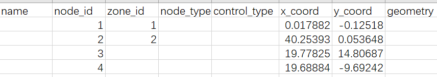

Figure 3.1

**Step 2: Use standard NEXTA to generate “geometry” field in both node and link
files**

Use the standard NEXTA_GMNS executable, then click menu “File’’-\>Open Traffic
Network Project-\> choose node.csv, and finally click on the menu item “Save
Project’’ or the related toolbar button.

After this step, one can open the files node.csv and road_link.csv again, to
check the generated geometry field as shown below.

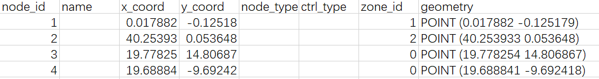

Figure 3.2

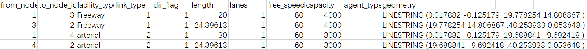

Figure 3.3

**Step 3: Use NeXTA_GIS to convert CSV file to SHAPE file**

Open the NeXTA_GIS executable. On the right side of the Import/Export Data File
dialog, please load a CSV file, choose the type (point/line/polygon) of geometry
field, and then click on the button “Export to GIS Shape File”.

Figure 3.4

>   Step 4: use Q-GIS to verify and display node.shp and link.shp. From Figure
>   3.5 and Figure 3.6, the shape files are generated successfully.

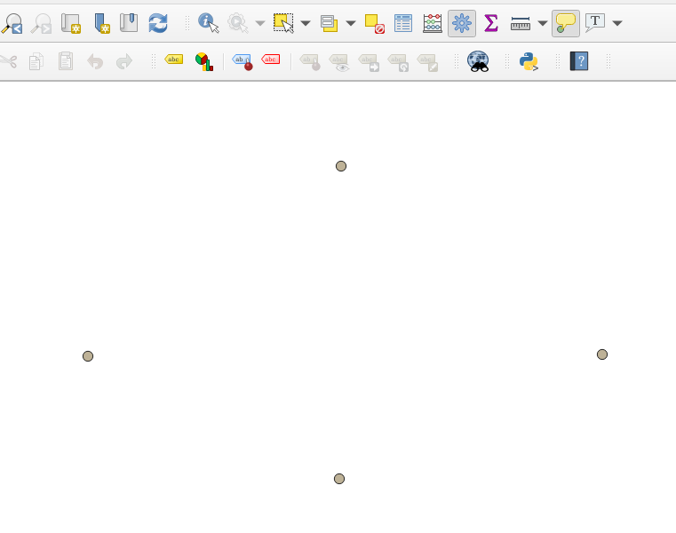

Figure 3.5

Figure 3.6
