|                                                    |
|----------------------------------------------------|
|                                                    |
| **How to Guide: Use NeXTA Visualization Features** |
|                                                    |
|                                                    |

How to open a data set?

>   1

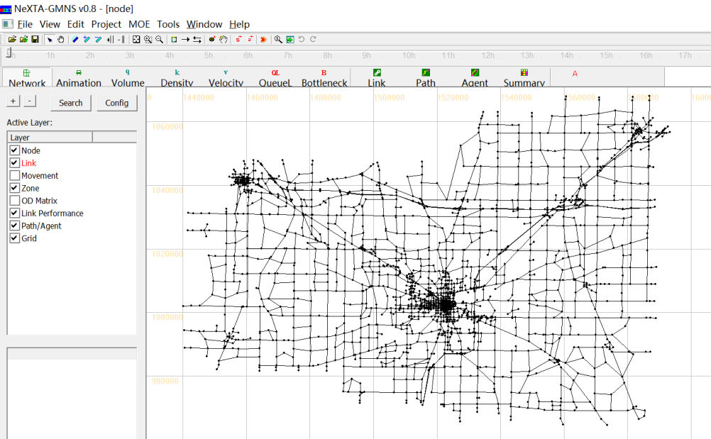

How to open a data set?

>   Outline

1. Network-related Display

2. Time-dependent Simulation Result Display

3. Advanced Analysis Features

4. Changing Network Data

>   **Network-related Display**

How to move a network?

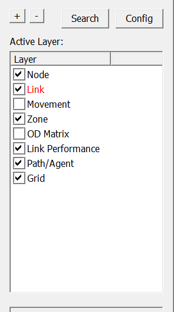

>   How to use GIS layer panel?

Link layer is selected.

How to reset the network display?

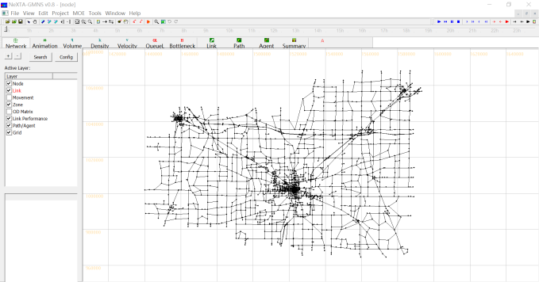

How to zoom in and zoom out?

How to increase/decrease the size of node?

>   How to show node label? **1**

>   **2**

>   How to show link label? **1**

>   **2**

How to increase/decrease offset between links?

How to increase the bandwidth of a link?

>   How to change link color? **1**

>   **2**

>   **3**

How to change link color?

>   **4**

How to change node color? **1**

>   **2**

>   **3**

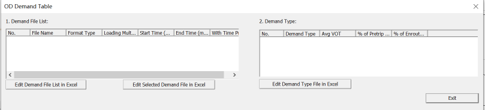

How to show OD matrix? **1**

>   **2**

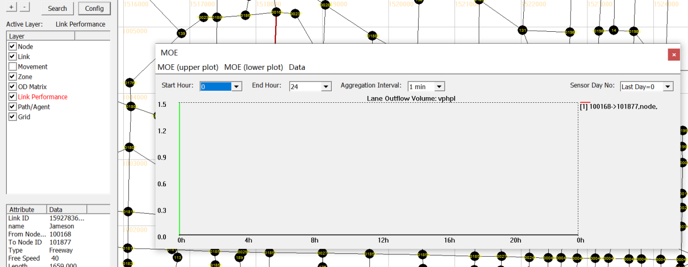

>   How to show link MOE? **1**

>   **2**

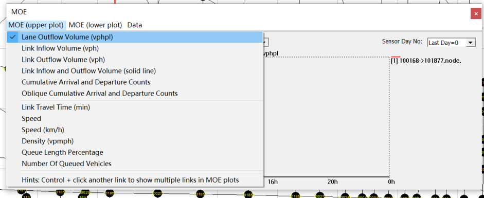

How to show link MOE?

How to show two MOEs simultaneously?

>   **1**

>   **2**

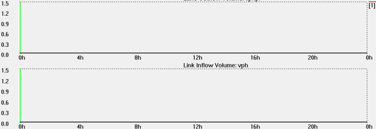

How to show two MOEs simultaneously?

>   **3**

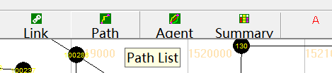

How to select a path?

>   **1**

>   **2**

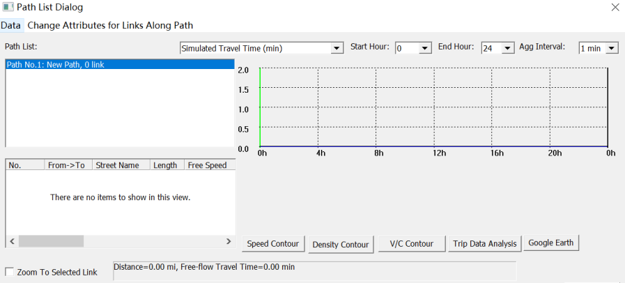

How to select a path?

>   **3**

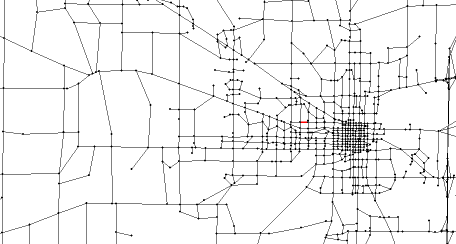

How to show/hide grid?

>   **Time-dependent AMS Result Display**

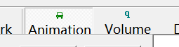

How to display time-dependent simulation result?(Animation)

>   **1**

>   **2**

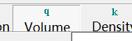

How to display time-dependent simulation result?(Volume)

>   **1**

>   **2**

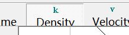

How to display time-dependent simulation result?(Density)

>   **1**

>   **2**

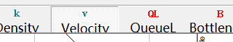

How to display time-dependent simulation result?(Speed)

>   **1**

>   **2**

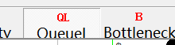

How to display time-dependent simulation result?(Queue)

>   **1**

>   **2**

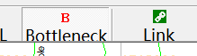

How to display time-dependent simulation result?(Bottleneck)

>   **1**

>   **2**

>   **Advanced Analysis Features**

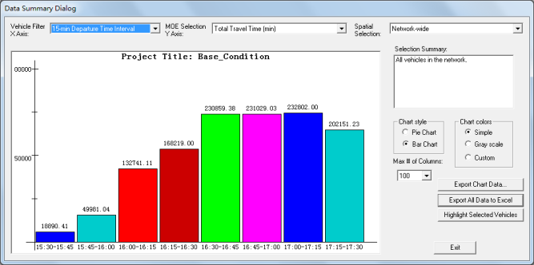

How to do overall network statistics?

>   **1**

>   **2**

How to select link analysis?

>   **1 2**

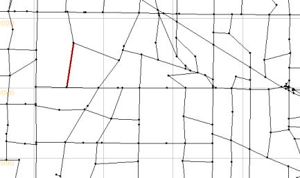

How to select link analysis?

>   **3 4**

>   How to select link analysis? **5**

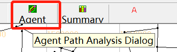

How to select OD analysis?

>   **1**

>   **2**

>   How to select link analysis? **3**

How to define vehicle selection categories?

Trips Passing Selected Path

Partial Trips Passing Selected Path

How to define vehicle selection categories?

Originating from Subarea

How to define vehicle selection categories?

Traversing through Subarea

How to define vehicle selection categories?

Subarea Internal-to-External Trips

How to define vehicle selection categories?

Subarea External-to-Internal Trips

How to define vehicle selection categories?

Subarea Internal-to-Internal Trips

How to define vehicle selection categories?

Complete and Partial Trips inside Subarea

How to define vehicle selection categories?

Subarea Boundary-to-Boundary Trips

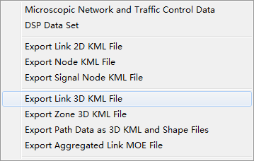

>   How to exporting 3D links to Google Earth?

**1**

>   **Changing Network Data**

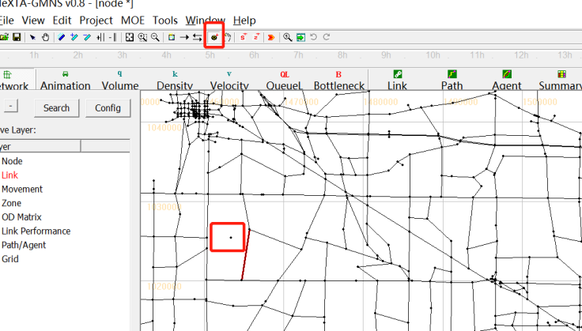

>   How to add a node?

**1**

>   **2**

>   New node

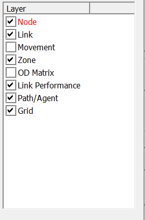

How to delete a node?

>   **1**

>   **2**

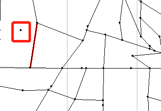

How to delete a node?

>   **3**

>   **4**

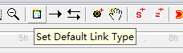

How to add a link based on a given link type?

>   **1 2**

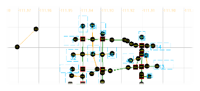

How to add a link based on a given link type?

>   **3**

>   **4**

>   A new link

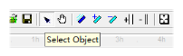

How to delete a link?

>   **1**

>   **2**

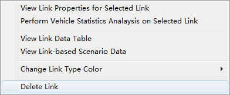

How to delete a link?

>   **3**

>   **4**

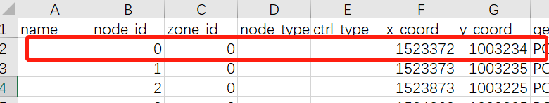

How to add node in CSV file?

>   **1**

>   **2**

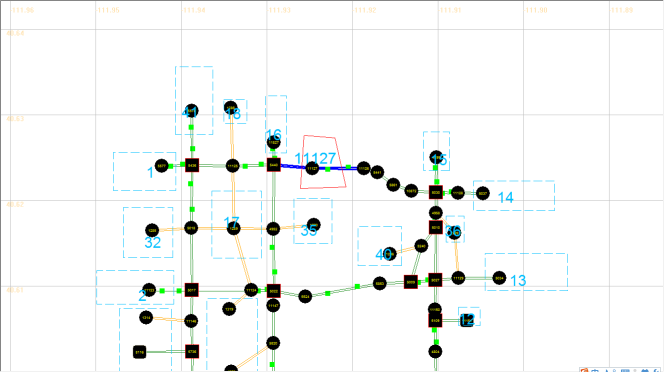

How to add a zone?

>   **1 2**

>   A new zone

How to delete a zone?

>   **1**

>   **2**

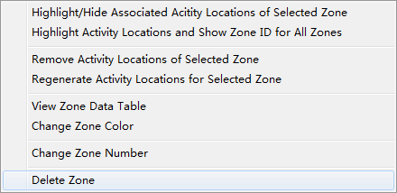

>   How to delete a zone?

**3**

>   **4**

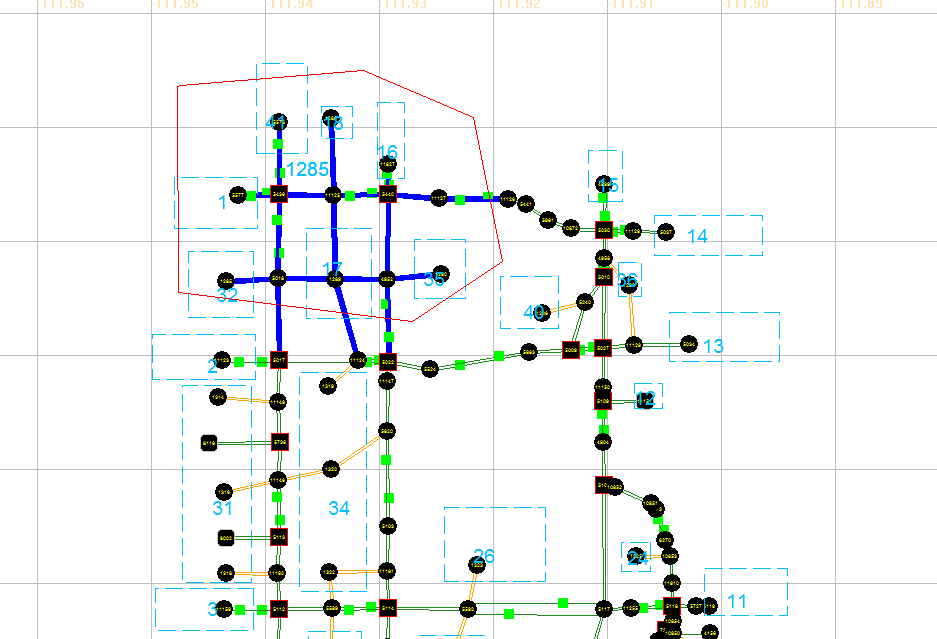

How to add subarea?

>   **1 2**

>   A New subarea

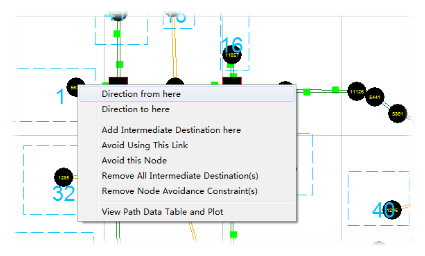

How to define a path?

>   **1**

>   **2**

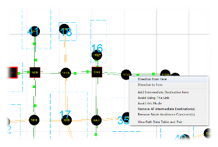

How to define a path?

>   **3**

>   A New path

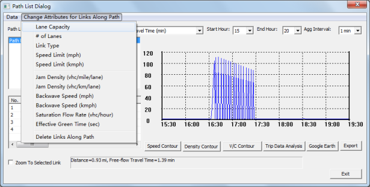

>   How to change link attribute for links along a path?

**1 2**

How to remove activity locations for a zone?

>   **1**

>   **2**

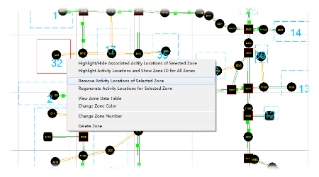

How to remove activity locations for a zone?

>   **3**
