# DTALite Users Guide

Working Document Version 1.0

Please feel free to send any questions, feedback, and corrections to Dr. Xuesong
(Simon) Zhou (xzhou74@asu.edu) by adding comments in this document.

Permission is granted to copy, distribute and/or modify this document under the
terms of the GNU Free Documentation License, Version 1.3 or any later version
published by the Free Software Foundation; with no Invariant Sections, no
Front-Cover Texts, and no Back-Cover Texts. A copy of the license is included in
<http://www.gnu.org/licenses/fdl.html>[www.gnu.org/licenses/fdl.html](http://www.gnu.org/licenses/fdl.html)

Table of Contents

[DTALite Users Guide](#dtalite-users-guide)

[1. Introduction](#introduction)

[1.1 Motivation](#11-motivation)

[1.2 System Architecture](#12-system-architecture)

[1.3 Five steps of performing traffic analysis using CSV
files](#13-five-steps-of-performing-traffic-analysis-using-csv-files)

[2. Getting Started from NeXTA graphical user interface and running
DTALite](#_Toc138058256)

[Step 1: Download and locate the project
folder](#step-1-download-and-locate-the-project-folder)

[Step 2: Prepare input files](#step-2-prepare-input-files)

[Step 3: Visualize and validate network in
NeXTA](#step-3-visualize-and-validate-network-in-nexta)

[Step 4: Run DTALite as a Windows console
application](#step-4-run-dtalite-as-a-windows-console-application)

[Step 5: Visualize output files in
NeXTA](#step-5-visualize-output-files-in-nexta)

[A Toy Example for using NeXTA and running DTALite](#_Toc138058262)

[3. Detailed data structure descriptions](#detailed-data-structure-descriptions)

[3.1 Input files](#31-input-files)

[3.1.1 Input for network data](#311-input-for-network-data)

[3.1.2 Input for demand data](#312-input-for-demand-data)

[3.1.3 Input for assignment and simulation configuration
file](#313-input-for-assignment-and-simulation-configuration-file)

[3.1.4 Input for scenario and subarea
data](#314-input-for-scenario-and-subarea-data)

[3.2 Output files](#32-output-files)

[4. Case Study](#case-study)

[4.1 Two Corridor](#_Toc138058271)

[4.2 Braess Paradox](#42-braess-paradox)

[4.3 Sioux Falls Network](#43-sioux-falls-network)

[4.4 Chicago Sketch](#44-chicago-sketch)

[4.5 Focusing Approach](#45-focusing-approach)

[4.6 Sensitivity Analysis](#46-sensitivity-analysis)

[Appendix A: From mathematical modeling to network-based assignment and
simulation](#appendix-a-from-mathematical-modeling-to-network-based-assignment-and-simulation)

[Appendix B: The method of preparing the zone ids](#_Toc138058278)

# Introduction

## 1.1 Motivation

Motivated by a wide range of transportation network analysis needs, static
traffic assignment (STA) and dynamic traffic assignment (DTA) models have been
increasingly recognized as a set of important tools for assessing operational
performances of those applications at different spatial resolutions (e.g.,
network, corridor and individual segment levels) and across various analysis
temporal regimes (e.g., peak hours, entire day and second-by-second). The
mathematical modeling and related volume-delay functions are described in
Appendix.

The advances of STA and DTA are built upon the capabilities of integrated flow
assignment and simulation models in describing the formation, propagation, and
dissipation of traffic congestion in a transportation network.

As a continuation of DTALite, the development of DTALite-S (S stands for
strategic or static assignment) is motivated by the following perspectives.

1.  **Bridging the gap from macroscopic static assignment to mesoscopic dynamic
    assignment**

    Planning practitioners have recognized the full potential of DTA modeling
    methodologies that describe the propagation and dissipation of system
    congestion with time-dependent trip demands in a transportation network. In
    April 2009, the TRB Network Modeling Committee conducted a DTA user survey
    through the FHWA TMIP mail list, which identified the following top 5
    technical barriers:

-   DTA requires more data than are available or accessible to most users (47%)

-   Setting up a DTA model consumed inordinate resource (44%)

-   Cost/benefit of implementation is unclear (45%)

-   DTA tools take too long to run (35%)

-   The underlying modeling approaches are not transparent (35%)

The development goal of DTALite aims to provide an integrated open-source
package for strategic traffic analysis that includes both static traffic
assignment and dynamic traffic simulation to reflect the impact of road capacity
constraints. The underlying volume-delay models include BPR functions and its
extension of BPR-X. Three traffic stream models, namely, point queue model,
spatial queue model and simplified kinematic wave models, are embedded in the
mesoscopic simulator to describe queueing behavior at bottlenecks with tight
capacity constraints.

1.  **Adopting open network standard of GMNS**

    General Travel Network Format Specification is a product of Zephyr
    Foundation, which aims to advance the field through flexible and efficient
    support, education, guidance, encouragement, and incubation. Further details
    can be found in
    <https://zephyrtransport.org/projects/2-network-standard-and-tools/>

2.  **Integrated graphic user interface and analysis package**

    NeXTA (Network eXplorer for Traffic Analysis) is another open-source graphic
    user interface (GUI) for transportation network analysis, while the
    lower-case “*e*” stands for education with broader impacts. With both
    open-source traffic assignment/simulation engine (as a simple Windows
    console application) and graphic user interface, the software suite of
    DTALite + NeXTA aims to

-   provide an open-source code base to enable transportation researchers and
    software developers to expand its range of Strategic Traffic Assignment
    capabilities to various traffic management analysis applications.

-   present results to other users by visualizing traffic flow dynamics and
    traveler route choice behavior in an integrated 2D environment.

-   provide a free education tool for students to understand the complex
    decision-making process in transportation planning and optimization
    processes.

1.  **Parallel computing on shared memory multi-core computer**

    Emerging multi-core computer processor techniques are offering unprecedented
    available parallel computing power, on most of laptops and desktops
    currently available in the market. To exploit this paradigm change in
    computing, we will require a new software architecture and algorithm design
    so as to facilitate the most efficient use of emergent parallel hardware.

    **The Mobility Equivalent Unit (MEU)**

    is a concept used in transportation planning and analysis to convert
    different modes of transportation into a common unit for comparison
    purposes. MEU allows for a meaningful comparison of the impacts and demands
    of different modes of transportation by considering their capacity and usage
    characteristics.

    MEU represents a standardized measure of mobility, indicating the equivalent
    demand or capacity of a particular mode of transportation in relation to a
    reference mode, often passenger cars. It takes into account factors such as
    passenger capacity, occupancy rates, and travel time.

    For example, if we consider a scenario where a certain number of passengers
    are traveling by passenger cars and another scenario where the same number
    of passengers are traveling by buses, the MEU would quantify the number of
    buses required to accommodate the same passenger demand as the passenger
    cars.

    The calculation of MEU involves considering factors such as passenger
    capacity, occupancy rates, and travel time of different modes. By converting
    various modes of transportation into a common unit, transportation planners
    and analysts can assess and compare the impacts, efficiency, and
    effectiveness of different modes in terms of their contribution to mobility
    and transportation demand.

MEU is a useful tool in transportation planning and decision-making processes as
it provides a standardized metric for evaluating and comparing the performance
and capacity of different modes of transportation. It helps in understanding the
trade-offs and implications of mode choice and can aid in developing more
efficient and sustainable transportation systems.

1.  **Integrated OD demand estimation through path flow estimator (to be
    added)**

The latest software release can be downloaded at our Github website. The source
code can be downloaded at https://github.com/asu-trans-ai-lab/DTALite. Table 1
illustrates the contents of different folders at Github
https://github.com/asu-trans-ai-lab/DTALite.

Table 1. contents of folders at Github.

| **Github Folder Name** | **Contents**                                                                                                                                   |
|------------------------|------------------------------------------------------------------------------------------------------------------------------------------------|
| src                    | source code of DTALite                                                                                                                         |
| user_guide             | user’s guide and other documentations for DTALite                                                                                              |
| dataset                | sample datasets for DTALite: 1. two_corridor 2. Braess_paradox 3. three_corridor 4. Sious_Falls_network 5. Chicago_Sketch 6. Tempe_ASU_network |

Release notes:

The upcoming release of DTALite software introduces an array of key features
designed to improve the user experience, especially for planners and students,
and to provide a more comprehensive suite of tools for transportation network
analysis. Here's a brief overview of what you can expect from the release
scheduled for July 1, 2023.

1.  **Multiple Scenarios:** The enhanced software now allows users to create,
    manage, and switch between multiple scenarios. This new feature makes it
    easier to study different transportation network configurations and demand
    patterns.

2.  **Improved Input Functionality:** The update focuses on bettering both the
    supply and demand side input functionality:

    -   On the supply side, users can now define and customize various
        attributes of network infrastructure, such as nodes, links, capacities,
        geometries, and special link types. Additionally, users can specify
        supply-side scenarios like incidents, road closures, or alternative
        routes.

    -   On the demand side, the software enables users to define various demand
        attributes, like origin-destination pairs, volume, mode choice, and time
        periods. The new version even supports importing activity travel and
        choice set data for activity-based models.

3.  **Enhanced Output Features:**

    -   The link Measures of Effectiveness (MOE) output functionality is
        improved to provide comprehensive information about link-level
        performance metrics like travel time, speed, volume, and congestion
        levels for each scenario.

    -   The route assignment output functionality is enhanced to provide
        detailed information about the assigned routes for different agents and
        scenarios, along with insights into volume, tolls, travel time,
        distance, link sequence, and time sequence.

4.  **Test Example:** A realistic test example covering a transportation network
    scenario with multiple supply and demand variations will be provided. This
    is designed to help users validate the software's capabilities and
    performance.

5.  **Link MOE Summary Across Scenarios:** The software can now generate a
    summary of link MOEs across multiple scenarios, enabling users to compare
    and analyze the performance of links across different scenarios.

6.  **System Performance Across Scenarios:** The system performance analysis
    functionality is enhanced to provide comprehensive reports and
    visualizations summarizing the overall performance of the transportation
    system across multiple scenarios.

7.  **Documentation and Collaborative Support:** The software documentation is
    updated to provide detailed instructions and explanations for the new
    features. Collaborative support and training materials will be provided to
    help users effectively utilize the multiple scenario, input, and output
    features.

## 1.2 System Architecture

### 1.2.1 DTALite+Nexta

The software architecture of DTALite aims to integrate many rich modeling and
visualization capabilities into an open-source traffic assignment model suitable
for practical everyday use within the context of an entire large-scale
metropolitan area network. Using a modularized design, the open-source suite of
**simulation engine + visualization interface** can also serve future needs by
enabling transportation researchers and software developers to continue to build
upon and expand its range of capabilities. The **streamlined data flow** from
static traffic assignment models can allow state DOTs and regional MPOs to
rapidly apply the advanced STA/DTA methodology, and further examine the
effectiveness of traffic mobility, reliability and safety improvement
strategies, individually and in combination, for a large-scale regional network,
a subarea or a corridor.

Figure 1.1 Software System Architecture

The components and different modules in the system are listed as following:

**a. Network Data** includes two essential files, node.csv and link.csv for the
macroscopic network representation.

**b. OD Demand Meta Database** includes the setting.csv as the configuration
file that describes information such as agent type, demand period, demand file
list, which help users to represent the OD demand information for different user
types at specific demand periods.

**c. Traffic Assignment Module** includes the key steps of the assignment,
including the BPR Volume Delay Function, Shortest Path Tree Generation, and Flow
Assignment, which generates the path flow and link flow according to the UE
principle.

**d. NEXTA: Visualization Interface Module** is able to visualize the network
and the output of traffic assignment, including Static Link Performance and
Agent Trajectory.

**e. Space-Time Simulation Module** utilizes the path flow output of Traffic
Assignment Module to perform Space-Time Simulation, while the underlying traffic
flow models in the Space-Time Simulation Module are Point Queue (PQ) and Spatial
Queue (SQ). A simplified kinematic wave (KW) model can be also used in an
advanced mode, similar to DTALite.

**f. Capacity Management** aims to manage the static and time-dependent link
capacity input for Space-Time Simulation, such as signal timing plans and
multi-modal service plans.

**g. Simulation Output Module** covers the output file of Space-Time Simulation
Module, including Dynamic Link Performance and Agent Trajectory in terms of
link_performance.csv and agent.csv, which can be visualized in NeXTA.

Regarding parameters in settings.csv, Table 2 illustrates the differences
between two key steps of Static Traffic Assignment and DTA + space-time
simulation.

Table 1.2. The between Analytical Traffic Assignment and DTA+ network based

|                              | Analytical Dynamic Traffic Assignment                               | Simulation-based Network loading                                    |
|------------------------------|---------------------------------------------------------------------|---------------------------------------------------------------------|
| Travel time evaluation       | BPR function with volume/capacity ratio (soft capacity constraints) | Space-time network based simulation with tight capacity constraints |
| Demand input                 | OD demand                                                           | OD demand or agent based input from the analytical DTA              |
| Output (1): link performance | Link performance, Dynamic Link performance based on  Queue VDF      |                                                                     |
| Output (2): route_assignment | Route_assignment Node_sequence, link_sequence                       |                                                                     |
| Output (3): trajectory       | no trajectory.csv with analytical traffic assignment                | Individual agent trajectory with path sequence and time sequence    |

### 1.2.2 Focusing Approach

As an important component of DTALite, Focusing Approach aims to develop a
comprehensive practice-oriented automating and streaming workflow for traffic
analysis tasks, which integrates 1) a **F**ocusing approach to define subareas,
2) **O**rigin-based flow extraction, 3) **C**olumn generation, 4) column
**U**pdating path flow using multiple data sources, e.g. travel time and traffic
counts, 5) **S**ensitivity analysis, 6) **I**nformation evaluation, 7)
multiresolution **N**etwork, and 8) **G**ent-based simulation. The workflow of
Focusing Approach is shown in Table 1.3.

Table 1.3 Illustration for FOCUSING approach workflow

|   | Steps                                 | Input                                                                                                          | Process                                                                                                                                                                                                                                       | Output                                                                                                                                                                                                                                                                                               |
|---|---------------------------------------|----------------------------------------------------------------------------------------------------------------|-----------------------------------------------------------------------------------------------------------------------------------------------------------------------------------------------------------------------------------------------|------------------------------------------------------------------------------------------------------------------------------------------------------------------------------------------------------------------------------------------------------------------------------------------------------|
| F | Focusing approach                     | subarea.csv                                                                                                    | 1. Identify subarea 2. Reduce the OD size: Identify the internal zones. Identify important external related zones outside the subarea. The importance of zones is decided based on the total amount of OD volume passing through the subarea. | zonal_hierarchy_mapping.csv.csv  each zone has a district id automatically identified                                                                                                                                                                                                                |
| O | Origin-based flow extraction          |                                                                                                                | Reduce the OD size further.                                                                                                                                                                                                                   |                                                                                                                                                                                                                                                                                                      |
| C | Column generation and updating        |                                                                                                                | Generate different paths                                                                                                                                                                                                                      |                                                                                                                                                                                                                                                                                                      |
| U | Baseline assignment and OD estimation | Measurement (traffic counts inside subarea)                                                                    | Perform column generation, and column-based updating as a nonlinear program for ODME to minimize the total deviations assigned volume and traffic counts.                                                                                     | observed and assigned link volume in link_performance.csv  before MOEs (Volume, speed, D/C, congestion duration P)                                                                                                                                                                                   |
| S | Subarea based sensitivity analysis    | supply_side_scenario  (\# of lanes being changed to represent work zone or incident)  or  demand_side_scenario | 1. Change the number of lanes from the baseline result, 2. Perform column generation again to find alternative routes,  3. Perform column updating to reach a new user equilibrium link and route flow                                        | final_summary.csv  link_performance.csv **subarea_link_performance.csv**  (volume, speed, D/C ratio, congestion duration for each link. Before and after the scenario being applied)  **district_performance.csv** (total travel time, average distance, and average travel time for each district)  |
| I | Information classes                   | Real time, DMS, DMS + mandatory information                                                                    | Specify the DMS location                                                                                                                                                                                                                      | Travel time for each information users                                                                                                                                                                                                                                                               |
| N | Multiresolution network               | Macroscopic network form OSM                                                                                   | Osm2gmns python package                                                                                                                                                                                                                       | Mesoscopic and Microscopic network                                                                                                                                                                                                                                                                   |
| G | Agent-based Simulation                | supply_side_scenario or  demand_side_scenario                                                                  |                                                                                                                                                                                                                                               | before and after MOEs in link_performance.csv                                                                                                                                                                                                                                                        |

**Stage FO: OD size reduction**

The key goal of this stage is to find an appropriate zone set, called subarea
related zone, to run the DTA model so that we can minimize the gap of the link
volume inside the subarea after we reduce the zone size, called after link
volume for convenience, and the corresponding link volume when we solve the
entire statewide network, called original link volume. At the same time, the
computer memory use can be reduced and the computation efficiency can be
improved.

**Stage CU: Column generation and updating**

We proposed an approximation approach to study a relatively small, focused
subarea with more complex traffic conditions, so that we can clearly calculate
the mutual impact between each vehicle group and space-time paths from a system
with sampled vehicles and reduced link capacities. A space-time-state path of
one vehicle with served passengers and visited space-time arcs is called one
column in the column pool. Based on the real-world passenger requests and road
capacity, we will determine how to reach the minimal system travel cost under
arc capacity constraints.

**Stage S: Sensitivity analysis**

This stage is to analyze the performance measurement before and after the
scenarios. The key input of sensitivity analysis is the OD demand matrixes for
base year and future year. Then perform column generation again to find
alternative routes after applying demand-side or supply-side scenarios. Future
we will perform a column updating step to reach a new user equilibrium link and
route flow. Finally, the output will be the time-dependent volume and speed,
congestion duration, and congested demand volume.

**Stage I: information classes**

Incident response operations require effective planning of resources to ensure
timely clearance of roadway accidents and avoidance of secondary incidents. This
section formulates a mixed- integer linear model that minimizes the total
expected travel time and maximizes the total incident demand covered. The model
accounts for the location, severity, frequency of incidents, dispatching
locations, and availability of incident respondents. An integrated methodology
is proposed that includes column generation and Lagrangian relaxation along with
a density-based spatial clustering of applications with noise technique to
define incident hotspots. A Benders decomposition technique is implemented to
conduct benchmark analyses.

**Stage N: multiresolution network**

To enable seamless data exchange among models of various domains and scales, the
research team utilizes and enhanced a GMNS-based data hub by FHWA.
<https://github.com/zephyr-data-specs/GMNS>. To model intersection turning
movements and signal control well, the research team proposed a Multi-Resolution
Model (MRM) methodology and workflow. In MRM, the analyst simultaneously
assesses traffic performance at multiple resolutions: macroscopic, mesoscopic,
and microscopic.

**Stage G: Agent-based simulation**

Agent-based modeling and simulation (ABMS) is a modeling approach for simulating
the actions and interactions of autonomous individuals, assessing their effects
on the system as a whole. The basic idea of ABMS is that complex phenomena can
be understood as systems of autonomous agents following rules of interaction. In
contrast to the traditional event simulation, which assumes that entities follow
a sequence of processes, ABMS defines the local behavior rules of the underlying
entities to reveal the emerging behaviors of the whole system.

## 1.3 Five steps of performing traffic analysis using CSV files

The specific instruction for the use of NeXTA and DTALite is as follows:

Step 1: **[Download and locate the project folder]** Download and unzip the
release software package from github. Locate DTALite file folder with several
input files, including network, demand, assignment, simulation, scenario and
subarea. Typically, copy DTALite.exe and NeXTA.exe in the same folder for easy
access.

Step 2: **[Prepare input files]** Open a file explorer, view or edit input files
of network, demand, assignment, simulation, scenario and subarea in CSV, Excel
or any text editor. The user can prepare the input files following the data
structure described in Section 3.1

Step 3: **[Visualize and validate network in NeXTA]** Click “NeXTA”—“File”—“Open
Traffic Network Project” to choose the node.csv file in your network data set.
Check the network connectivity through a simple path calculation by selecting
one OD pair.

Step 4: **[Run DTALite as a Windows console application]** Click on the
executable of “DTALite.exe” from a file explorer or run it from Windows command
window, to perform traffic assignment and simulation. The output of this Windows
console applications is displayed in screen and log files. After the completion
of DTALite, users can view the output performance and summary files in CSV
format. The user can check the output files following the data structure
described in Section 3.2.

Step 5: [**Visualize output files in NeXTA**] For static traffic assignment,
NeXTA is able to display link travel time, speed and volume, as well as path
display in the agent dialog. For dynamic assignment and simulation, one can use
NeXTA to view time-dependent queue and density.

# Getting Started from NeXTA graphical user interface and running DTALite

This chapter uses 01_two_corridor as an example to introduce the basic content
and usage of DTALite. This example uses a simple case with a single
origin-to-destination pair and two paths p=1 for the primary path
(link_type=Freeway), p=2 for the alternative path (link_type=Arterial). As each
path has two links, path 1 has a free-flow travel time of 20 minutes, and path 2
has a free-flow travel time of 30 minutes. This example can be established in a
real-world scenario. Consider a city called ‘Desert city’ which is divided into
different districts. It is found that there is a traffic flow demand between two
districts, assume that they are called ‘Downtown’ and ‘Marketplace’. These two
districts are connected by an arterial road and a freeway. The arterial road
passes through a district called ‘Suburbs’ and the freeway passes through a
district called ‘Steel Plant’. It must be noted that there is no production or
attraction in the ‘Suburbs’ and ‘Steel Plant’ districts, the links only pass
through them in this particular scenario.

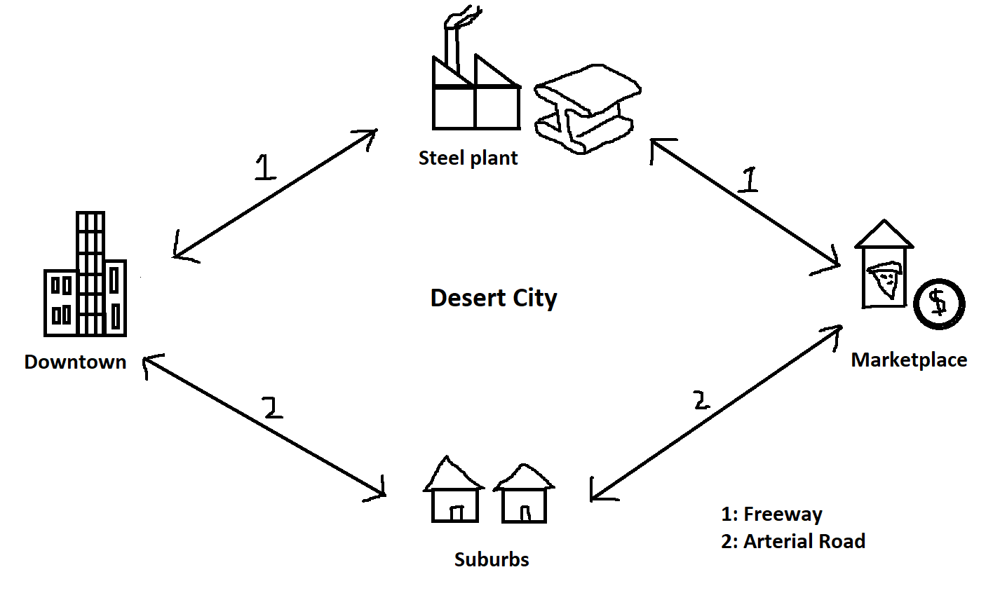

## Step 1: Download and locate the project folder

First, download and unzip the released packages from github . Locate the project
folder of "01_two_corridor". Typically, copy DTALite.exe and NeXTA.exe in the
same folder for easy access. The list of data files is as follows.

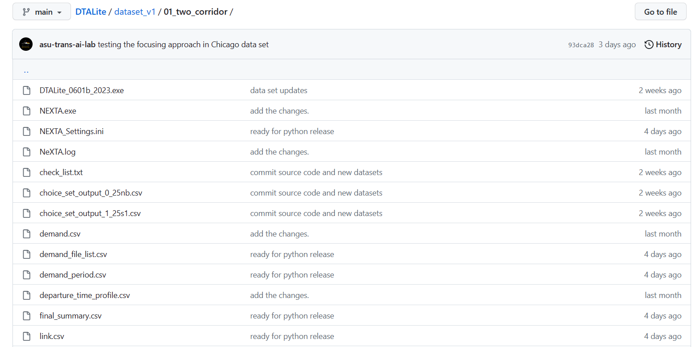

## Step 2: Prepare input files

Users can prepare their own input files according to the data structure
described in Section 3.1, which mainly consists of network files, demand files
and configuration files. For example, the contents and format of the core input
files for 01_two_corridor are as follows.

node.csv: nodes in the network

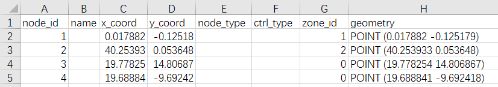

link.csv: links in the network with essential attributes for assignment

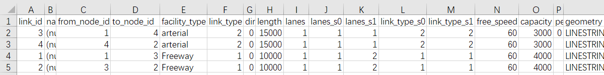

The two input files above constructs a simple network with 4 nodes and 4 links,
as follows:

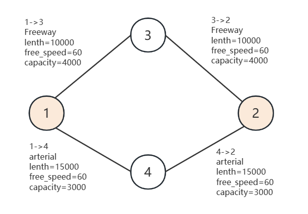

demand.csv: the demand of passengers for each OD pair

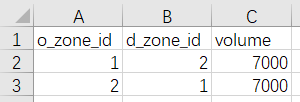

setting.csv: the basic setting for the network, the number of iterations

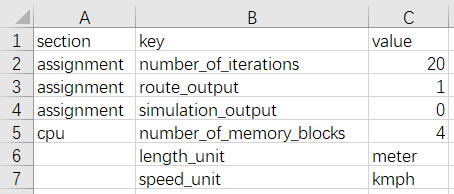

## Step 3: Visualize and validate network in NeXTA

Click “NeXTA”—“File”—“Open Traffic Network Project” to choose the node.csv file
in your network data set. Check the network connectivity through a simple path
calculation by selecting one OD pair.

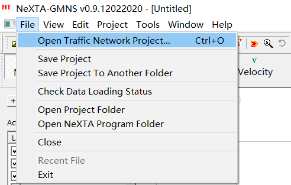
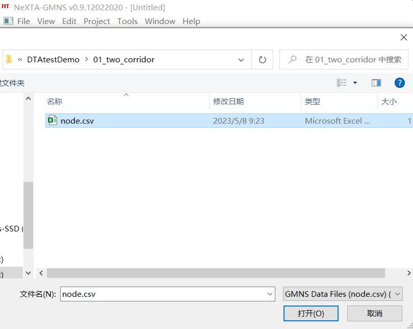

The network is as follows.

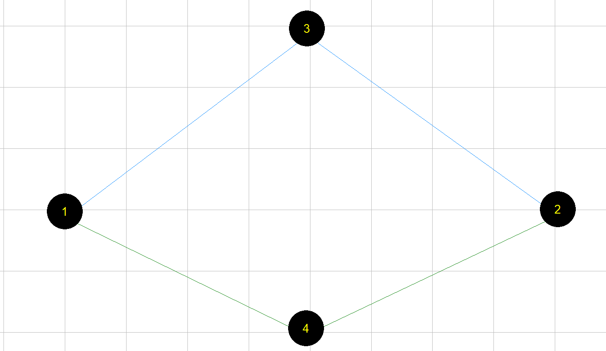

First, select the node layer in the left-hand-side GIS panel, we can use the
mouse to select node 1 and node 2. Alternatively, one can use a keyboard
shortcut of Control+f to search those nodes.

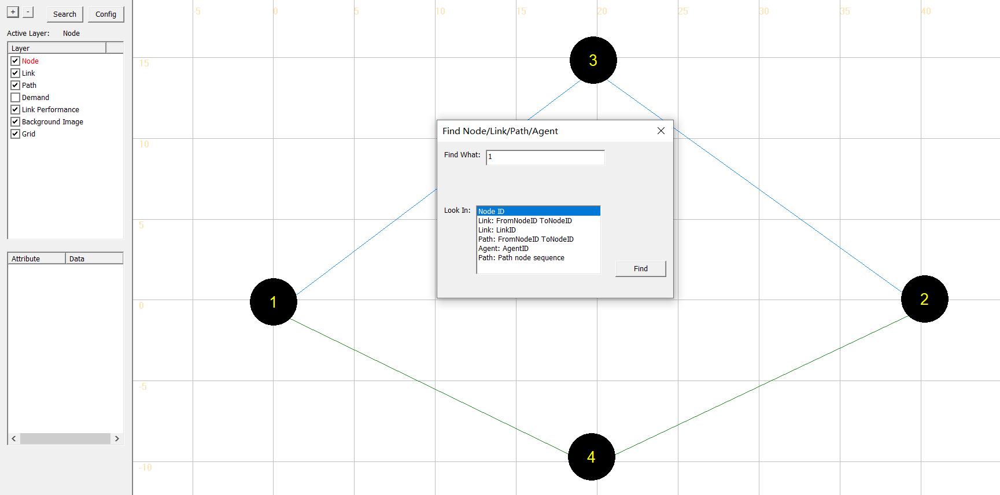

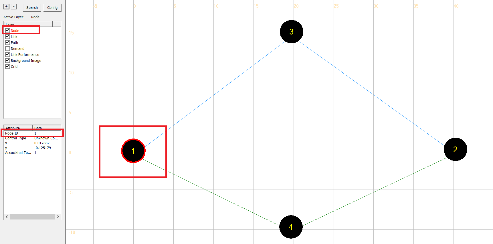

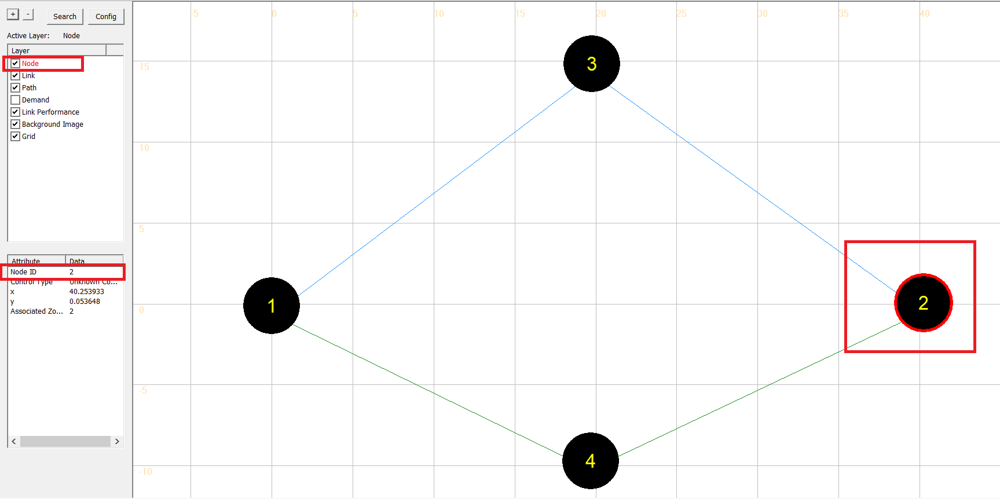

Go the path GIS layer, users can check if this path is connected. Here is an
example. Select node 1, right-click and select the "Check Connectivity from
here" option.

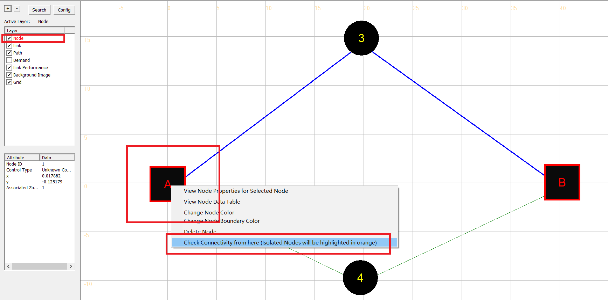

Then select node 2, right-click and select the "Direction to here" option.

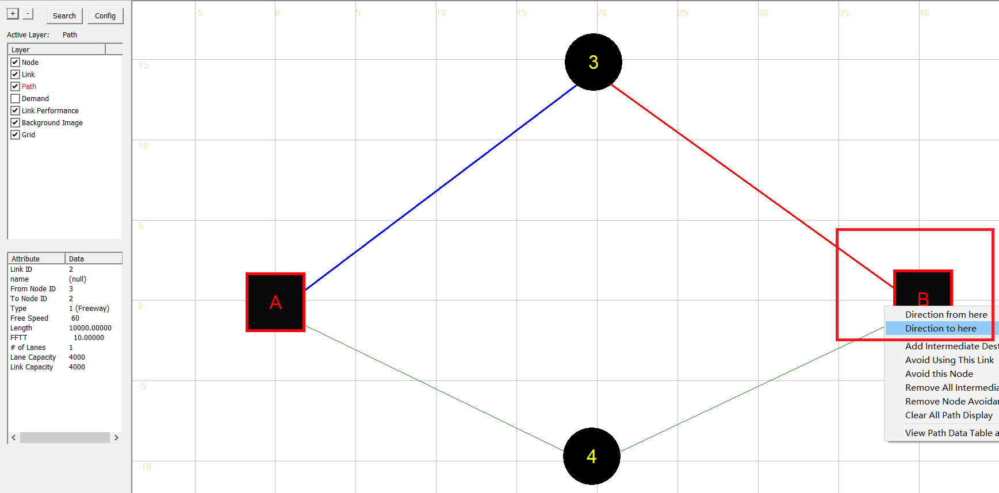

Alternatively, one can use a keyboard shortcut of Control+f to specify the
origin and destination for the path. As shown below, enter the ID of the origin
node and the destination separated by spaces, and click the "find" button to
find the corresponding path.

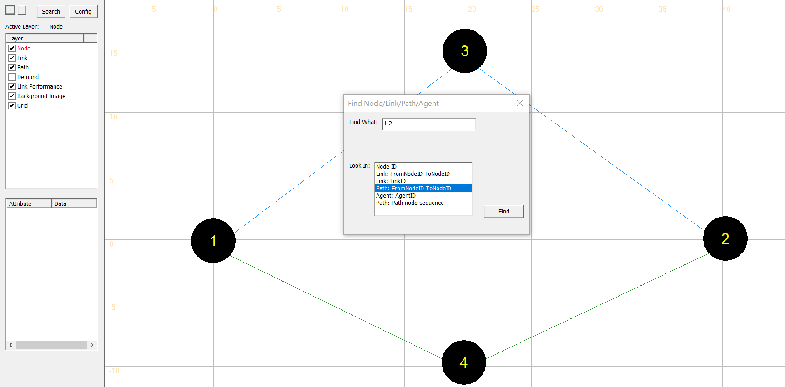

The following figure shows the result, with A as the origin node and B as the
destination node.

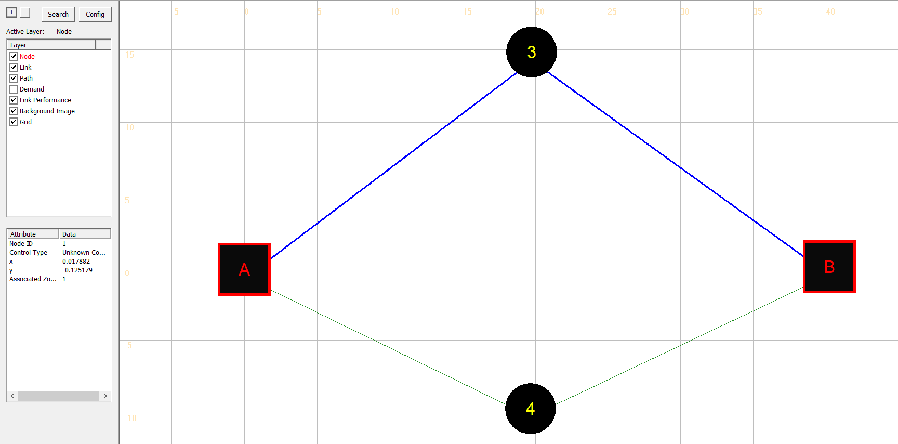

## Step 4: Run DTALite as a Windows console application

Put the executable of “DTALite.exe” with the input files in the same file
explorer and click on it to perform traffic assignment and simulation.

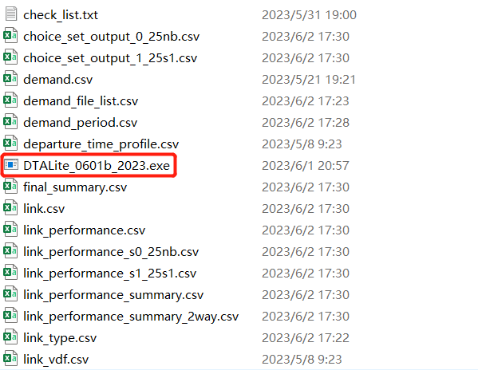

For a given OD demand of 7,000 on this network, we can use the User Equilibrium
method to perform traffic assignment. A graphic-based solution process can be
described by Figure 2.3. As the path flow changes, the travel time on the two
paths reaches the same equilibrium point, which satisfied the requirement of
User Equilibrium. User equilibrium solution is reached when the freeway flow is
5400, and arterial flow as 7000-5400=1600, and this leads to the same travel
time of 30 min on both routes.

Figure 2.3 illustration of Equilibrium with X axis as freeway path flow.

The detailed parameters are in Table 2.1.

Table 2.1 parameters

| **Parameters**                            | **Value** |
|-------------------------------------------|-----------|
| Freeway flow travel time (min): Freeway:  | 20        |
| Freeway flow travel time (min): Arterial: | 30        |
| Capacity (vehicles / hour): Freeway:      | 4000      |
| Capacity (vehicles / hour):Arterial:      | 3000      |
| Demand                                    | 7000      |
| BPR alpha                                 | 0.15      |
| BPR beta                                  | 4         |

The travel time function is

Freeway_TT = FFTT[1 + 0.15(v/c)4]

Arterial \_TT= FFTT[1 + 0.15((demand-v)/c)4]

where:

TT = link travel time

FFTT= free-flow travel time of link

v = link flow

c = link capacity

The above content is the theoretical basis of the toy example. Next, the steps
for solving the user equilibrium in the toy example are illustrated by using
NeXTA and running DTALite. Generic network files used for DTALite include files
for three layers: physical layer, demand layer and configuration file layer. The
related files used in DTALite are listed below.

The user now can check output files in Excel/CSV for the following files:

1.  link_performance_s(scenario_index)_(scenario_name).csv

2.  route_assignment_s(scenario_index)_(scenario_name).csv

3.  district_performance_s(scenario_index)_(scenario_name).csv

4.  od_performance_summary.csv

5.  link_performance_summary.csv

6.  system_performance_summary.csv

7.  final_summary.csv

If the user performs focusing approach, the following file will be generated in
addition to the above files:

1.  zonal_hierarchy_mapping.csv

    All DTALite **data files** are in CSV format. The files for physical layers
    (node, link and zone) have geometric fields for importing from and exporting
    to GIS software.

## Step 5: Visualize output files in NeXTA

**Volume/Capacity (V/C) Ratio Visualization**

The V/C Visualization View is enabled using the
 button, showing the
time-dependent Volume-to-Capacity Ratio for each link in the network. An example
is shown below for a portion of the two-corridor network, where the link width
is based on the time-dependent link volume.

**Volume Visualization**

The Volume Visualization View is enabled using the
 button, showing the
time-dependent volume for each link in the network. An example is shown below
for a portion of the two-corridor network, where the link width is based on the
time-dependent link volume.

**Speed Visualization**

The Speed Visualization View is enabled using the
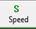 button, showing the
time-dependent speed for each link in the network. An example is shown below for
a portion of the two-corridor network, where the link width is based on the
time-dependent link volume.

Open NEXTA, import the network, chose the time period that you set in
demand_period.csv, and click volume, you can see the assignment outcome as shown
below.

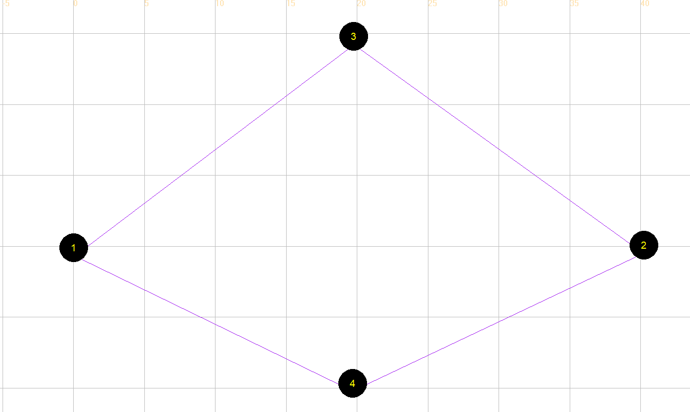

# Detailed data structure descriptions

There are 14 input files and 8 output files for the DTALite package. The input
and output files are listed in Table 3.1.

**Table 3.1 Input and output file list for DTALite**

| File type                    | Index: file name                                                | Description                                                                                                                                                                                                                                                                                                                                                                                                                                                                                                                                                                                                                                                                                         |
|------------------------------|-----------------------------------------------------------------|-----------------------------------------------------------------------------------------------------------------------------------------------------------------------------------------------------------------------------------------------------------------------------------------------------------------------------------------------------------------------------------------------------------------------------------------------------------------------------------------------------------------------------------------------------------------------------------------------------------------------------------------------------------------------------------------------------|
| Input for physical layer     | 1a: *node.csv*                                                  | Define nodes in the network.                                                                                                                                                                                                                                                                                                                                                                                                                                                                                                                                                                                                                                                                        |
|                              | 1b: *link.csv*                                                  | Define links in the network with essential attributes for assignment.                                                                                                                                                                                                                                                                                                                                                                                                                                                                                                                                                                                                                               |
|                              | 1c: *zone.csv*                                                  | Optional as zone_id can be defined in *node.csv.*                                                                                                                                                                                                                                                                                                                                                                                                                                                                                                                                                                                                                                                   |
| Input for demand layer       | 2a: *demand.csv*                                                | Define the demand of passengers on each OD pair, which could be extracted by *demand_file_list.csv*.                                                                                                                                                                                                                                                                                                                                                                                                                                                                                                                                                                                                |
|                              | 2b: *demand_period.csv*                                         | Define demand period, which could be extracted by demand_file_list.                                                                                                                                                                                                                                                                                                                                                                                                                                                                                                                                                                                                                                 |
|                              | 2c: *departure_time_profile.csv*                                | Define departure time in the agent-based simulation.                                                                                                                                                                                                                                                                                                                                                                                                                                                                                                                                                                                                                                                |
|                              | 2d: *demand_file_list.csv*                                      | Define demand type, period, and format type.                                                                                                                                                                                                                                                                                                                                                                                                                                                                                                                                                                                                                                                        |
| Input for configuration file | 3a: *settings.csv*                                              | Define basic setting for the network, the number of iteration                                                                                                                                                                                                                                                                                                                                                                                                                                                                                                                                                                                                                                       |
|                              | 3b: *mode_type.csv*                                             | Define attributes of each type of agent, including vot (unit: dollar per hour) and pce.                                                                                                                                                                                                                                                                                                                                                                                                                                                                                                                                                                                                             |
|                              | 3c: *link_type.csv*                                             | Define types of links in the network                                                                                                                                                                                                                                                                                                                                                                                                                                                                                                                                                                                                                                                                |
|                              | 3d: *link_vdf.csv*                                              | Analytical volume demand function parameters                                                                                                                                                                                                                                                                                                                                                                                                                                                                                                                                                                                                                                                        |
|                              | 3e: *sensor_data.csv*                                           | Observed link volume                                                                                                                                                                                                                                                                                                                                                                                                                                                                                                                                                                                                                                                                                |
|                              | 3f*:dynamic_traffic_management.csv*                             |                                                                                                                                                                                                                                                                                                                                                                                                                                                                                                                                                                                                                                                                                                     |
|                              | 4a: *scenario_index_list.csv*                                   | Define scenario name, scenario description and activation state                                                                                                                                                                                                                                                                                                                                                                                                                                                                                                                                                                                                                                     |
|                              | 4b: *subarea.csv*                                               | Extract the subarea polygon information using NeXTA tool                                                                                                                                                                                                                                                                                                                                                                                                                                                                                                                                                                                                                                            |
| Output files                 | 5a:*link_performance_s(scenario_index)\_ (scenario_name).csv*   | Show the performance of each link under different scenarios, including the travel time, volume, and resource balance.                                                                                                                                                                                                                                                                                                                                                                                                                                                                                                                                                                               |
|                              | 5b:*route_assignment_s(scenario_index)_(scenario_name).csv*     | Show the results of the assignment under different scenarios, including the volume, toll, travel time and distance of each path of each agent, as well as the link sequence and time sequence.                                                                                                                                                                                                                                                                                                                                                                                                                                                                                                      |
|                              | 5c:*district_performance_(scenario_index)_(scenario_name).csv*  | Show the results of district_based performance. explores traffic performance at the analysis district level, a large area within a city or region composed of numerous traffic zones. By evaluating Origin-Destination (OD) flows within these districts, we aggregate detailed trip data—encompassing start and end points, chosen routes, travel times, and transportation modes—to provide a macroscopic view of our transportation infrastructure.  This comprehensive aggregation illuminates not just the quantity of traffic emanating from different zones, but also factors like overall and average travel times, allowing us to assess the effectiveness of our transportation network.  |
|                              | 5d:*od_performance.csv*                                         | Show the performance of the OD pairs, including the o_zone_id, d_zone_id and volume.                                                                                                                                                                                                                                                                                                                                                                                                                                                                                                                                                                                                                |
|                              | 5e:*link_performance_summary.csv*                               | Show the summary of the performance of each link                                                                                                                                                                                                                                                                                                                                                                                                                                                                                                                                                                                                                                                    |
|                              | 5f:*system_performance_summary.csv*                             | Show the performance of the whole transportation system, including total travel time, average distance, and total distance.                                                                                                                                                                                                                                                                                                                                                                                                                                                                                                                                                                         |
|                              | 5g:*final_summary.csv*                                          | Show the comprehensive summary of the output.                                                                                                                                                                                                                                                                                                                                                                                                                                                                                                                                                                                                                                                       |
|                              | 5h:*zonal_hierarchy_mapping.csv*                                | Show the subarea internal zones and impacted zones.                                                                                                                                                                                                                                                                                                                                                                                                                                                                                                                                                                                                                                                 |

## 3.1 Input files

### 3.1.1 Input for network data

-   The specific files for physical layer are *node.csv* and *link.csv*.

-   Nodes in the physical network represent points of demand, including node_id,
    zone_id, and coordinates with an arbitrary coordinate system.

-   A link is defined using upstream node and downstream node ids, with
    essential attributes such as length, free_speed, lanes, capacity, link_type,
    and coefficients of Volume Delay Function, typically required for static
    traffic assignment and mesoscopic traffic assignment.

**File 1a: node.csv**

| **Field Name** | **Description**                                                                                                 | **Sample Value**              |
|----------------|-----------------------------------------------------------------------------------------------------------------|-------------------------------|
| node_id        | Node identification number                                                                                      | 1001                          |
| name           | Optional for visualization only                                                                                 | Main street @ Highland Dr.    |
| x_coord        | Longitude or horizontal coordinate in any arbitrary geographic coordinate system.                               | 100                           |
| y_coord        | Latitude or vertical coordinate horizontal coordinate in any arbitrary geographic coordinate system             | 200                           |
| node_type      | Optional text label for visualization and identifies of node                                                    | 1                             |
| ctrl_type      | Optional text label for signal control                                                                          | 1                             |
| zone_id        | Indication of node’s physical location (a zone can contain multiple nodes)                                      | 1                             |
| district_id    | corresponds to the specific district to which a zone belongs to (this field only used when_zone_id is defined ) | 1                             |
| geometry       | Optional text for coordinate of node                                                                            | POINT (-111.791358 33.352512) |

**File 1b: link.csv**

| **Field Name**  | **Description**                                                                                                                                                                                                                                                                                                                                 | **Sample Values**                                         |
|-----------------|-------------------------------------------------------------------------------------------------------------------------------------------------------------------------------------------------------------------------------------------------------------------------------------------------------------------------------------------------|-----------------------------------------------------------|
| link_id         | Link identification number of the road                                                                                                                                                                                                                                                                                                          | 1003                                                      |
| name            | Optional for visualization purposes                                                                                                                                                                                                                                                                                                             | Main Street                                               |
| from_node_id    | Upstream node number of the link, must already be defined in *node.csv*                                                                                                                                                                                                                                                                         | 1                                                         |
| to_node_id      | Downstream node number of the link, must already be defined in *node.csv*                                                                                                                                                                                                                                                                       | 3                                                         |
| facility_type   | Index of facility type name                                                                                                                                                                                                                                                                                                                     | 1                                                         |
| link_type       | Index of link type name                                                                                                                                                                                                                                                                                                                         | 1                                                         |
| dir_flag        | Indication of directions of the link (=0, bi-direction; =1, single direction)                                                                                                                                                                                                                                                                   | 1                                                         |
| length          | The length of the link (between end nodes), measured in units of meter                                                                                                                                                                                                                                                                          | 10                                                        |
| lanes           | Number of lanes on the link                                                                                                                                                                                                                                                                                                                     | 1                                                         |
| lanes_s*k*      | Number of lanes on the link, k is scenario_index defined in scenario_index_file.csv                                                                                                                                                                                                                                                             | 1                                                         |
| link_type_s*k*  | Number of lanes on the link                                                                                                                                                                                                                                                                                                                     | 1                                                         |
| free_speed      | Free-flow speed on defined link. Suggested Unit: kmph                                                                                                                                                                                                                                                                                           | 60                                                        |
| capacity        | The number of vehicles per hour per lane (lane’s capacity per hour), the capacity of multimodal facilities such as bike and walk modes are defined in link_type.csv.                                                                                                                                                                            | 2000                                                      |
| penalty_auto_s1 | This is an adjustment field designed for advanced users to modify traffic assignment routing outcomes. By adjusting the values in this field, users can either discourage or encourage traffic to use a particular link. These adjustments can be made according to different models (e.g., automobile-based commuting as auto) and scenario 1. |                                                           |
| geometry        | Optional text for coordinate of link                                                                                                                                                                                                                                                                                                            | LINESTRING (-111.791358 33.352512, -111.789627 33.352527) |

**File 1c: zone.csv**

| **Field Name**     | **Description**                                                                                     | **Sample Value** |
|--------------------|-----------------------------------------------------------------------------------------------------|------------------|
| first_column       | For the compatibility of unix, windows and mac OS                                                   |                  |
| zone_id            | Indication of node’s physical location                                                              | 1                |
| name               | Optional for visualization                                                                          | A1               |
| access_node_vector | The accessible node_id of the zone                                                                  | 100007           |
| x_coord            | Longitude or horizontal coordinate in any arbitrary geographic coordinate system.                   | 100              |
| y_coord            | Latitude or vertical coordinate horizontal coordinate in any arbitrary geographic coordinate system | 200              |

### 3.1.2 Input for demand data

-   The specific files for demand layer are *demand.csv*

-   Travel demand is given by periods. Thus, one file defines total volume of
    demand and one file defines time periods.

**File 2a: demand.csv**

| **Field Name** | **Description**                                                         | **Sample Values** |
|----------------|-------------------------------------------------------------------------|-------------------|
| o_zone_id      | Origin zone number of the link, must already defined in *node.csv*      | 1                 |
| d_zone_id      | Destination zone number of the link, must already defined in *node.csv* | 2                 |
| volume         | Travel demand                                                           | 1500              |

**File 2b: demand_period.csv**

| **Field Name**   | **Description**                                                    | **Sample Values** |
|------------------|--------------------------------------------------------------------|-------------------|
| first_column     | For the compatibility of unix, windows and mac OS                  |                   |
| demand_period_id | Demand period identification number (type: integer)                | 1                 |
| demand_period    | Name of the demand period (type: string)                           | AM                |
| notes            | Description of the demand period                                   |                   |
| time_period      | A time period string coded in HHMM_HHMM format                     | 0700_0800         |
| peak_time        | The peak time in time period (e.g., the middle time of the period) | 730               |

**File 2c: departure_time_profile.csv**

| **Field Name**               | **Description**                                                                                                                                       | **Sample Values**                     |
|------------------------------|-------------------------------------------------------------------------------------------------------------------------------------------------------|---------------------------------------|
| first_column                 | For the compatibility of unix, windows and mac OS                                                                                                     |                                       |
| departure_time_profile_no    | Identification number                                                                                                                                 | 1                                     |
| name                         | Optional for visualization                                                                                                                            |                                       |
| time_period                  | The simulation period of the agent in HHMM format                                                                                                     | 0700_1700                             |
| T0700, T0705,…, T1655, T1700 | The departure time ratio of at Time index in HHMM format. The current departure time profile is provided from the typical MPO departure time survey.  | 0.005002,0.005002,…,0.006391,0.006401 |

For instance, when the field 'T1500' has a value of 0.07, indicating the time
period between 15:00 and 15:15, it corresponds to the following demand loading
pattern.

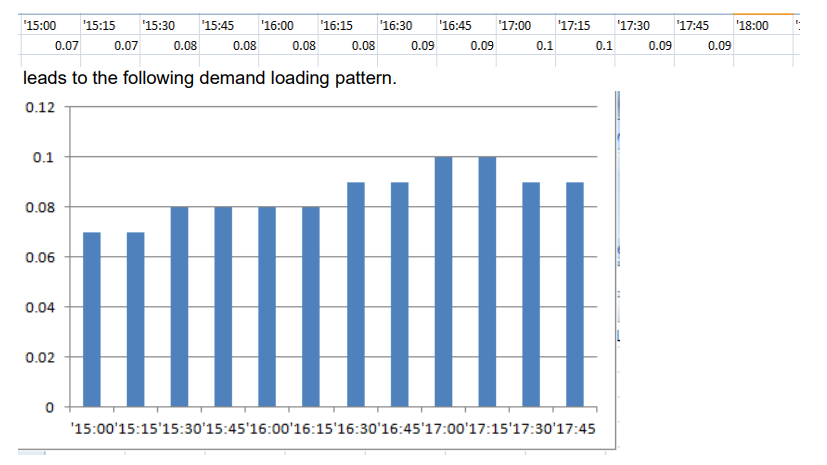

**File 2d: demand_file_list.csv**

| **Field Name**            | **Description**                                                          | **Sample Values**      |
|---------------------------|--------------------------------------------------------------------------|------------------------|
| file_sequence_no          | Sequence number of reading the files                                     | 1                      |
| scenario_index_vector     | Indication number of scenario index, defined in scenario_index_list.csv  | 0                      |
| file_name                 | Name of the file to be read                                              | demand_25_E_E_AM_d.csv |
| demand_period             | Name of the demand period                                                | AM                     |
| mode_type                 | Name of the mode type                                                    | auto                   |
| format_type               | column for three columns, agent_csv, routing policy                      | Column                 |
| scale_factor              | Scale factor of different agent types                                    | 0.2                    |
| departure_time_profile_no | Identification number                                                    | 1                      |

### 3.1.3 Input for assignment and simulation configuration file

-   The specific file for the configuration file is *settings.csv.*

**File 3a: settings.csv**

****

**1. assignment**: This section pertains to assignment-related parameters.

-   **number_of_iterations**: Specifies the total number of iterations for the
    assignment, set to 20 in this case.

-   **route_output**: Determines whether the route output should be generated (1
    for yes, 0 for no).

-   **simulation_output**: Determines whether the simulation output should be
    generated (1 for yes, 0 for no).

**2. cpu**: This section relates to CPU-related parameters.

-   **number_of_memory_blocks**: Specifies the number of memory blocks allocated
    for processing, set to 4 in this case.

-   **length_unit**: Specifies the unit of measurement for length, which is set
    to meters in this example.

-   **speed_unit**: Specifies the unit of measurement for speed, indicated as
    kilometers per hour (km/h) in this case.

These key-value pairs serve as configuration options that can be customized
according to the user's requirements.

**File 3b: mode_type.csv**

| **Field Name**                       | **Description**                                                                                                                                                                                                                                                                                                                                                                                                                                                                                                                                                                                                                                                                                                                                                                                                | **Sample Values**                        |
|--------------------------------------|----------------------------------------------------------------------------------------------------------------------------------------------------------------------------------------------------------------------------------------------------------------------------------------------------------------------------------------------------------------------------------------------------------------------------------------------------------------------------------------------------------------------------------------------------------------------------------------------------------------------------------------------------------------------------------------------------------------------------------------------------------------------------------------------------------------|------------------------------------------|
| first_column                         | For the compatibility of unix, windows and mac OS                                                                                                                                                                                                                                                                                                                                                                                                                                                                                                                                                                                                                                                                                                                                                              |                                          |
| mode_type                            | Name of the mode type                                                                                                                                                                                                                                                                                                                                                                                                                                                                                                                                                                                                                                                                                                                                                                                          | auto                                     |
| mode_type_index                      | Represents the index assigned to each mode type.                                                                                                                                                                                                                                                                                                                                                                                                                                                                                                                                                                                                                                                                                                                                                               | 0                                        |
| name                                 | Full name of the agent type                                                                                                                                                                                                                                                                                                                                                                                                                                                                                                                                                                                                                                                                                                                                                                                    | passenger; bike; drive; rail; pedestrian |
| vot                                  | Stands for Value of Time, which represents the perceived value or importance of time for travelers using that mode. Additionally, the unit of measurement for VOT is typically expressed in dollars or the relevant currency unit per hour. E.g. 10 dollars per hour.                                                                                                                                                                                                                                                                                                                                                                                                                                                                                                                                          | 10                                       |
| mode_specific_assignment             | this is used to indicate if this mode needs its own assignment based its own capacity and speed limit. E.g. bike mode has its own speed limit and the impact of cars driving on the shared lane will be considered towards as the multimodal equivalent unit. On the other hand, the HOV and truck share the same speed limit and capacity with passenger cars, so the value here is is as they will be considered as passenger car equivlanet as the normal car-oriented assignment.                                                                                                                                                                                                                                                                                                                          | 1                                        |
| person_occupancy                     | Specifies the occupancy or number of individuals typically occupying the mode of transportation                                                                                                                                                                                                                                                                                                                                                                                                                                                                                                                                                                                                                                                                                                                | 1                                        |
| headway_in_sec                       | Represents the headway, which is the time interval between consecutive vehicles in seconds. This attribute is used in microscopic traffic simulation to model vehicle spacing.                                                                                                                                                                                                                                                                                                                                                                                                                                                                                                                                                                                                                                 | 1.5                                      |
| real_time_info                       |  Determines the availability of real-time information for route changes. It is measured on a scale of 0 to 2, with the following meanings: 0: No real-time information is available, and the original path from the ODME (Origin-Destination Matrix Estimation) and early CG (column generation) results is used. Route changes are not considered after applying the SA (sensitivity Assignment) scenario. 1: Real-time information allows for route changes after applying the SA scenario. 2: VMS (Variable Message Signs): Route changes are permitted for VMS zones to follow the real-time path. Users define the zone_id for each VMS node, and a route flow merge process is performed. In the first stage, the original route is used, while in the second stage, the Real-Time routes are activated. | 0;1;2                                    |
| comments                             | Note for each mode type                                                                                                                                                                                                                                                                                                                                                                                                                                                                                                                                                                                                                                                                                                                                                                                        |                                          |
| multimodal_dedicated_assignment_flag | This field is used to indicate whether a particular mode type has a dedicated lane assignment.                                                                                                                                                                                                                                                                                                                                                                                                                                                                                                                                                                                                                                                                                                                 |                                          |
| DTM_real_time_info_type              | This field signifies the type of real-time information associated with Dynamic Traffic Management (DTM) for the corresponding mode type.                                                                                                                                                                                                                                                                                                                                                                                                                                                                                                                                                                                                                                                                       |                                          |

**File 3c: link_type.csv**

| **Field Name**              | **Description**                                                                                                                                                                                          | **Sample Values**            |
|-----------------------------|----------------------------------------------------------------------------------------------------------------------------------------------------------------------------------------------------------|------------------------------|
| first_column                | For the compatibility of unix, windows and mac OS                                                                                                                                                        |                              |
| link_type                   | Index of link type name                                                                                                                                                                                  | 1                            |
| link_type_name              | The name of link type                                                                                                                                                                                    | arterial                     |
| name\_ description          | Description of link type                                                                                                                                                                                 | Highway/Expressway           |
| type_code                   | A text character which identifies which type of link is mapped to the link type identification number. f = freeway, h = highway/expressway, a = arterial, c = connector, r = ramp, t = transit, w = walk | a/f/c/b                      |
| demand_period_id            | Identification number of demand period                                                                                                                                                                   | 0                            |
| traffic_flow_model          | The name of traffic flow model used in the program                                                                                                                                                       | spatial_queue/kw/point_queue |
| allowed_uses_p*k*           | The mode type in the *k* th period that is allowed on the link                                                                                                                                           | d;b;w                        |
| allowed_uses_p*k*           | The mode type in the *k* th period that is allowed on the link                                                                                                                                           | d;b;w                        |
| peak_load_factor_p*k*\_auto | Peak load factor in the *k* th period for automobile                                                                                                                                                     | 1                            |
| peak_load_factor_p*k*\_bike | Peak load factor in the *k* th period for bike                                                                                                                                                           | 1                            |
| peak_load_factor_p*k*\_walk | Peak load factor in the *k* th period for pedestrian                                                                                                                                                     | 1                            |
| free_speed_auto             | Free-flow speed for automobile. Suggested Unit: mph                                                                                                                                                      | 60                           |
| free_speed_bike             | Free-flow speed for bike. Suggested Unit: mph                                                                                                                                                            | 13.2                         |
| free_speed_walk             | Free-flow speed for pedestrian. Suggested Unit: mph                                                                                                                                                      | 4.8                          |
| capacity_auto               | The number of vehicles per hour per lane (lane’s capacity per hour)                                                                                                                                      | 2000                         |
| capacity_bike               | The number of vehicles per hour per lane (lane’s capacity per hour)                                                                                                                                      | 600                          |
| capacity_walk               | The number of vehicles per hour per lane (lane’s capacity per hour)                                                                                                                                      | 1000                         |
| lanes_bike                  | Number of lanes for bike                                                                                                                                                                                 | 1                            |
| lanes \_walk                | Number of lanes for pedestrian                                                                                                                                                                           | 1                            |
| k_jam_km                    | The jam density measured in unit veh/km                                                                                                                                                                  | 400                          |
| meu_auto_bike               | Coefficient of automobile over bike                                                                                                                                                                      | 1.5                          |
| meu_auto_walk               | Coefficient of automobile over pedestrian                                                                                                                                                                | 2                            |
| meu_auto_auto               | Coefficient of automobile over automobile                                                                                                                                                                | 1                            |
| meu_bike_bike               | Coefficient of bike over bike                                                                                                                                                                            | 1                            |
| meu_bike_walk               | Coefficient of bike over pedestrian                                                                                                                                                                      | 1.2                          |
| meu_bike_auto               | Coefficient of bike over automobile                                                                                                                                                                      | 0.5                          |
| meu_walk_bike               | Coefficient of pedestrian over bike                                                                                                                                                                      | 0.8                          |
| meu_walk_walk               | Coefficient of pedestrian over pedestrian                                                                                                                                                                | 1                            |
| meu_walk_auto               | Coefficient of pedestrian over automobile                                                                                                                                                                | 0.3                          |

**File 3d: link_vdf.csv**

This is an advanced file used for analytical dynamic traffic assignment. These
fields provide detailed information about the link type, identification numbers,
VDF parameters, and factors that influence traffic flow and travel time on the
road links. For a more comprehensive explanation, the paper titled "A
meso-to-macro cross-resolution performance approach for connecting polynomial
arrival queue model to volume-delay function with inflow demand-to-capacity
ratio" by Xuesong Zhou, Qixiu Cheng, Xin Wu, Peiheng Li, Baloka Belezamo, Jiawei
Lu, and Mohammad Abbasi, published in the Multimodal Transportation journal,
Volume 1, Issue 2, in 2022, can be referred to for additional details and
insights.

| **Field Name** | **Description**                                                                                                           | **Sample Values** |
|----------------|---------------------------------------------------------------------------------------------------------------------------|-------------------|
| data_type      | Represents the data type or link type based on default values or Volume Delay Function (VDF) type. To be explained later  | link              |
| link_id        | Link identification number of the road                                                                                    | link              |
| from_node_id   | Upstream node number of the link, must already be defined in *node.csv*                                                   | 1                 |
| to_node_id     | Downstream node number of the link, must already be defined in *node.csv*                                                 | 3                 |
| vdf_code       | Code for identifying vdf type                                                                                             | 1                 |
| QVDF_plf*k*    | Peak load factor in the *k* th period of the link in the *k* th period                                                    | 1                 |
| QVDF_n*k*      | Oversaturation-to-duration elasticity factor of the link in the *k* th period                                             | 1.24              |
| QVDF_s*k*      | Duration-to-speed reduction elasticity factor of the link in the *k* th period                                            | 4                 |
| QVDF_cp*k*     | Duration-to-speed reduction elasticity factor of the link in the *k* th period                                            | 0.24              |
| QVDF_cd*k*     | Oversaturation-to-duration elasticity factor of the link in the *k* th period                                             | 1                 |
| QVDF_alpha*k*  | BPR-shaped alpha factor of the link in the *k* th period                                                                  | 0.128             |
| QVDF_beta*k*   | BPR-shaped beta factor of the link in the *k* th period                                                                   | 4.96              |

**File 3e: sensor_data.csv**

These fields provide important information about the measurement sensor, node
connections, scenario index, traffic counts, capacity, and data usability. They
are crucial for the accurate processing and analysis of the Origin-Destination
Matrix Estimation (ODME) and transportation modeling.

| **Field Name**   | **Description**                                                                                                                                                                                                                                                         | **Sample Values** |
|------------------|-------------------------------------------------------------------------------------------------------------------------------------------------------------------------------------------------------------------------------------------------------------------------|-------------------|
| sensor_id        | Measurement identification number                                                                                                                                                                                                                                       | 1                 |
| from_node_id     | Upstream node number of the link, must already be defined in *node.csv*                                                                                                                                                                                                 | 1                 |
| to_node_id       | Downstream node number of the link, must already be defined in *node.csv*                                                                                                                                                                                               | 3                 |
| scenario_index   | Scenario index for the count value. Different matching count values can exist for different scenario years. For example, the count may be relatively low for the base year and high for future year cases.                                                              |                   |
| count            | Observed period volume of the link in the *k* th period                                                                                                                                                                                                                 | 3000.975          |
| upper_bound_flag | Indicates whether the value in the count field is only used as the capacity on this link. A value of 1 means that the count value represents the capacity, and the "\<=" operator is applied in the OD (Origin-Destination) estimation program. The default value is 0. | 0                 |
| active           | Indicates the usability of the data. A value of 1 means that this data will be used in the ODME process, while a value of 0 means that this data item will be ignored in the ODME process.                                                                              | 0                 |

**File 3f: dynamic_traffic_management.csv**

| **Field Name** | **Description**                                                                                                                                                                                      | **Sample Values** |
|----------------|------------------------------------------------------------------------------------------------------------------------------------------------------------------------------------------------------|-------------------|
| dtm_type       | Identification number of dynamic traffic management                                                                                                                                                  |                   |
| from_node_id   | Upstream node number of the link, must already be defined in *node.csv*                                                                                                                              |                   |
| to_node_id     | Downstream node number of the link, must already be defined in *node.csv*                                                                                                                            |                   |
| final_lanes    |                                                                                                                                                                                                      |                   |
| demand_period  | Name of the demand period                                                                                                                                                                            |                   |
| mode_type      | Name of the mode type                                                                                                                                                                                |                   |
| scenario_index | Identification number assigned to each scenario. This index will be referenced by the demand_file_list and by the number of lanes and link type specified in the link.csv file for the supply side.) |                   |
| activate       | Flag indicating the activation status of the scenario. A value of 1 means the scenario is activated, while a value of 0 means it is deactivated or inactivated.                                      |                   |

### 3.1.4 Input for scenario and subarea data

-   The specific file for scenario setting and sensitivity analysis is
    *scenario_index_list.csv*

-   The specific file for subarea analysis and focusing approach is
    *subarea.csv*

**File 4a: scenario_index_list.csv**

DTALite is equipped with advanced multi-scenario management capabilities for
both the demand and supply sides. The scenario_index_list.csv file plays a
crucial role in managing these scenarios.

| **Field Name**       | **Description**                                                                                                                                                                                                                                                                   | **Sample Values** |
|----------------------|-----------------------------------------------------------------------------------------------------------------------------------------------------------------------------------------------------------------------------------------------------------------------------------|-------------------|
| first_column         | For the compatibility of unix, windows and mac OS                                                                                                                                                                                                                                 |                   |
| scenario_index       | Identification number assigned to each scenario. This index will be referenced by the demand_file_list and by the number of lanes and link type specified in the link.csv file for the supply side.)                                                                              | 0                 |
| year                 | Planning year associated with the scenario.                                                                                                                                                                                                                                       | 2022_2025         |
| scenario_name        | Short name or identifier (as one word without space) assigned to the scenario. This name is used for generating the output file, link_performance, specific to each scenario. For example, a scenario named "25nb" will generate an output file named "link_performance_s1_25nb". | 25nb              |
| scenario_description | A relatively detailed description of the scenario, providing additional context and information. In this case, "nb" stands for "no build" scenarios.                                                                                                                              | 2022_2025 nb      |
| activate             | Flag indicating the activation status of the scenario. A value of 1 means the scenario is activated, while a value of 0 means it is deactivated or inactivated.                                                                                                                   | 1                 |

These fields are essential for managing and organizing multiple scenarios within
DTALite. The scenario_index_list.csv file allows users to define and configure
various scenarios, specify planning years, assign short names for easy
identification, provide detailed descriptions, and activate or deactivate
specific scenarios as needed. This comprehensive scenario management capability
enhances the flexibility and analysis options for assessing transportation
demand and supply in different planning contexts.

**File 4b: subarea.csv**

| **Field Name** | **Description**               | **Sample Values**                                                                                                                          |
|----------------|-------------------------------|--------------------------------------------------------------------------------------------------------------------------------------------|
| notes          | Notes for subarea             | subarea_polygon                                                                                                                            |
| geometry       | Polygon coordinate of subarea | POLYGON ((-88.016403 42.040773,-87.988141 41.691355,-87.416483 41.718332,-87.494845 42.045912,-88.015119 42.043343,-88.016403 42.040773,)) |

## 3.2 Output files

**File 5a: link_performance_s(scenario_index)_(scenario_name).csv**

It provides detailed information and performance metrics for each link in the
transportation network. This file provides comprehensive information about each
link's characteristics, performance metrics, and the impact of different
scenarios on the link's volume, speed, congestion, and travel time.

| **Field Name**                  | **Description**                                                                                                | **Sample Values**                                       |
|---------------------------------|----------------------------------------------------------------------------------------------------------------|---------------------------------------------------------|
| link_id                         | Link identification number of the road                                                                         | 1                                                       |
| vdf_type                        | Type of vdf                                                                                                    | bpr                                                     |
| from_node_id                    | Upstream node number of the link, must already defined in input_node.csv                                       | 1                                                       |
| to_node_id                      | Downstream node number of the link, must already defined in input_node.csv                                     | 3                                                       |
| lanes                           | Number of lanes on the link                                                                                    | 1                                                       |
| distance_km                     | Link length in the unit of km                                                                                  | 0.161095                                                |
| distance_mile                   | Link length in the unit of mile                                                                                | 0.100121                                                |
| fftt                            | Free flow travel time, representing the minimum travel time without any congestion, measured in minutes.       | 0.241642                                                |
| link_type                       | Description of link type                                                                                       | Major arterial                                          |
| link_type_code                  | Code of link type                                                                                              | 1                                                       |
| vdf_code                        | Code identifying the Volume Delay Function (VDF) used for the link.                                            | 1                                                       |
| time_period                     | The simulation period of the agent HHMM format                                                                 | 0700_0800                                               |
| volume                          | Link based flow volume for the defined period (volume per hour \* hour in the defined period)                  | 5600                                                    |
| volume_after_odme               | The link volume before ODME                                                                                    | 4972.49                                                 |
| volume_after_odme               | The link volume after ODME                                                                                     | 5022.595                                                |
| volume_diff_odme                | The link volume difference after ODME                                                                          | 50.105                                                  |
| obs_count                       | The observed link volume from ODME                                                                             | 0                                                       |
| upper_bound_type                | Flag indicating the upper-bound capacity used in the ODME process.                                             |                                                         |
| obs_count_dev_odme              | The deviations between the observed and assigned link volume from ODME                                         |                                                         |
| preload_volume                  | The preloading volume on the link                                                                              | 0                                                       |
| person_volume                   | The person volume on the link                                                                                  | 5022.595                                                |
| travel_time                     | Link travel_time in minute                                                                                     | 15                                                      |
| speed_kmph                      | Average travel speed on the link(Unit:kmph)                                                                    | 59.99                                                   |
| speed_mph                       | Average travel speed on the link(Unit:mph)                                                                     | 37.29                                                   |
| speed_ratio                     | as speed /free speed.                                                                                          | 1                                                       |
| VOC                             | Volume /capacity ratio                                                                                         | 0.4                                                     |
| DOC                             | Demand /capacity ratio                                                                                         | 1.432                                                   |
| capacity                        | Ultimate capacity of the link in the unit veh/(hour·lane)                                                      | 2000                                                    |
| queue                           | queue length percentage on the link                                                                            | 0                                                       |
| total_simu_waiting_time_in_min  | The total simulation time(Unit:min)                                                                            | 0                                                       |
| avg_simu_waiting_time_in_min    | The average simulation time(Unit:min)                                                                          | 0                                                       |
| plf                             | Peak load factor                                                                                               | 1                                                       |
| lanes                           | Number of lanes of automobile                                                                                  | 1                                                       |
| D_per_hour_per_lane             | Demand of the link(Unit: veh/(lane·h))                                                                         | 5022.595                                                |
| QVDF_cd                         | The coefficient factor of congestion duration over D/C                                                         | 0.955                                                   |
| QVDF_n                          | The coefficient factor of congestion duration over D/C                                                         | 1.142                                                   |
| P                               | Congestion duration(Unit:h)                                                                                    | 0.002                                                   |
| severe_congestion_duration_in_h | Severe congestion duration(Unit:h)                                                                             | 0                                                       |
| vf                              | Free-flow speed                                                                                                | 60                                                      |
| v_congestion_cutoff             | Cut-off speed under congestion                                                                                 | 51                                                      |
| QVDF_cp                         | The coefficient factor of speed reduction magnitude over congestion duration                                   | 0.4                                                     |
| QVDF_s                          | The coefficient factor of speed reduction magnitude over congestion duration                                   | 4                                                       |
| QVDF_v                          | Estimated average speed in congestion duration                                                                 | 59.997                                                  |
| vt2                             | Lowest speed in congestion duration                                                                            | 51                                                      |
| VMT                             | Vehicle mile travelled                                                                                         | 4332.84                                                 |
| VHT                             | Vehicle travel time                                                                                            | 116.19                                                  |
| PMT                             | Person mile travelled                                                                                          | 4332.84                                                 |
| PHT                             | Person travel time                                                                                             | 116.19                                                  |
| geometry                        | Optional text for coordinate of link                                                                           | LINESTRING (-87.675575 42.011629, -87.663667 42.020633) |
| person_vol_d                    | Unknown                                                                                                        | 5022.595                                                |
| vHH:MM                          | Estimated speed on the timestamp HH:MM                                                                         | 60                                                      |
| scenario_code                   | Code of scenario                                                                                               | 1                                                       |
| volume_before_sa                | The volume of the link when the scene in the *supply_side_scenario.csv* is not executed                        | 6791.691                                                |
| volume_after_sa                 | The volume of the link after the scene in the  *supply_side_scenario.csv* is executed                          | 6792.691                                                |
| volume_diff_sa                  | volume_diff = volume_after - volume_before                                                                     | 0                                                       |
| speed_before_sa                 | The speed of the link when the scene in the  *supply_side_scenario.csv* is not executed                        | 59.997                                                  |
| speed_after_sa                  | The speed of the link after the scene in the  *supply_side_scenario.csv* is executed                           | 60.997                                                  |
| speed_diff_sa                   | speed_diff = speed_after - speed_before                                                                        | 1                                                       |
| DoC_before_sa                   | The ratio of demand over capacity of the link when the scene in the *supply_side_scenario.csv* is not executed | 0.1                                                     |
| DoC_after_sa                    | The ratio of demand over capacity of the link when the scene in the *supply_side_scenario.csv* is executed     | 0.3                                                     |
| DoC_diff_sa                     | DoC_diff = DoC_after_sa - DoC_before_sa                                                                        | 0.2                                                     |
| P_before_sa                     | The congestion duration of the link when the scene in the *supply_side_scenario.csv* is not executed           | 0.1                                                     |
| P_after_sa                      | The congestion duration of the link when the scene in the *supply_side_scenario.csv* is executed               | 0.3                                                     |
| P_diff_sa                       | P_diff = P_after_sa - P_before_sa                                                                              | 0.2                                                     |
| notes                           | Some explanatory text                                                                                          | period-based                                            |

**File 5b: route_assignment_s(scenario_index)_(scenario_name).csv**

This file contains detailed information about the assigned routes for specific
scenarios. These fields provide comprehensive information about the assigned
routes, including zone connections, flow volumes, travel times, gap values, and
other relevant characteristics. They are essential for analyzing and evaluating
transportation networks under different scenarios and demand patterns.

| **Field Name**                      | **Description**                                                                                                                                                                            | **Sample Values**                                                        |
|-------------------------------------|--------------------------------------------------------------------------------------------------------------------------------------------------------------------------------------------|--------------------------------------------------------------------------|
| first_column                        | For the compatibility of unix, windows and mac OS                                                                                                                                          |                                                                          |
| path_no                             | identification number of the path                                                                                                                                                          | 1                                                                        |
| o_zone_id                           | Upstream number of the zone, must already defined in zone.csv                                                                                                                              | 1                                                                        |
| d_zone_id                           | Downstream number of the zone, must already defined in zone.csv                                                                                                                            | 3                                                                        |
| od_pair                             | OD pair index for this route.                                                                                                                                                              | 0                                                                        |
| o_sindex                            | super origin zone index used for focusing approach                                                                                                                                         | 1                                                                        |
| d_sindex                            | super destination zone index used for focusing approach                                                                                                                                    | 76-\>120                                                                 |
| path_id                             | Path identification number of the route                                                                                                                                                    | 1                                                                        |
| information_type                    |  Indicates whether the route is based on real-time information or Variable Message Signs (VMS).                                                                                            | 1                                                                        |
| mode_type                           | Name of the transportation mode associated with the assigned route.                                                                                                                        | auto                                                                     |
| demand_period                       | Name of the demand period                                                                                                                                                                  | am                                                                       |
| volume                              | Flow volume of the assigned path for the defined period. It is calculated as the product of volume per hour and the duration of the defined period.                                        | 135.198                                                                  |
| OD_relative_gap                     |  Gap value representing the equilibrium gap at the Origin-Destination (OD) level.                                                                                                          | 0.0014                                                                   |
| travel_time                         | Travel time associated with the assigned path.                                                                                                                                             | 30.3205                                                                  |
| path_gap                            | path based UE equilibrium gap                                                                                                                                                              | 0                                                                        |
| preload_volume                      | The preloading link volume                                                                                                                                                                 | 0                                                                        |
| volume_before_odme                  | The link volume before ODME                                                                                                                                                                | 0                                                                        |
| volume_after_odme                   | The link volume after ODME                                                                                                                                                                 | 0                                                                        |
| volume_diff_odme                    | The link volume difference after ODME                                                                                                                                                      | 0                                                                        |
| rt_new_path_flag                    | Flag indicating whether the path is generated from real-time information for a specific user class.                                                                                        | 0                                                                        |
| volume_before_sa                    | The link volume before sensitivity analysis                                                                                                                                                | 0                                                                        |
| volume_after_sa                     | The link volume after sensitivity analysis                                                                                                                                                 | 0                                                                        |
| volume_diff_sa                      | The link volume difference after sensitivity analysis                                                                                                                                      | 0                                                                        |
| simu_volume                         | simulated link volume                                                                                                                                                                      | 0                                                                        |
| subarea_flag                        | If this link is in subarea or not                                                                                                                                                          | 1                                                                        |
| OD_impact_flag                      | if this route’s OD is affected by supply side scenario such as incident or VMS                                                                                                             | 0                                                                        |
| at_OD_impact_flag                   | mode specific OD impact flag                                                                                                                                                               | 0                                                                        |
| path_impact_flag                    | if this route is affected by the supply side scenario such as incident or VMS                                                                                                              | -1                                                                       |
| toll                                | Amount of money that the agent pays for the route, measured in dollars.                                                                                                                    | 0                                                                        |
| \#_of_nodes                         | Number of nodes                                                                                                                                                                            | 3                                                                        |
| \#_of_sensor_links                  | Number of links with sensor data                                                                                                                                                           | 0                                                                        |
| \#_of_SA_links                      | Number of links with sensitivity analysis                                                                                                                                                  | 0                                                                        |
| travel_time                         | travel time from analytical travel time function or simulation                                                                                                                             | 30.3                                                                     |
| VDF_travel_time                     | travel time from analytical travel time function                                                                                                                                           | 30.3205                                                                  |
| VDF_travel_time_without_access_link | Path-level travel time without considering extra waiting at the access links. This is useful to debug if there is extra demand surge for being loaded in the simulation on the connectors. | 30.3205                                                                  |
| distance_km                         | The distance travelled(Unit:km)                                                                                                                                                            | 30                                                                       |
| distance_mile                       | The distance travelled(Unit:mile)                                                                                                                                                          | 18.6451                                                                  |
| node_sequence                       | Node sequence in the route                                                                                                                                                                 | 1;4;2;                                                                   |
| link_sequence                       | Link sequence in the route                                                                                                                                                                 | 3;4;                                                                     |
| geometry                            | Optional text for coordinate of link                                                                                                                                                       | LINESTRING (0.017882 -0.125179, 19.688841 -9.692418, 40.253933 0.053648) |
| link_type_name_sequence             | Link type sequence in the route                                                                                                                                                            |                                                                          |
| link_code_sequence                  | Link code sequence in the route                                                                                                                                                            |                                                                          |
| link_FFTT_sequence                  | Link free-flow travel time in the route                                                                                                                                                    |                                                                          |

**File 5c: od_performance.csv**

It provides information about the performance of Origin-Destination (OD) pairs
in the transportation network. These fields provide valuable information about
the OD pairs, including their identification numbers, origin and destination
zones, mode type, demand periods, volumes, coordinates, and performance metrics
such as free-flow travel time and distance. Analyzing this data helps in
understanding the traffic patterns and performance of specific OD pairs within
the transportation network.

| **Field Name**          | **Description**                                                                                                                                               | **Sample Values** |
|-------------------------|---------------------------------------------------------------------------------------------------------------------------------------------------------------|-------------------|
| od_no                   | Identification number of OD pair                                                                                                                              | 1                 |
| o_zone_id               | Identification number of origin zone                                                                                                                          | 1                 |
| d_zone_id               | Identification number of destination zone                                                                                                                     | 2                 |
| o_sindex                | super origin zone index                                                                                                                                       | 0                 |
| d_sindex                | super destination zone index                                                                                                                                  | 1                 |
| o_district_id           | Identification number of origin district                                                                                                                      | 0                 |
| d_district_id           | Identification number of destination district                                                                                                                 | 0                 |
| mode_type               | Name of the mode type                                                                                                                                         | auto              |
| demand_period           | Name of the demand period                                                                                                                                     | am                |
| volume                  | Number of vehicles or passengers for this specific mode.                                                                                                      | 4000              |
| connectivity_flag       | Identification number of connectivity                                                                                                                         | 0                 |
| s_x_coord               | Longitude or horizontal coordinate in any arbitrary geographic coordinate system. S stands for starting. ST is used in QGIS for OD pair based visualization.  | 0.017882          |
| s_y_coord               | Latitude or vertical coordinate horizontal coordinate in any arbitrary geographic coordinate system                                                           | -0.125179         |
| t_x_coord               | Longitude or horizontal coordinate in any arbitrary geographic coordinate system. T stands for ending.                                                        | 40.253933         |
| t_y_coord               | Latitude or vertical coordinate horizontal coordinate in any arbitrary geographic coordinate system                                                           | 0.053648          |
| path_FF_travel_time_min | Free-flow travel time of the path (Unit: min)                                                                                                                 |                   |
| distance_km             | The total distance travelled (Unit: km)                                                                                                                       |                   |
| distance_mile           | The total distance travelled (Unit: mile)                                                                                                                     |                   |

**File 5d: link_performance_summary.csv**

The link_performance_summary.csv file plays a crucial role in the multi-scenario
management implemented in scenario_index_list.csv. By providing performance
metrics for each link in the transportation network, the
link_performance_summary.csv file serves as a reference for evaluating the
impact of different scenarios on the network.

| **Field Name**         | **Description**                                                                                           | **Sample Values**                                   |
|------------------------|-----------------------------------------------------------------------------------------------------------|-----------------------------------------------------|
| link_id                | Link identification number of the road                                                                    | 1003                                                |
| based_link_type        | Name of the link type                                                                                     | highway                                             |
| from_node_id           | Upstream node number of the link                                                                          | 1                                                   |
| to_node_id             | Downstream node number of the link                                                                        | 3                                                   |
| geometry               | Optional text for coordinate of link                                                                      | LINESTRING (0.017882 -0.125179,19.778254 14.806867) |
| distance_km            | The total distance travelled(Unit:km)                                                                     | 0.01                                                |
| distance_mile          | The total distance travelled(Unit:mile)                                                                   | 0.006215                                            |
| fftt                   | Free flow travel time(the unit is unknown)                                                                | 0.01                                                |
| meso_link_id           | Link identification number of the mesoscopic link                                                         | -1                                                  |
| tmc                    | Identification number of the tmc type                                                                     |                                                     |
| tmc_corridor_name      | Name of the corridor                                                                                      | network_wide                                        |
| tmc_corridor_id        | Identification number of corridor                                                                         | -1                                                  |
| tmc_road_order         | Identification number of corridor order                                                                   | 0                                                   |
| tmc_road_sequence      | Identification number of link sequence in the corridor                                                    | -1                                                  |
| subarea_id             | Identification number of the subarea                                                                      | -1                                                  |
| lanes_s*k*             | Number of lanes on the link under the *k*th scenario                                                      | 1                                                   |
| type_s*k*              | Link type under the *k*th scenario                                                                        | highway                                             |
| penaltys*k*            | Penalty factor under the *k*th scenario                                                                   | 0                                                   |
| p0_s0_auto_vol         | period 0 scenario index – volume (this might have a bug as period starts from 1)                          | 2048                                                |
| am_s_no_build_auto_vol | first period scenario no build,this is the same as the above filed, but with detailed names.              | 2048                                                |
| am_s_build_auto_vol    | values for the period based and scenario based                                                            | 4000                                                |
| amno_buildautoMEU      | Mobility Equivalent Unit (MEU) for the period-based and scenario-based cases in the AM period.            | 4000                                                |
| amno_buildautocap      | capacity                                                                                                  | 2000                                                |
| amno_buildautoDOC      |  Demand to Capacity (DoC) ratio for the period-based and scenario-based cases in the AM period.           | 40                                                  |
| am_no_build_auto_TT    |  Travel time on the link in minutes for the period-based and scenario-based cases in the AM period.       | 40.01                                               |
| ambuildautoMEU         |  Repeated entry of travel time in minutes for the period-based and scenario-based cases in the AM period. | 4000                                                |
| ambuildautocap         |                                                                                                           | 2000                                                |
| ambuildautoDOC         |                                                                                                           | 40                                                  |
| am_build_auto_TT       |                                                                                                           | 40.01                                               |

These fields provide valuable information about the characteristics and
performance of each link, which is vital for understanding how different
scenarios impact the network. In scenario_index_list.csv, the scenario_index
field refers to the identification number of each scenario. By analyzing the
link_performance_summary.csv file for different scenario_index values, users can
assess the changes in link performance metrics such as travel time, capacity,
and volume under different scenarios.

The link_performance_summary.csv file, combined with scenario_index_list.csv,
enables comprehensive multi-scenario management by providing insights into how
each scenario affects the performance of individual links. This information is
crucial for decision-making, infrastructure planning, and evaluating the
effectiveness of various transportation scenarios in the network.

**File 5e: system_performance_summary.csv**

It contains information related to different scenarios and their associated
performance metrics. These fields provide valuable insights into the performance
and characteristics of different scenarios, including their distances traveled,
travel times, mode types, and demand periods. Analyzing this information helps
in understanding the variations and impacts of different scenarios on
transportation systems, aiding in decision-making, planning, and evaluating the
effectiveness of transportation strategies and policies..

| **Field Name**         | **Description**                                                                                                                                                                      | **Sample Values** |
|------------------------|--------------------------------------------------------------------------------------------------------------------------------------------------------------------------------------|-------------------|
| first_column           | For the compatibility of unix, windows and mac OS                                                                                                                                    |                   |
| scenario_index         | Identification number of the scenario. Defined in scenario_index_list.csv                                                                                                            | 0                 |
| scenario_name          | Name or label assigned to the scenario for easy identification.                                                                                                                      | no_build          |
| demand_period          | Name of the demand period corresponding to the scenario. It represents a specific time period or time of day when transportation demand is considered.                               | am                |
| mode_type              | Name of the mode type or transportation mode associated with the scenario. It indicates the specific mode of transportation for which the scenario's performance is being evaluated. | auto              |
| od_volume              | Identification number of origin district                                                                                                                                             | 4000              |
| number_of_routes       | Identification number of destination district                                                                                                                                        | 2                 |
| total_distance_km      | Total travelled distance(Unit:km)                                                                                                                                                    | 180040            |
| total_distance_mile    | Total travelled distance(Unit:mile)                                                                                                                                                  | 111896            |
| total_travel_time_min  | Number of vehicles or agents per mode type.                                                                                                                                          | 260086            |
| avg_distance_km        | Identification number of connectivity                                                                                                                                                | 45.01             |
| avg_distance_mile      | Longitude or horizontal coordinate in any arbitrary geographic coordinate system.                                                                                                    | 27.9739           |
| avg_travel_time_in_min | Latitude or vertical coordinate horizontal coordinate in any arbitrary geographic coordinate system                                                                                  | 65.0215           |

**File 5f: final_summary.csv**

This file is a summary file of the output results, showing the summary of the
final statistics.

|   | **Steps**                                                       | **Information**                                                                                                                                                    |
|---|-----------------------------------------------------------------|--------------------------------------------------------------------------------------------------------------------------------------------------------------------|
| 1 | Read network node.csv                                           | link.csv, zone.csv, summary by multi-modal and demand types, summary by road link type                                                                             |
| 2 | Read demand                                                     | defined in [demand_file_list] in settings.csv.                                                                                                                     |
| 3 | Check OD connectivity and accessibility in od_accessibility.csv | \# of connected OD pairs, \# of OD/agent_type/demand_type columns without paths, CPU Running Time, \# of agents, Avg Travel Time, Avg UE gap                       |
| 4 | Column Generation for Traffic Assignment                        | Iteration, avg travel time, optimization obj, Relative_gap                                                                                                         |
| 5 | Column pool-based flow updating for traffic assignment          | \# of flow updating iterations，ODME stage，link MAE，link_MAPE，system_MPE，avg_tt，UE gap                                                                        |
| 6 | OD estimation                                                   | \# of ODME_iterations                                                                                                                                              |
| 7 | Sensitivity analysis stage                                      | Iteration，Avg Travel Time(min)                                                                                                                                    |
| 8 | Column updating                                                 | Iteration，avg travel time，optimization obj，Relative_gap                                                                                                         |
| 9 | Output Link Performance                                         | VMT，VHT，MPH，PMT，PHT，MAPE，VKT，PKT，KPH，simple avg link volume，simple avg link speed，simple avg link speed ratio，\# of simulated agents in trajectory.csv |

**File 5g: zonal_hierarchy_mapping.csv**

"zonal_hierarchy_mapping" refers to a process or methodology in the field of
transportation planning and urban analysis. Here's a simplified explanation:

zonal_hierarchy_mapping: This process involves categorizing or grouping various
geographical zones based on certain criteria or attributes to create a
hierarchical structure. The mapping part refers to the process of associating or
linking these zones to their respective categories or higher-level groupings.

In terms of the zonal_hierarchy_mapping.csv file, it would likely contain
information about the zones (such as their geographical coordinates and unique
identifiers), along with their associated higher-level groupings (like
super_zones or analysis districts).

This hierarchical structure can be helpful for understanding and analyzing
patterns or trends at different geographical scales. For instance, you may want
to compare travel times within a specific zone to the average travel times
within its encompassing super zone or analysis district.

| **Field Name**            | **Description**                                                                                                                                                                                                                             | **Sample Values**                                                                                                                                                                                                                                                                                     |
|---------------------------|---------------------------------------------------------------------------------------------------------------------------------------------------------------------------------------------------------------------------------------------|-------------------------------------------------------------------------------------------------------------------------------------------------------------------------------------------------------------------------------------------------------------------------------------------------------|
| first_column              | For the compatibility of unix, windows and mac OS                                                                                                                                                                                           |                                                                                                                                                                                                                                                                                                       |
| zone_id                   | Indication of node’s physical location                                                                                                                                                                                                      | 1                                                                                                                                                                                                                                                                                                     |
| x_coord                   | Longitude or horizontal coordinate in any arbitrary geographic coordinate system                                                                                                                                                            | -87.675591                                                                                                                                                                                                                                                                                            |
| y_coord                   | Latitude or vertical coordinate horizontal coordinate in any arbitrary geographic coordinate system                                                                                                                                         | 42.01165                                                                                                                                                                                                                                                                                              |
| super_zone_id             | This ID is generated from a focused zoning approach, clustering similar zones together. These super zones can be useful for higher-level analyses.                                                                                          | 0                                                                                                                                                                                                                                                                                                     |
| analysis_district_id      | This field is the identification number of the analysis district, a larger area within which a zone is located. This is useful for aggregating data at the district level.                                                                  | 6                                                                                                                                                                                                                                                                                                     |
| demand                    | The number of vehicles                                                                                                                                                                                                                      | 5262.31                                                                                                                                                                                                                                                                                               |
| subarea_significance_flag | This identification flag marks the significance of the subarea, helping prioritize areas of interest or focus for various analyses                                                                                                          | 1                                                                                                                                                                                                                                                                                                     |
| inside_flag               |  This field is a categorical indicator determining the spatial relation of a zone to a predefined subarea. It has three possible values: This information can be beneficial when analyzing traffic patterns in and around specific regions. |  A value of 1 means that the zone lies entirely outside of the subarea. A value of 2 indicates that the zone is located on or around the boundary of the subarea, meaning it may partially overlap with the subarea. A value of 3 signifies that the zone is completely contained within the subarea. |

## 3.3 Preparation of input files

1.  node.csv

Creating a GMNS network in Excel is an important step for transportation
modeling. Excel is a powerful tool due to its simplicity, accessibility, and
capability to handle large amounts of data. This section provides a tutorial on
how to create **node.csv** using Excel.

**1. Open Excel and create a new file:**

Start by opening Excel and creating a new file. Save it in a location of your
choice and give it a suitable name such as '**node.csv**'.

**2. Setting up the data structure:**

In the first row of your Excel sheet, input the following headers to represent
different data points for each node: 'node_id', 'name', 'x_coord', 'y_coord',
'node_type', 'ctrl_type', 'zone_id', 'district_id', 'geometry'.

**3. Filling the Data:**

Please refer to the data structure description of 'node.csv' in Section 3.1.1.

**4. Saving the file:**

After filling out the data for all nodes, save your file as a ‘.csv’ format,
which is a universally accepted data format.

Please note that this is a simple example. Depending on the complexity of your
network, you might need to include additional details, like the type of node,
any specific control type, etc.

In summary, creating a GMNS network in Excel is straightforward. It requires a
structured approach to data entry and an understanding of the network's
requirements. The most important aspect is to ensure that the data for each node
is accurately represented, as this forms the basis of your transportation
network model.

1.  link.csv

In addition to nodes, the **links** between them are crucial in forming the
structure of your transportation network. Links represent the road segments
connecting the nodes. Here's how you can create and update a link data file
using Excel:

**1. Open Excel and create a new file:**

Start by opening Excel and creating a new file. Save it in a location of your
choice and name it appropriately, such as '**link.csv**'.

**2. Setting up the data structure:**

In the first row of your Excel sheet, input the following headers to represent
different data points for each link: 'link_id', 'name', 'from_node_id',
'to_node_id', 'facility_type', 'link_type', 'dir_flag', 'length', 'lanes',
'lanes_sk', 'lanes_s1', 'link_type_s0', 'link_type_s1', 'free_speed',
'capacity', 'penalty_auto_s1', 'geometry'.

**3. Filling the Data:**

Please refer to the data structure description of 'link.csv' in Section 3.1.1.

**4. Saving the file:**

After filling out the data for all links, save your file as a '.csv' format,
which is a universally accepted data format.

Keep in mind that depending on the specifics of your network, you might need to
add more fields or adjust the above-mentioned ones. Ensure that all the data
accurately reflects the real-world situation as closely as possible.

In summary, creating a GMNS link file in Excel requires a structured approach to
data entry and an understanding of the elements of your network. Just like
creating the node file, the most important aspect is that the data accurately
represents your transportation network.

1.  zone.csv

**1. Open Excel and create a new file:**

Open Excel, create a new file, and save it as '**zone.csv**'.

**2. Setting up the data structure:**

Create the following headers in the first row of your Excel sheet:
'first_column', 'zone_id', 'name', 'access_node_vector', 'x_coord', 'y_coord'.

**3. Filling the Data:**

Please refer to the data structure description of 'zone.csv' in Section 3.1.1.

1.  demand.csv

The **demand.csv** file represents the volume of trips between pairs of zones in
the network. This is often referred to as an Origin-Destination (OD) matrix.
Each row in this file indicates the volume of travel demand from one zone (the
origin) to another (the destination).

**1. Open Excel and create a new file:**

Open Excel, create a new file, and save it as 'demand.csv'.

**2. Setting up the data structure:**

Create the following headers in the first row of your Excel sheet: 'o_zone_id',
'd_zone_id', 'volume'.

**3. Filling the Data:**

Please refer to the data structure description of 'demand.csv' in Section 3.1.2.

It's important to note that these are aggregate volumes, typically representing
a certain time period (like a day or peak hour), and that the same volume from
origin to destination does not necessarily imply the same travel patterns in
both directions. The route chosen by travelers from zone 1 to zone 2 may be
different from the route from zone 2 to zone 1 due to factors like road
capacities, travel times, or other network conditions.

1.  demand_period.csv

The **demand_period.csv** file contains data related to demand periods or time
periods in a transportation network.

**1. Open Excel and create a new file:**

Open Excel, create a new file, and save it as 'demand_period.csv'.

**2. Setting up the data structure:**

Create the following headers in the first row of your Excel sheet:
'first_column', 'demand_period_id', 'demand_period', 'notes', 'time_period',
'peak_time'.

**3. Filling the Data:**

Please refer to the data structure description of 'demand_period.csv' in Section
3.1.2.

Remember, the purpose of demand_period.csv is to define demand periods, which
are used to break down a full day's transportation network demand into smaller,
more manageable periods that can then be analyzed separately.

1.  departure_time_profile.csv

The **departure_time_profile.csv** file represents the distribution of departure
times for a given demand period. This is often used in traffic simulation models
to assign volumes to specific time intervals within a larger demand period (like
an AM or PM peak).

**1. Open Excel and create a new file:**

Open Excel, create a new file, and save it as 'departure_time_profile.csv'.

**2. Setting up the data structure:**

Create the following headers in the first row of your Excel sheet:
'first_column', 'departure_time_profile_no', 'name', 'time_period', 'T0000',
'T0005',..., 'T2355', 'T2400'.

**3. Filling the Data:**

Please refer to the data structure description of 'departure_time_profile.csv'
in Section 3.1.2.

In the example, the time period is 0600_0900, and the proportions of departures
are distributed among the different time intervals (T0000 through T2400). For
example, 0.000571 of the departures occur in each of the first six intervals
(from T0000 to T0025), 0.000506 in the next three intervals, and so on.

These profiles are extremely valuable in traffic simulation because they allow
for more accurate modeling of how demand fluctuates within larger time periods.
Instead of assuming that all travel demand occurs at exactly the same time,
these profiles distribute the demand more realistically throughout the defined
time period.

1.  demand_file_list.csv

The **demand_file_list.csv** file contains the list of demand files, their
relevant characteristics, and other parameters that will be used in the analysis
or simulation.

**1. Open Excel and create a new file:**

Open Excel, create a new file, and save it as 'demand_file_list.csv'.

**2. Setting up the data structure:**

Create the following headers in the first row of your Excel sheet:
'file_sequence_no', 'scenario_index_vector', 'file_name', 'demand_period',
'mode_type', 'format_type', 'scale_factor', 'departure_time_profile_no',
'comment'.

**3. Filling the Data:**

Please refer to the data structure description of 'demand_file_list.csv' in
Section 3.1.2.

In the example, both lines in the demand_file_list.csv file point to the same
demand.csv file, demand period, and mode type, but for different scenarios (0
and 1). It appears to be two different scenarios using the same demand data but
potentially with other scenario-specific parameters not shown in this file.

1.  settings.csv

The **settings.csv** file contains two sections, including assignment and cpu
section.

1.  assignment: This section pertains to assignment-related parameters.

-   number_of_iterations: Specifies the total number of iterations for the
    assignment, set to 20 in this case.

-   route_output: Determines whether the route output should be generated (1 for
    yes, 0 for no).

-   simulation_output: Determines whether the simulation output should be
    generated (1 for yes, 0 for no).

1.  cpu: This section relates to CPU-related parameters.

-   number_of_memory_blocks: Specifies the number of memory blocks allocated for
    processing, set to 4 in this case.

-   length_unit: Specifies the unit of measurement for length, which is set to
    meters in this example.

-   speed_unit: Specifies the unit of measurement for speed, indicated as
    kilometers per hour (km/h) in this case.

These key-value pairs serve as configuration options that can be customized
according to the user's requirements.

**1. Open Excel and create a new file:**

Open Excel, create a new file, and save it as 'settings.csv'.

**2. Filling the Data:**

Please refer to the data structure description of 'settings.csv' in Section
3.1.3.

1.  mode_type.csv

The **mode_type.csv** file contains information about different transportation
modes and their specific characteristics. The file helps define the
characteristics and attributes of different transportation modes, allowing for
more accurate simulation and analysis of travel demand and traffic patterns.

**1. Open Excel and create a new file:**

Open Excel, create a new file, and save it as 'mode_type.csv'.

**2. Setting up the data structure:**

Create the following headers in the first row of your Excel sheet:
'first_column', 'mode_type', 'mode_type_index', 'name', 'vot',
'mode_specific_assignment', 'person_occupancy', 'headway_in_sec',
'real_time_info', 'comments'.

**3. Filling the Data:**

Please refer to the data structure description of 'mode_type.csv' in Section
3.1.3.

1.  link_type.csv

how to interpret and create the **link_type.csv** file:

**1. Open Excel and create a new file:**

Open Excel, create a new file, and save it as '**link_type.csv**'.

**2. Setting up the data structure:**

Create the following headers in the first row of your Excel sheet:
'first_column', 'link_type', 'link_type_name', 'name_description', 'type_code',
'demand_period_id', 'traffic_flow_model', 'allowed_uses_p1', 'allowed_uses_p2',
'allowed_uses_p3', 'allowed_uses_p1_backup', 'allowed_uses_p2_backup',
'allowed_uses_p3_backup', 'peak_load_factor_p1_auto',
'peak_load_factor_p1_bike', 'peak_load_factor_p1_walk',
'peak_load_factor_p2_auto', 'peak_load_factor_p2_bike',
'peak_load_factor_p2_walk', 'peak_load_factor_p3_auto',
'peak_load_factor_p3_bike', 'peak_load_factor_p3_walk', 'free_speed_auto',
'free_speed_bike', 'free_speed_walk', 'capacity_auto', 'capacity_bike',
'capacity_walk', 'lanes_bike', 'lanes_walk', 'k_jam_km', 'meu_auto_bike',
'meu_auto_walk', 'meu_auto_auto', 'meu_bike_bike', 'meu_bike_walk',
'meu_bike_auto', 'meu_walk_bike', 'meu_walk_walk', 'meu_walk_auto'.

**3. Filling the Data:**

Please refer to the data structure description of 'link_type.csv' in Section
3.1.3.

1.  link_vdf.csv

**1. Open Excel and create a new file:**

Open Excel, create a new file, and save it as '**link_vdf.csv**'.

**2. Setting up the data structure:**

Create the following headers in the first row of your Excel sheet: ' data_type
', ' link_id ', ' from_node_id ', ' to_node_id ', ' vdf_code ', ' QVDF_plf*k* ',
' QVDF_n*k* ', ' QVDF_s*k* ', ' QVDF_cp*k* ', ' QVDF_cd*k* ', ' QVDF_alpha*k* ',
' QVDF_beta*k* '

**3. Filling the Data:**

Please refer to the data structure description of 'link_vdf.csv' in Section
3.1.3.

1.  sensor_data.csv

**1. Open Excel and create a new file:**

Open Excel, create a new file, and save it as '**sensor_data.csv**'.

**2. Setting up the data structure:**

Create the following headers in the first row of your Excel sheet: ' sensor_id
', ' from_node_id ', ' to_node_id ', ' scenario_index ', ' count ', '
upper_bound_flag ', ' active '.

**3. Filling the Data:**

Please refer to the data structure description of 'sensor_data.csv' in Section
3.1.3.

1.  dynamic_traffic_management.csv

**1. Open Excel and create a new file:**

Open Excel, create a new file, and save it as '
**dynamic_traffic_management.csv**'.

**2. Setting up the data structure:**

Create the following headers in the first row of your Excel sheet: ' dtm_type ',
' from_node_id ', ' to_node_id ', ' final_lanes', ' demand_period ', ' mode_type
', ' scenario_index ', ' activate '.

**3. Filling the Data:**

Please refer to the data structure description of '
dynamic_traffic_management.csv' in Section 3.1.3.

1.  scenario_index_list.csv

The **scenario_index_list.csv** file provides information about different
scenarios within a transportation analysis or simulation.

**1. Open Excel and create a new file:**

Open Excel, create a new file, and save it as 'scenario_index_list.csv'.

**2. Setting up the data structure:**

Create the following headers in the first row of your Excel sheet:
'first_column', 'scenario_index', 'year', 'scenario_name',
'scenario_description', 'activate'.

**3. Filling the Data:**

Please refer to the data structure description of 'scenario_index_list.csv' in
Section 3.1.4.

In the example, there are several scenarios listed:

• Scenario 0: 2022-2025 nb (northbound), which is activated.

• Scenario 1: 2025 s1 (senario1), which is activated.

• Scenario 2: 2025 s2 (scenario2) with changes on Gilbert Rd (2 lanes), which is
not activated.

• Scenario 3: 2025 s2v2 (scenario2_v2) with Gilbert Rd closed, which is not
activated.

• Scenario 4: 2025 s3 (senario3), which is not activated.

• Scenario 5: 2050 nb (northbound), which is not activated.

• Scenario 6: 2050 s1 (senario1), which is not activated.

• Scenario 7: 2050 s2 (scenario2) with changes on Gilbert Rd (2 lanes), which is
not activated.

• Scenario 8: 2050 s2v2 (scenario2_v2) with Gilbert Rd closed, which is not
activated.

• Scenario 9: 2050 s3 (senario3), which is not activated.

The scenarios represent different variations or configurations of the
transportation system being analyzed, allowing for the exploration of different
future conditions or policy changes. The activation status determines which
scenarios are actively considered and used in the analysis.

1.  subarea.csv

The **subarea.csv** file provides information about different scenarios within a
transportation analysis or simulation.

**1. Open Excel and create a new file:**

Open Excel, create a new file, and save it as 'subarea_list.csv'.

**2. Setting up the data structure:**

Create the following headers in the first row of your Excel sheet: 'notes',
'geometry'.

**3. Filling the Data:**

Please refer to the data structure description of 'subarea.csv' in Section
3.1.4.

## 3.4 Interpretation of output files

The **link_performance.csv** file provides information about the performance of
transportation links.

The **route_assignment.csv** file provides the results of route assignment for
different OD pairs.

The **od_performance.csv** file provides information about the performance of OD
matrix.

The **link_performance_summary.csv** file provides detailed information on link
performance for different transportation links.

The **system_performance_summary.csv** file provides an overview of the system
performance for different scenarios.

The **final_summary.csv** file provides a summary of the different steps and
outputs generated during the transportation simulation.

The **zonal_hierarchy_mapping.csv** file involves categorizing or grouping
various geographical zones based on certain criteria or attributes to create a
hierarchical structure.

# Case Study

## 4.1 Two Corridor

Key input: input files of different layers

Key output: the traffic assignment result (user equilibrium)

## 4.2 Braess Paradox

Key input: input files before and after the construction of new link

Key output: performance file before and after the construction of new link

In the latest version, DTALite provides users with default options for input
files. By using these options, users can prepare just three files: node.csv,
link.csv, and demand.csv, in order to perform dynamic traffic assignment on the
road network.

This section presents a case study on the Braess Paradox, including an overview
of the case, instructions on how to prepare the data, and the output of the
program.

**(1) node.csv**

In the file, you should list all the nodes in the network along with their
coordinates. There are four fields that must exist and cannot be empty: node_id,
zone_id, x_coord and y_coord.

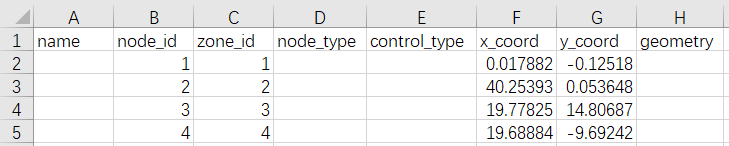

**(2) link.csv**

The file should list all the links in the network along with their attributes.

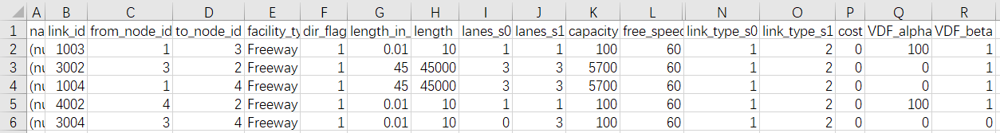

In this case of Braess Paradox, we build two simple road scenarios.

Scenario 0 (s0): Link 3004 is closed. Scenario 1 (s1): Link 3004 is open with
three lanes.

The network structure is depicted in the following diagram.

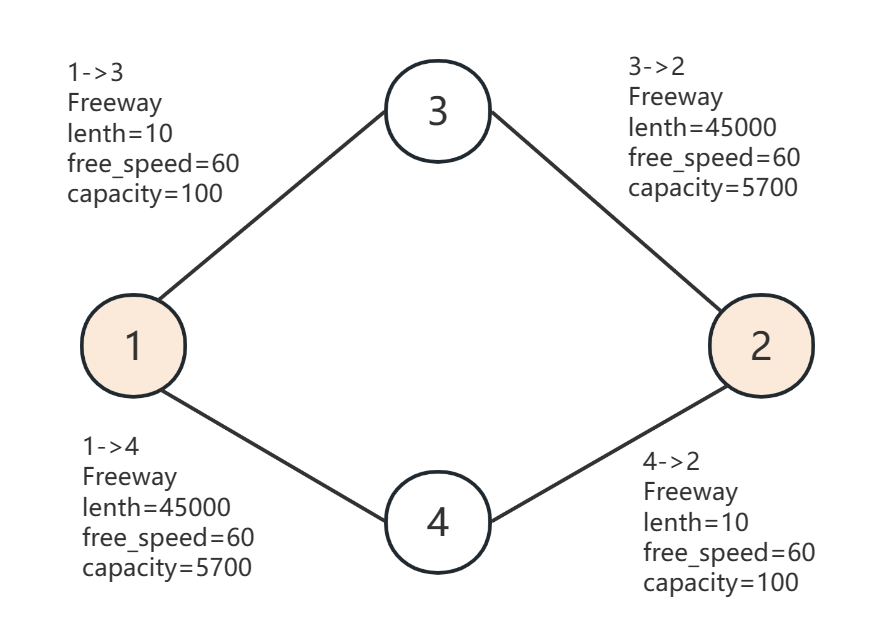
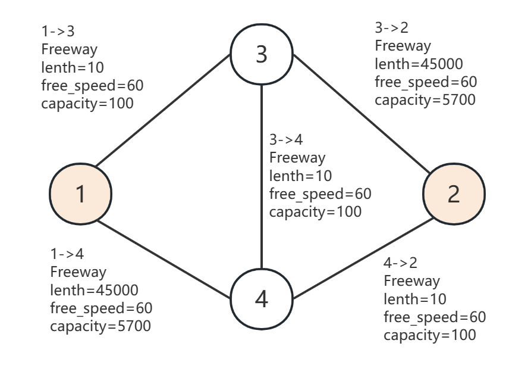

**(3) demand.csv**

The file should include the demand volume between OD pairs.

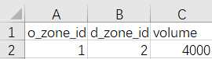

**(4) other files**

Other files can be automatically generated by the program using default
settings. If you want to customize a more specialized version, you can modify
the generated input files or manually create your own input files referring to
Section 3.1 for parameter guidance.

For example, the program generates a default mode_type.csv with only one
mode(auto), and you can add information and modify the fields to include
additional mode types in the dataset.

**mode_type.csv**

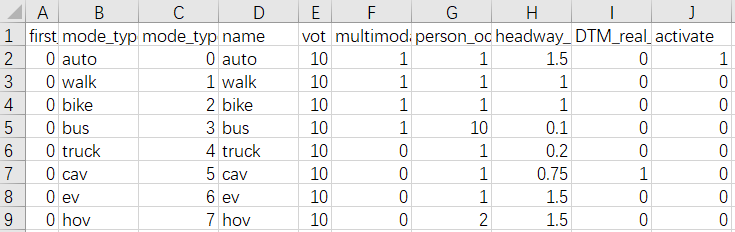

**scenario_index_list.csv**

In the default scenario file, there is only one scenario. If you want to test a
multi scenario case using the automatically generated files, you need to
activate the option in the scenario_index_list.csv.

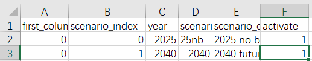

**demand_file_list.csv**

The default value for scale_factor is 2, but in this case, we change it to 1 to
ensure volume consistency.

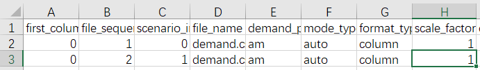

Following the steps described in Chapter 2, when running the program, the
console will print out the program's execution information, and these details
will also be saved in log_main.txt.

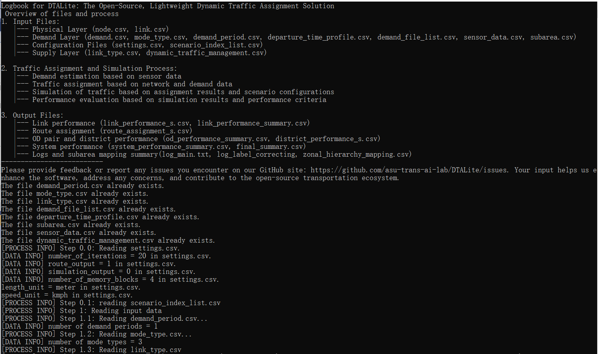

After that, the following output files will be generated. You can examine these
files to verify the correct execution of the program.

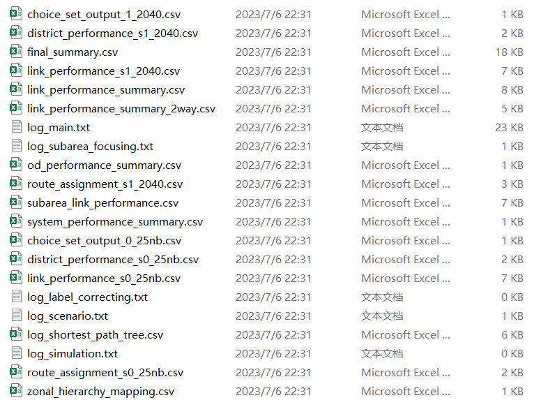

In this case, you can use the route_assignment file to check the program's
results and validate the Braess Paradox.

**route_assignment_s0_25nb.csv**

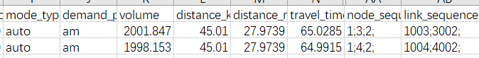

In scenario s0, the travel time for users on two routes are respectively 65 and
64\. And the combined flow on both paths is 4000.

**route_assignment_s1_2040.csv**

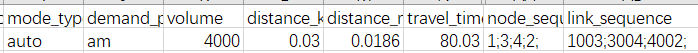

In scenario s1, users only choose path 1-\>3-\>4-\>2 with a travel time of 80
and a flow of 4000.

By comparing the two scenarios, we can observe that after constructing a new
road, the travel time for users actually increases. It is because when each user
"selfishly" chooses their own path, adding additional capacity to the network
can paradoxically decrease overall performance. This is the phenomenon described
as the Braess Paradox.

## 4.3 Sioux Falls Network

Key input: physical layer and demand layer

Key output: performance files

## 4.4 Chicago Sketch

Key input: subarea information

Key output: subarea physical network, subarea performance

## 4.5 Focusing Approach

Key input: subarea information

Key output: subarea physical network, subarea performance

## 4.6 Sensitivity Analysis

Key input: change on supply/ demand side

Key output: the performance file before and after the change

# Appendix A: From mathematical modeling to network-based assignment and simulation

1.  **Link volume-delay function in static traffic assignment**

    There are a number of key components for the static traffic assignment
    procedure.

-   input trip table describes the flow per hour from each origin zone to each
    destination zone

-   a traffic network consisting of nodes, links and link volume delay functions

-   volume-delay function such as BPR **(Bureau of Public Roads** **)**
    relationship that shows increased link travel time as an increase in link
    volume

    TT = FFTT[1 + 0.15(v/c)4]

    where:

    TT = link travel time

    FFTT= free-flow travel time of link

    v = link flow

    c = link capacity

    [Remark: the link travel time function typically is only dependent on its
    own flow, while ignoring link volume on opposing or conflicting directions.
    The link capacity might not be a strict upper limit on flow, e.g. specified
    by highway capacity manual.]

    As one of the simplest *c*ases of behavior, User Equilibrium (UE) Principle
    assumes users are “greedy” and are familiar with the system. E*quilibrium
    requires iteration* to reach the following two principles:

-   Principle A: No individual trip maker can reduce his path costs by switching
    routes.

-   Principle B: All used routes between an O-D pair have equal and minimum
    costs

    While all unused routes have greater or equal costs *(to the used path
    costs)*.

    Wardrop (1952) proposed the user equilibrium and system optimal principles
    of route choice behavior in his seminal paper, and Beckman et al. (1956)
    formulated the static user equilibrium traffic assignment problem as an
    equivalent convex mathematical programming problem. Since their influential
    contributions, the development of the static network assignment
    formulations, algorithms and applications have made remarkable progress. The
    books by Sheffi (1985) and Patriksson (1994) provide the most comprehensive
    coverage on the static traffic assignment problem and its variants.

1.  **General mathematical descriptions of traffic assignment**

    Traffic assignment loads an origin-destination (OD) trip matrix onto links
    of a traffic network, while satisfying a certain route choice behavioral
    model, e.g., deterministic user equilibrium. Traffic assignment is used to
    predict/estimate how trip-makers may shift to other routes or departure
    times in response to a number of strategies such as road pricing, incidents,
    road capacity improvement and traffic signal re-timing.

    For example, tolling typically lead to traffic diversion on alternative
    routes and/or other transportation modes, and many traffic congestion
    mitigation strategies should be developed to improve the capacity to which
    the traffic may be diverted, for example, signal optimization, traveler
    information provision, and transit operation.

    The common time periods include morning peak, afternoon peak and off-peak,
    and we can use the time of day factor to calculate the trip in the peak hour
    (e.g., morning peak may be 11% of daily traffic) from a 24 hour demand
    volume.

    By using a simplified static traffic assignment formulation, the following
    mathematic description adopts the related sections in the paper titled
    “Equivalent Gap Function-Based Reformulation and Solution Algorithm for the
    Dynamic User Equilibrium Problem” by Lu, Mahmassani and Zhou in (2009). One
    can consider the extended DTA formulation by adding a time index dimension.

    Consider a network G = (*N*, *A*), where *N* is a finite set of nodes and
    *A* is a finite set of directed links (*i*, *j*), *iN* and *jN*. Associated
    with each link (*i*, *j*) is the link travel time *sij*(*t*) required to
    traverse link (*i*, *j*) when departing at time interval *tS* from node *i*.
    For simplicity and without loss of generality, *sij*(*t*) is regarded as
    link travel time, though it can be generalized to include travel time,
    out-of-pocket cost and other travel impedances that may incur when
    traversing link (*i*, *j*) at time *t*. Travel time and cost are used
    interchangeably in this paper. Other important notation and variables are
    summarized below.

    *O* subset of origin nodes; *O  N*

    *D* subset of destination nodes; *D  N*.

    *T* set of departure time intervals.

    *o* subscript for an origin node, *oO*.

    *d* subscript for a destination node, *dD*.

    set of all feasible paths for a given triplet (*o*, *d*).

    *p*  subscript for a path *p*.

    number of trips departing from node *o* to node *d*.

    number of trips departing from *o* to *d* and assigned to path *p*.

    *r* path flow vector, *r* = {, *o O*, *d D*, and *p* }.

    path travel cost (or time) for the travelers departing from *o* to *d* and
    assigned to path *p*;, and is a function of the path flow vector *r*.

    *c*(*r*) vector of path travel costs; *c*(*r*) = {, *o O*, *d D*, and *p* }.

    The OD demand pattern for the entire planning horizon (i.e.,, *o*, *d* is
    assumed to be known *a priori*. The key behavioral assumption for the path
    choice decision is as follows: in a disutility-minimization framework, each
    trip-maker is rational and chooses a path that minimizes the travel cost.
    Specifically, for each trip-maker in, a path *p*\* will be selected if and
    only if .

    Given the assumptions above, the problem is to solve the UE traffic
    assignment problem, with a given OD demand, to obtain a path flow pattern
    satisfying the UE conditions. Specifically, the goal is to determine a UE
    path flow vector (routing policies) over a vehicular network for each OD
    pair and each departure time interval (i.e., *r\** {, *o*, *d*, and *p* }.

    By the above UE definition, all trips in a network are equilibrated in terms
    of actual experienced path costs, so it is necessary to determine the
    experienced path costs *c*(*r*) for a given path flow vector *r*. To this
    end, a simulation-based dynamic traffic (or network loading) model is used
    to obtain the experienced path cost vector. It should be noted that the
    algorithm is independent of the specific dynamic traffic model selected; any
    (macroscopic, microscopic or mesoscopic) dynamic traffic model capable of
    capturing complex traffic flow dynamics, in particular the effect of
    physical queuing, as well as preventing violations of the first-in-first-out
    property, can be embedded into the proposed solution algorithm.

    With the introduction of the gap function *Gap*(*r*, ), the proposed
    nonlinear minimization problem (NMP) is presented as the following.

    (1)

    Subject to , *o*, *d* (2)

    , *o*, *d*, and *pP*(*o*, *d*) (3)

    ,  *o*, *d*, and *pP*(*o*, *d*) (4)

    In the above NMP reformulation, both  and *r* are *independent* decision
    variables and hence the gap function is a function of both *r* and  (i.e.,
    *Gap*(*r*, )), where  and *r* are connected with each other through
    inequality constraint (3). *Gap*(*r*, ) provides a measure of the violation
    of the UE conditions in terms of the difference between the total actual
    experienced path travel cost and the total shortest path cost evaluated at
    any given path flow pattern *r*. The difference vanishes when the path flow
    vector *r*\* satisfies the UE conditions. Thus, solving the UE problem can
    be viewed as a process of finding the path flow vector *r*\* and \* such
    that *Gap*(*r\**, \*) = 0.

    [DTALite/dataset at main · asu-trans-ai-lab/DTALite
    (github.com)](https://github.com/asu-trans-ai-lab/DTALite/blob/main/dataset/02_Braess_Paradox/Braess_network_Process_Tutorial.xlsx)

# Appendix B: Log file of DTALite

DTALite's log provides a detailed record of the entire program execution
process, from initial input files reading to generating the final output. This
log aims to help users quickly understand the program, obtain execution
information, and pinpoint issues in case of errors. It consists of two parts:
structural overview and program information.

The program information includes process status updates, data checkpoints, and
error reports. The log tracks the reading and validation of different csv files,
memory allocation processes, demand iteration, travel parameter calculations,
etc. It also provides details about scenario indices, average travel times, and
optimization gaps between different iterations.

**For user**

From this log, users can gather the following information:

-   Different steps and operations performed by the program

-   Reading and processing of data files

-   Configuration and parameter information for the program and the dataset

-   Generation and output of result files

-   Error messages and error pinpointing when program execution is interrupted

This log provides key information about the execution of the program, helping
users to understand the status, progress, parameter configuration and results
file generation. It is an essential tool for monitoring program execution,
troubleshooting, debugging and results verification.

**Specific content**

**1. Overview of files and process**

This section provides an overview of DTALite's log recording and its related
files and processes. It includes input files, traffic assignment and simulation
processes, and the content of output files. Users can gain a general
understanding of DTALite from here, and for more detailed information, they can
refer to Chapter 2 for program flow introduction and Chapter 3 for input and
output file descriptions.

**2. Program information**

This section provides specific details and information about the execution
process of the DTALite program. It includes warning messages, data information,
status information, performance evaluation information, and output file
information. These details are very helpful for users to understand the
execution details of the program and validate the data structure.

**[PROCESS INFO]**

It provides key information related to specific steps or processes, such as
reading files, initializing data, executing specific algorithms, or handling
specific tasks, to help users understand the progress of the program and the
current operation.

Example:

[PROCESS INFO] Step 0.0: Reading settings.csv.

It indicates that the current operation of the program is reading the
settings.csv file for program configuration.

**[DATA INFO]**

It provides specific details and statistical information about the data. For
example, data information may include the number of nodes, the number of links,
detailed statistics and summaries of program performance, OD pair and district
performance, and system performance.

Example:

[DATA INFO] Total number of column pool updating iterations = 40

and a data table that records information about each iteration in the column
pool updating process.

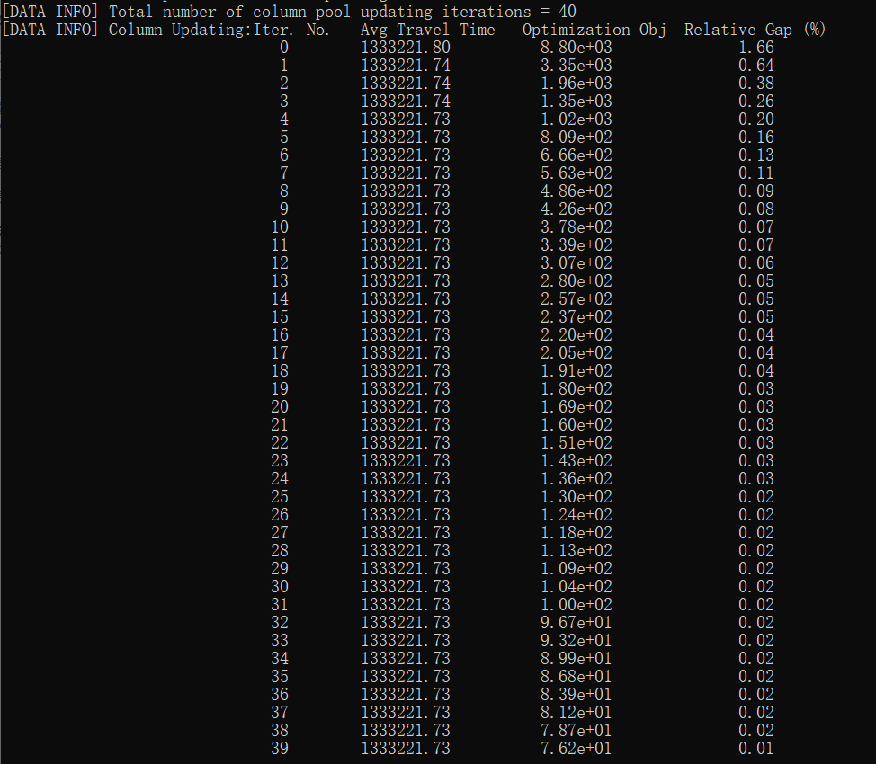

**[STATUS INFO]**

It reflects the states and operations during the program execution process. For
example, status information may include the status updates for different steps,
such as reading node data, initializing data, validating data files, and so on.

Example:

[STATUS INFO] reading demand file demand.csv for scenario index = 0

it indicates that it is reading the demand information for scenario 0.

**[WARNING]**

Warning messages indicate potential issues or missing fields.

Example:

[WARNING] Field 'peak_load_factor_p1_auto' not found in 'link_type.csv'. The
default peak load factor 1.0 was used. Consider adding
'peak_load_factor_p1_auto' to the 'link_type.csv' for more accurate results.

**[ERROR]**

Error messages indicate missing files or files that do not comply with the
format specifications, helping users locate the error position in the program
and make modifications to the data files.

Example:

[ERROR] Field length in file link.csv does not exist. Please check the file.

This error message indicates that the "length" field in the link file cannot be
empty, prompting the user to check the link file.
