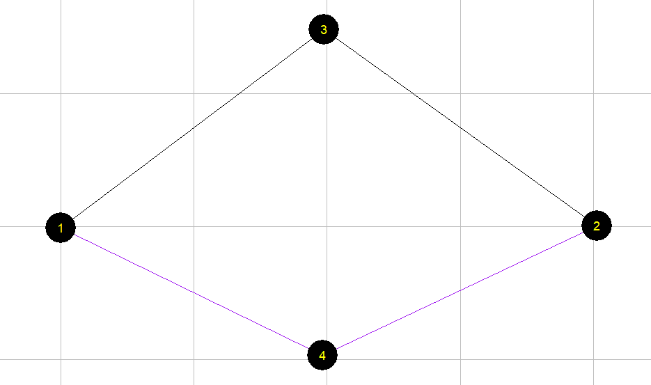

# DTALite Users Guide

Working Document Version 1.1

Please feel free to send any questions, feedback, and corrections to Dr. Xuesong
(Simon) Zhou (xzhou74@asu.edu) by adding comments in this document.

Permission is granted to copy, distribute and/or modify this document under the
terms of the GNU Free Documentation License, Version 1.3 or any later version
published by the Free Software Foundation; with no Invariant Sections, no
Front-Cover Texts, and no Back-Cover Texts. A copy of the license is included in
<http://www.gnu.org/licenses/fdl.html>[www.gnu.org/licenses/fdl.html](http://www.gnu.org/licenses/fdl.html)

Table of Contents

[DTALite/DTALite Users Guide 1](#_Toc2525)

[1. Introduction 2](#_Toc17997)

>   [1.1. Motivation 2](#_Toc26356)

>   [1.2 System Architecture 4](#_Toc21323)

>   [1.3. 5 steps of performing traffic analysis using CSV files 6](#_Toc29392)

[2. Getting Started from NeXTA graphical user interface and running DTALite
7](#_Toc14421)

>   [Step 1: Download and locate the project folder, check CSV network files.
>   7](#_Toc18037)

>   [Step 2: Visualize and validate network in NeXTA using shortest path finding
>   8](#_Toc24380)

>   [Step 3. Run DTALite as a Windows console application from File Explorer
>   10](#_Toc28132)

[3. Toy Examples for Computing Static User Equilibrium 11](#_Toc4001)

>   [3.1 Two-corridor example 11](#_Toc30525)

>   [3.2 Detailed data structure description 12](#_Toc30755)

[4. Detailed data structure descriptions 15](#_Toc13232)

>   [4.1 Input for network data 15](#_Toc22008)

>   [4.2 Input for demand data 17](#_Toc322)

>   [4.3 Assignment and simulation configuration file 17](#_Toc22066)

>   [4.4 Input for signal timing and service layer 19](#_Toc27504)

>   [4.5 Output file 19](#_Toc26172)

[Appendix: From mathematical modeling to network-based assignment and simulation
21](#_Toc8757)

# Introduction

## 1.1. Motivation

>   Motivated by a wide range of transportation network analysis needs, static
>   traffic assignment (STA) and dynamic traffic assignment (DTA) models have
>   been increasingly recognized as a set of important tools for assessing
>   operational performances of those applications at different spatial
>   resolutions (e.g., network, corridor and individual segment levels) and
>   across various analysis temporal regimes (e.g., peak hours, entire day and
>   second-by-second). The mathematical modeling and related volume-delay
>   functions are described in Appendix.

>   The advances of STA and DTA are built upon the capabilities of integrated
>   flow assignment and simulation models in describing the formation,
>   propagation, and dissipation of traffic congestion in a transportation
>   network.

>   As a continuation of DTALite, the development of DTALite (S stands for
>   strategic or static assignment) is motivated by the following perspectives.

1.  **Bridging the gap from macroscopic static assignment to mesoscopic dynamic
    assignment**

2.  Planning practitioners have recognized the full potential of DTA modeling
    methodologies that describe the propagation and dissipation of system
    congestion with time-dependent trip demands in a transportation network. In
    April 2009, the TRB Network Modeling Committee conducted a DTA user survey
    through the FHWA TMIP mail list, which identified the following top 5
    technical barriers:

-   DTA requires more data than are available or accessible to most users (47%)

-   Setting up a DTA model consumed inordinate resource (44%)

-   Cost/benefit of implementation is unclear (45%)

-   DTA tools take too long to run (35%)

-   The underlying modeling approaches are not transparent (35%)

>   The development goal of DTALite aims to provide an integrated open-source
>   package for strategic traffic analysis that includes both static traffic
>   assignment and dynamic traffic simulation to reflect the impact of road
>   capacity constraints. The underlying volume-delay models include BPR
>   functions and its extension of BPR-X. Three traffic stream models, namely,
>   point queue model, spatial queue model and simplified kinematic wave models,
>   are embedded in the mesoscopic simulator to describe queueing behavior at
>   bottlenecks with tight capacity constraints.

1.  **Adopting open network standard of GMNS**

2.  General Travel Network Format Specification is a product of Zephyr
    Foundation, which aims to advance the field through flexible and efficient
    support, education, guidance, encouragement, and incubation. Further details
    can be found in
    <https://zephyrtransport.org/projects/2-network-standard-and-tools/>

3.  **Integrated graphic user interface and analysis package**

4.  NeXTA (Network eXplorer for Traffic Analysis) is another open-source graphic
    user interface (GUI) for transportation network analysis, while the
    lower-case “*e*” stands for education with broader impacts. With both
    open-source traffic assignment/simulation engine (as a simple Windows
    console application) and graphic user interface, the software suite of
    DTALite + NeXTA aims to

-   provide an open-source code base to enable transportation researchers and
    software developers to expand its range of Strategic Traffic Assignment
    capabilities to various traffic management analysis applications.

-   present results to other users by visualizing traffic flow dynamics and
    traveler route choice behavior in an integrated 2D environment.

-   provide a free education tool for students to understand the complex
    decision-making process in transportation planning and optimization
    processes.

1.  **parallel computing on shared memory multi-core computer**

2.  Emerging multi-core computer processor techniques are offering unprecedented
    available parallel computing power, on most of laptops and desktops
    currently available in the market. To exploit this paradigm change in
    computing, we will require a new software architecture and algorithm design
    so as to facilitate the most efficient use of emergent parallel hardware.

3.  **Integrated signal timing optimization (to be added)**

4.  **Integrated OD demand estimation through path flow estimator (to be
    added)**

5.  The latest software release can be downloaded at our Github website. The
    source code can be downloaded at
    https://github.com/asu-trans-ai-lab/DTALite. Table 1 illustrates the
    contents of different folders at Github
    https://github.com/asu-trans-ai-lab/DTALite.

6.  Table 1. contents of folders at Github.

| **Github Folder Name** | **Contents**                                                                                                                             |
|------------------------|------------------------------------------------------------------------------------------------------------------------------------------|
| Src                    | source code of DTALite                                                                                                                   |
| test                   | a simple working dataset for console application DTALite and visualizer of NeXTA.                                                        |
| Doc                    | user’s guide and other documentations for DTALite                                                                                        |
| Data                   | sample datasets for DTALite: 1. two_corridor 2. Braess’s_paradox 3. three_corridor 4. Sious_Falls 5. Chicago_sketch 6. Tempe ASU network |

## 1.2 System Architecture

>   The software architecture of DTALite aims to integrate many rich modeling
>   and visualization capabilities into an open-source traffic assignment model
>   suitable for practical everyday use within the context of an entire
>   large-scale metropolitan area network. Using a modularized design, the
>   open-source suite of **simulation engine + visualization interface** can
>   also serve future needs by enabling transportation researchers and software
>   developers to continue to build upon and expand its range of capabilities.
>   The **streamlined data flow** from static traffic assignment models can
>   allow state DOTs and regional MPOs to rapidly apply the advanced STA/DTA
>   methodology, and further examine the effectiveness of traffic mobility,
>   reliability and safety improvement strategies, individually and in
>   combination, for a large-scale regional network, a subarea or a corridor.

>   Figure 1.1 Software System Architecture

>   The components and different modules in the system are listed as following:

>   **a. Network Data** includes two essential files, node.csv and link.csv for
>   the macroccopic network representation.

>   **b. OD Demand Meta Database** includes the setting.csv as the configuration
>   file that describes information such as agent type, demand period, demand
>   file list, which help users to represent the OD demand information for
>   different user types at specific demand periods.

>   **c. Traffic Assignment Module** includes the key steps of the assignment,
>   including the BPR Volume Delay Function, Shortest Path Tree Generation, and
>   Flow Assignment, which generates the path flow and link flow according to
>   the UE principle.

>   **d. NEXTA: Visualization Interface Module** is able to visualize the
>   network and the output of traffic assignment, including Static Link
>   Performance and Agent Trajectory.

>   **e. Space-Time Simulation Module** utilizes the path flow output of Traffic
>   Assignment Module to perform Space-Time Simulation, while the underlying
>   traffic flow models in the Space-Time Simulation Module are Point Queue (PQ)
>   and Spatial Queue (SQ). A simplified kinematic wave (KW) model can be also
>   used in an advanced mode, similar to DTALite.

>   **f. Capacity Management** aims to manage the static and time-dependent link
>   capacity input for Space-Time Simulation, such as signal timing plans and
>   multi-modal service plans.

>   **g. Simulation Output Module** covers the output file of Space-Time
>   Simulation Module, including Dynamic Link Performance and Agent Trajectory
>   in terms of link_performance.csv and agent.csv, which can be visualized in
>   NeXTA.

>   Regarding parameters in settings.csv, Table 2 illustrates the differences
>   between two key steps of Static Traffic Assignment and DTA + space-time
>   simulation.

>   Table 2. The differences between Static Traffic Assignment and DTA+
>   space-time simulation

|                                 | Static Traffic Assignment                                                          | Dynamic Traffic Assignment + space-time simulation                  |
|---------------------------------|------------------------------------------------------------------------------------|---------------------------------------------------------------------|
| Assignment_mode in settings.csv | Link-based UE                                                                      | DTA                                                                 |
| Travel time evaluation          | BPR function with volume/capacity ratio (soft capacity constraints)                | Space-time network based simulation with tight capacity constraints |
| Demand input                    | OD demand                                                                          | OD demand agent based                                               |
|                                 |                                                                                    |                                                                     |
|                                 |                                                                                    |                                                                     |
| Output (1): link performance    | Link performance VOC, volume, delay                                                | Dynamic Link performance ueue, delay at time t                      |
|                                 |                                                                                    |                                                                     |
| Output (): data                 | Path flow for OD and k-paths, based on path pool based gradient projection methods |                                                                     |
|                                 |                                                                                    |                                                                     |

## 1.3. 5 steps of performing traffic analysis using CSV files

>   The specific instruction for the use of NeXTA and DTALite is as follows:

>   Step 0: **[Download and locate the project folder]** Download and unzip the
>   release software package from github. Locate DTALite file folder with
>   node.csv, link csv, demand.csv and settings.csv. Typically, copy DTALite.exe
>   and NeXTA.exe in the same folder for easy access.

>   Step 1: **[Check input files in Excel]** Open a file explorer, view or edit
>   input files of node, link and demand csv files, in Excel or any text editor.
>   Review and change the configuration in settings.csv in Excel.

>   Step 2: **[Visualize and validate network in NeXTA ]** Click
>   “NeXTA”—“File”—“Open Traffic Network Project” to choose the node.csv file in
>   your network data set. Check the network connectivity through a simple path
>   calculation by selecting one OD pair.

>   Step 3: **[Run DTALite as a Windows console application]** Click on the
>   executable of “DTALite.exe” from a file explorer or run it from Windows
>   command window, to perform traffic assignment and simulation. The output of
>   this Windows console applications is displayed in screen and log file
>   DTALite_log.txt.

>   Step 4: [**Check output files in Excel**] After the completion of DTALite,
>   users can view the output link performance and agent files in Excel.

>   Step 5: [**Visualize output files in NeXTA**] For static traffic assignment,
>   NeXTA is able to display view link travel time, speed and volume, as well as
>   path display in the agent dialog. For dynamic assignment and simulation, one
>   can use NeXTA to view time-dependent queue and density.

# Getting Started from NeXTA graphical user interface and running DTALite

## Step 1: Download and locate the project folder, check CSV network files.

>   Locate the project folder of “6_Tempe ASU network”.

>   Check input files in Excel

>   node.csv

>   link.csv

## Step 2: Visualize and validate network in NeXTA using shortest path finding

First, select the node layer in the left-hand-side GIS panel, we can use the
mouse to select node 44, and node 86. Alternatively, one can use a keyboard
shortcut of Control+f to search those nodes.

Go the path GIS layer, right click to check and confirm if this path is
connected.

Alternatively, one can use a keyboard shortcut of Control+f to specify the
origin and destination for the path.

## Step 3. Run DTALite as a Windows console application from File Explorer

>   The user now can check
>   output files in Excel for the following two files:

>   static_link performance.csv

>   path_flow.csv

>   All DTALite **data files** are in CSV format. The files for node, link and
>   zone layers have geometric fields for importing from and exporting to GIS
>   software.

# Toy Examples for Computing Static User Equilibrium

## 3.1 Two-corridor example

>   This example uses a simple case with a single origin-to-destination pair and
>   two paths p=1 for the primary path, p=2 for the alternative path, see in
>   Figure 3.1 As each path has two links, path 1 has a free-flow travel time of
>   20 minutes, and path 2 has a free-flow travel time of 30 minutes.

>   Figure 3.1 illustrative example of two-corridor network

>   For a given OD demand of 7,000 on this network, we can use the User
>   Equilibrium method to perform traffic assignment. A graphic-based solution
>   process can be described by Figure 3.2. As the path flow changes, the travel
>   time on the two paths reaches the same equilibrium point, which satisfied
>   the requirement of User Equilibrium. User equilibrium solution is reached
>   when the freeway flow is 5400, and arterial flow as 7000-5400=1600, and this
>   leads to the same travel time of 30 min on both routes.

>   Figure 3.2 illustration of Equilibrium with X axis as freeway path flow.

>   The detailed parameters are in Table 3.1.

>   Table 3.1 parameters

| **Parameters**                            | **Value** |
|-------------------------------------------|-----------|
| Freeway flow travel time (min): Freeway:  | 20        |
| Freeway flow travel time (min): Arterial: | 30        |
| Capacity (vehicles / hour): Freeway:      | 4000      |
| Capacity (vehicles / hour):Arterial:      | 3000      |
| Demand                                    | 7000      |
| BPR alpha                                 | 0.15      |
| BPR beta                                  | 4         |

>   The travel time function is

>   Freeway_TT = FFTT[1 + 0.15(v/c)4]

>   Arterial \_TT= FFTT[1 + 0.15((demand-v)/c)4]

>   where:

>   TT = link travel time

>   FFTT= free-flow travel time of link

>   v = link flow

>   c = link capacity

## 3.2 Detailed data structure description

Generic network files used for DTALite include files for three layers: physical
layer, service layer and demand layer.

**Table 3.1 File list for DTALite**

| File type                | Index: file name            | Description                                                                                                                                                          |
|--------------------------|-----------------------------|----------------------------------------------------------------------------------------------------------------------------------------------------------------------|
| Input for physical layer | 1a: *node.csv*              | Define nodes in the network.                                                                                                                                         |
|                          | 1b.: *link.csv*             | Define links in the network with essential attributes for assignment.                                                                                                |
| Input for demand layer   | 2: *demand.csv*             | Define the demand of passengers on each OD pair, which could be extracted by *demand_file_list.csv*.                                                                 |
| Input configuration file | 3: *settings.csv*           | Define basic setting for the Network, it contains five sections.                                                                                                     |
|                          | Section of assignment       | Set the number of iteration and the mode of assignment.                                                                                                              |
|                          | Section of agent_type       | Define attributes of each type of agent, including VOT (unit: dollar per hour) and PCE.                                                                              |
|                          | Section of link_type        | Define types of links in the network                                                                                                                                 |
|                          | Section of demand_period    | Define demand period, which could be extracted by demand_file_list                                                                                                   |
|                          |                             |                                                                                                                                                                      |
|                          | Section of demand_file_list | Define demand type, period, and format type.                                                                                                                         |
| Output file              | 4: *link_performance.csv*   | Show the performance of each link, including the travel time, volume, and resource balance.                                                                          |
|                          | 5: *.csv*                   | Show the results of the assignment, including the volume, toll, travel time and distance of each path of each agent, as well as the link sequence and time sequence. |

>   The related files used in DTALite are listed below.

>   **（1）Prepare input data**

-   node.csv

1.  Table 3.2 node.csv

| **node_id** | **zone_id** | **x_coord** | **y_coord** |
|-------------|-------------|-------------|-------------|
| 1           | 1           | 0.017882    | -0.12518    |
| 2           | 2           | 40.25393    | 0.053648    |
| 3           |             | 19.77825    | 14.80687    |
| 4           |             | 19.68884    | -9.69242    |

-   link.csv

1.  Table 3.3 link.csv

| **link_id**  | **from_node_id** | **to_node_id** | **facility_type** | **dir_flag** | **length**     | **lanes**     |
|--------------|------------------|----------------|-------------------|--------------|----------------|---------------|
| 1003         | 1                | 3              | Freeway           | 1            | 10             | 1             |
| 3002         | 3                | 2              | Freeway           | 1            | 10             | 1             |
| 1004         | 1                | 4              | arterial          | 1            | 15             | 1             |
| 4002         | 4                | 2              | arterial          | 1            | 15             | 1             |
| **capacity** | **free_speed**   | **link_type**  | **VDF_fftt1**     | **VDF_cap1** | **VDF_alpha1** | **VDF_beta1** |
| 4000         | 60               | 1              | 20                | 4000         | 0.15           | 4             |
| 4000         | 60               | 1              | 0                 | 4000         | 0.15           | 4             |
| 3000         | 60               | 2              | 30                | 3000         | 0.15           | 4             |
| 3000         | 60               | 2              | 30                | 3000         | 0.15           | 4             |

-   demand.csv

1.  Table 3.6 demand.csv

| **o_zone_id** | **d_zone_id** | **volume** |
|---------------|---------------|------------|
| 1             | 2             | 7000       |

-   settings.csv

There are different sections in the settings.csv file. And each section starts
with the format of [section_name] along with the field names. There are five
sections in the settings.csv, see in Table 3.4.

>   **(2) Check output files**

>   The files are the output of the previous input data.

-   agent.csv

Table 3.10 agent.csv

| **agent_id**   | **o_zone_id**     | **d_zone_id**     | **path_id**              | **o_node_id**   | **d_node_id** |
|----------------|-------------------|-------------------|--------------------------|-----------------|---------------|
| 1              | 1                 | 2                 | 0                        | 1               | 2             |
| 2              | 1                 | 2                 | 1                        | 1               | 2             |
| **agent_type** | **demand_period** | **agent_type**    | **toll**                 | **travel_time** | **distance**  |
| p              | AM                | p                 | 0                        | 30.3224         | 20            |
| p              | AM                | p                 | 0                        | 30.3224         | 30            |
|                | **node_sequence** | **link_sequence** | **time_sequence**        |                 |               |
|                | 1;3;2;            | 1003;3002;        | 0730:00;0800:19;0800:19; |                 |               |
|                | 1;4;2;            | 1004;4002;        | 0800:19;0830:38;0830:38; |                 |               |

>   The volume in this file represents path volume, and the path is further
>   represented in node_sequence.

>   For the above example (Table 3.10), when the assignment reaches equilibrium,
>   there are two paths to choose. For path id 0, the origin zone id is 1 and
>   destination zone id is 2, and the node sequence of this path is 1, and
>   travel time on this path is 30.3224 minutes, and distance of this path is
>   20.

>   Table 3.11 static_link_performance.csv

| **link_id** | **from_node_id** | **to_node_id** | **time_period** | **volume** | **travel_time** | **speed** | **VOC** | **notes**    |
|-------------|------------------|----------------|-----------------|------------|-----------------|-----------|---------|--------------|
| 1003        | 1                | 3              | 0700_0800       | 5447.848   | 30.322          | 39.575    | 1.362   | period-based |
| 3002        | 3                | 2              | 0700_0800       | 5447.848   | 0               | 0         | 1.362   | period-based |
| 1004        | 1                | 4              | 0700_0800       | 1552.149   | 30.322          | 59.362    | 0.517   | period-based |
| 4002        | 4                | 2              | 0700_0800       | 1552.149   | 0               | 0         | 0.517   | period-based |

>   From link_performance.csv, users are able to obtain the link volume, link
>   travel_time, speed and VOC. For the above example (Table 3.11), the first
>   link id is 1003, and the from-node of this link is 1, and the end-node of
>   this link is 3. From 7:00 to 8:00, the volume on this link is 5447.848, and
>   the travel time during this period is 30.322 (min), and the speed is 39.575
>   mile per hour, and the volume over capacity (VOC) is 1.362.

>   **（3）Visualize the output in NEXTA**

>   Open NEXTA, import the network, chose the time period that you set in
>   demand_period.csv, and click volume, you can see the assignment outcome in
>   Figure 3.3.

>   Figure 3.3 Link volume visualization

# 4. Detailed data structure descriptions

## 4.1 Input for network data

-   The specific files for physical layer are *node.csv* and *link.csv*.

-   Nodes in the physical network represent points of demand, including node_id,
    zone_id, and coordinates with an arbitrary coordinate system.

-   A link is defined using upstream node and downstream node ids, with
    essential attributes such as length, free_speed, lanes, capacity, link_type,
    and coefficients of Volume Delay Function, typically required for static
    traffic assignment and mesoscopic traffic assignment.

**File 1a: node.csv**

| **Field Name** | **Description**                                                                                     | **Sample Value**           |
|----------------|-----------------------------------------------------------------------------------------------------|----------------------------|
| name           | Optional for visualization only                                                                     | Main street @ Highland Dr. |
| node_id        | Node identification number                                                                          | 1001                       |
| x_coord        | Longitude or horizontal coordinate in any arbitrary geographic coordinate system.                   | 100                        |
| y_coord        | Latitude or vertical coordinate horizontal coordinate in any arbitrary geographic coordinate system | 200                        |
| node_type      | Optional text label for visualization and identifies of node                                        | 1                          |
| zone_id        | Indication of node’s physical location                                                              | 1                          |

**File 1b: link.csv**

| **Field Name** | **Description**                                                                  | **Sample Values** |
|----------------|----------------------------------------------------------------------------------|-------------------|
| name           | Optional for visualization purposes                                              | Main Street       |
| link_id        | Link identification number of the road                                           | 1003              |
| from_node_id   | Upstream node number of the link, must already be defined in *node.csv*          | 1                 |
| to_node_id     | Downstream node number of the link, must already be defined in *node.csv*        | 3                 |
| link_type_name | Optional text label for visualization and data checking purposes                 | 1                 |
| dir_flag       | Indication of directions of the link (=0, bi-direction; =1, single direction)    | 1                 |
| length         | The length of the link (between end nodes), measured in units of miles or km.    | 10                |
| free_speed     | Free-flow speed on defined link. Suggested Unit: mph or kmph                     | 60                |
| lanes          | The number of lanes on the link                                                  | 1                 |
| capacity       | The number of vehicles per hour per lane                                         | 4000              |
| link_type      | Index of link type name                                                          | 1                 |
| toll           | Optional generalized toll cost of the link, which could also be the cost of fuel | 0                 |
| VDF_cap1       | Capacity used in the volume-delay function                                       | 4000              |
| VDF_alpha1     | Coefficient used in the volume-delay function                                    | 0.15              |
| VDF_beta1      | Coefficient used in the volume-delay function                                    | 4                 |

## 4.2 Input for demand data

-   The specific files for demand layer is *demand.csv*

-   Travel demand is given by periods. Thus, one file defines total volume of
    demand and one file defines time periods.

**File 2: demand.csv**

| **Field Name** | **Description**                                                         | **Sample Values** |
|----------------|-------------------------------------------------------------------------|-------------------|
| o_zone_id      | Origin zone number of the link, must already defined in *node.csv*      | 1                 |
| d_zone_id      | Destination zone number of the link, must already defined in *node.csv* | 2                 |
| demand         | Travel demand                                                           | 1500              |

## 4.3 Assignment and simulation configuration file

-   The specific file for the configuration file is *settings.csv.*

-   It defines basic setting for the Network, and contains five sections, namely
    assignment, agent_type, link_type, demand_period, demand_file_list.

**File 3: settings.csv**

| **Section Name** | **Field Name**             | **Description**                                     | **Sample Values**      |
|------------------|----------------------------|-----------------------------------------------------|------------------------|
| assignment       | assignment_mode            | Assignment_mode can be ue, dta or odme              | 1                      |
|                  | number_of_iterations       |                                                     | 40                     |
|                  | column_updating_iterations |                                                     | 40                     |
| agent_type       | agent_type_id              | Agent type identification number (type: integer)    | 1                      |
|                  | agent_type                 | Abbreviation of the agent type (type, string)       | p                      |
|                  | name                       | Full name of the agent type                         | Passengers or vehicles |
|                  | VOT                        | Value of time for the agent                         | 10                     |
|                  | PCE                        | Passenger Car Equivalent (PCE) of the agent         | 1                      |
| link_type        | time_period                | Time period expressed by HHMM_HHMM                  | 0600_1200              |
| demand_period    | demand_period_id           | Demand period identification number (type: integer) | 1                      |
|                  | demand_period              | Name of the demand period (type: string)            | AM                     |
|                  | time_period                | Time period expressed by HHMM_HHMM                  | 0600_1200              |
| demand_file_list | file_sequence_no           | Sequence number of reading the files                | 1                      |
|                  | file_name                  | Name of the file to be read                         | demand                 |
|                  | format_type                | column for three columns, agent_csv, routing policy | Column                 |
|                  | demand_period              | Name of the demand period                           | AM                     |
|                  | agent_type                 | Abbreviation of the agent type                      | p                      |

## 4.4 Input for signal timing and service layer

-   The specific files for service layer is *timing.csv*.

-   Service arcs are the physical link added with time dimension, which could
    describe the time periods of a certain link for open access.

-   Agents providing transport service in the network must use certain services
    arcs, which are predetermined.

**File 4: timing in link.csv**

| **Field Name**   | **Description**                                                        | **Sample Values** |
|------------------|------------------------------------------------------------------------|-------------------|
| mvmt_txt_id      | Optional name of the arc                                               | SBL               |
| cycle_length     | Upstream node number of the link, must already defined in *node.csv*   | 120               |
| start_green_time | Downstream node number of the link, must already defined in *node.csv* | 0                 |
| end_green_time   | Time period when the link is open for service                          | 60                |

## 4.5 Output file

**File 5a: static_link_performance.csv**

| **Field Name** | **Description**                                                            | **Sample Values** |
|----------------|----------------------------------------------------------------------------|-------------------|
| link_id        | Link identification number of the road                                     | 1                 |
| from_node_id   | Upstream node number of the link, must already defined in input_node.csv   | 1                 |
| to_node_id     | Downstream node number of the link, must already defined in input_node.csv | 3                 |
| time_period    | The simulation period of the agent HHMM format                             | 0700_0800         |
| volume         | Link based flow volume for the defined period                              | 5600              |
| travel_time    | Link travel_time in minute                                                 | 15                |
| speed          | Average travel speed on the link                                           | 38                |
| VOC            | Volume /capacity ratio                                                     | 0.4               |
| notes          | Some explanatory text                                                      | period-based      |

**File 5b: path_flow.csv**

| **Field Name**        | **Description**                                                                                                                     | **Sample Value**         |
|-----------------------|-------------------------------------------------------------------------------------------------------------------------------------|--------------------------|
| agent_id              | Node identification number                                                                                                          | 1                        |
| o_zone_id             | Origin zone number of the agent                                                                                                     | 1                        |
| d_zone_id             | Destination zone number of the agent                                                                                                | 2                        |
| path_id               | Path identification number                                                                                                          | 0                        |
| o_node_id             | Origin node number of the agent                                                                                                     | 1                        |
| d_node_id             | Destination node number of the agent                                                                                                | 2                        |
| agent_type            | Type of the agent                                                                                                                   | p                        |
| demand_period         | Name of the demand period                                                                                                           | AM                       |
| volume                | Flow volume assigned on the agent                                                                                                   | 5600                     |
| toll                  | The amount of money/time that agent pays, unit: dollar                                                                              | 360                      |
| travel_time           | The total time from the origin to the destination of the agent                                                                      | 31.5                     |
| distance              | The total travel distance from the origin to the destination of the agent, unit: mile or km as users defined for length in link.csv | 20                       |
| node_sequence         | The number of nodes through which agents pass in turn                                                                               | 1;3;2;                   |
| link_sequence         | The number of links through which agents pass in turn                                                                               | 1003;3002;               |
| time_sequence         | Time point through which agents pass in turn                                                                                        | 0730:00;0745:45;0801:31; |
| time_decimal_sequence | The number of decimal times through which agents pass in turn                                                                       | 450.00;465.76;481.52;    |

# Mathematical modeling to network-based assignment and simulation

1.  **Link volume-delay function in static traffic assignment**

2.  There are a number of key components for the static traffic assignment
    procedure.

-   input trip table describes the flow per hour from each origin zone to each
    destination zone

-   a traffic network consisting of nodes, links and link volume delay functions

-   volume-delay function such as BPR **(Bureau of Public Roads )** relationship
    that shows increased link travel time as an increase in link volume

1.  TT = FFTT[1 + 0.15(v/c)4]

2.  where: TT = link travel time, FFTT= free-flow travel time of link; v = link
    flow; c = link capacity

3.  [Remark: the link travel time function typically is only dependent on its
    own flow, while ignoring link volume on opposing or conflicting directions.
    The link capacity might not be a strict upper limit on flow, e.g. specified
    by highway capacity manual.]

4.  As one of the simplest *c*ases of behavior, User Equilibrium (UE) Principle
    assumes users are “greedy” and are familiar with the system. E*quilibrium
    requires iteration* to reach the following two principles:

-   Principle A: No individual trip maker can reduce his path costs by switching
    routes.

-   Principle B: All used routes between an O-D pair have equal and minimum
    costs

1.  While all unused routes have greater or equal costs *(to the used path
    costs)*.

2.  Wardrop (1952) proposed the user equilibrium and system optimal principles
    of route choice behavior in his seminal paper, and Beckman et al. (1956)
    formulated the static user equilibrium traffic assignment problem as an
    equivalent convex mathematical programming problem. Since their influential
    contributions, the development of the static network assignment
    formulations, algorithms and applications have made remarkable progress. The
    books by Sheffi (1985) and Patriksson (1994) provide the most comprehensive
    coverage on the static traffic assignment problem and its variants.

3.  **General mathematical descriptions of traffic assignment**

4.  Traffic assignment loads an origin-destination (OD) trip matrix onto links
    of a traffic network, while satisfying a certain route choice behavioral
    model, e.g., deterministic user equilibrium. Traffic assignment is used to
    predict/estimate how trip-makers may shift to other routes or departure
    times in response to a number of strategies such as road pricing, incidents,
    road capacity improvement and traffic signal re-timing.

5.  For example, tolling typically lead to traffic diversion on alternative
    routes and/or other transportation modes, and many traffic congestion
    mitigation strategies should be developed to improve the capacity to which
    the traffic may be diverted, for example, signal optimization, traveler
    information provision, and transit operation.

6.  The common time periods include morning peak, afternoon peak and off-peak,
    and we can use the time of day factor to calculate the trip in the peak hour
    (e.g., morning peak may be 11% of daily traffic) from a 24 hour demand
    volume.

7.  By using a simplified static traffic assignment formulation, the following
    mathematic description adopts the related sections in the paper titled
    “Equivalent Gap Function-Based Reformulation and Solution Algorithm for the
    Dynamic User Equilibrium Problem” by Lu, Mahmassani and Zhou in (2009). One
    can consider the extended DTA formulation by adding a time index dimension.

8.  

9.  

10. 
